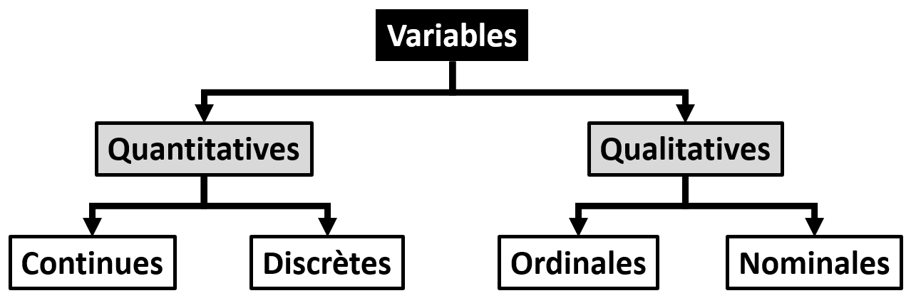
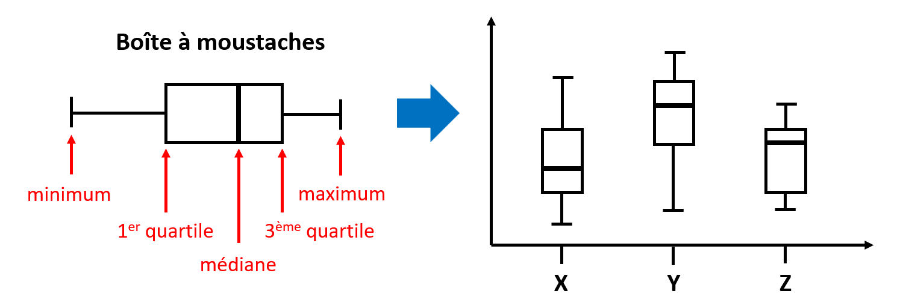
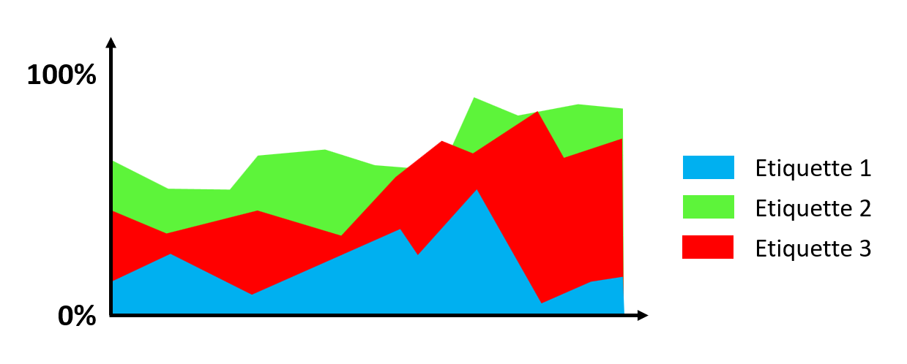
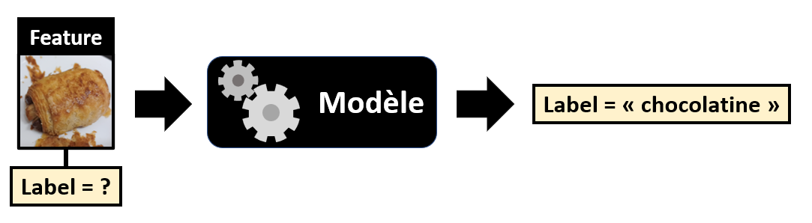
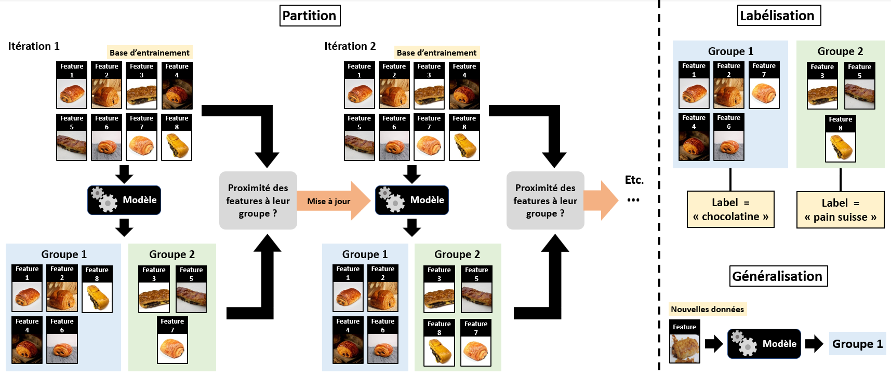
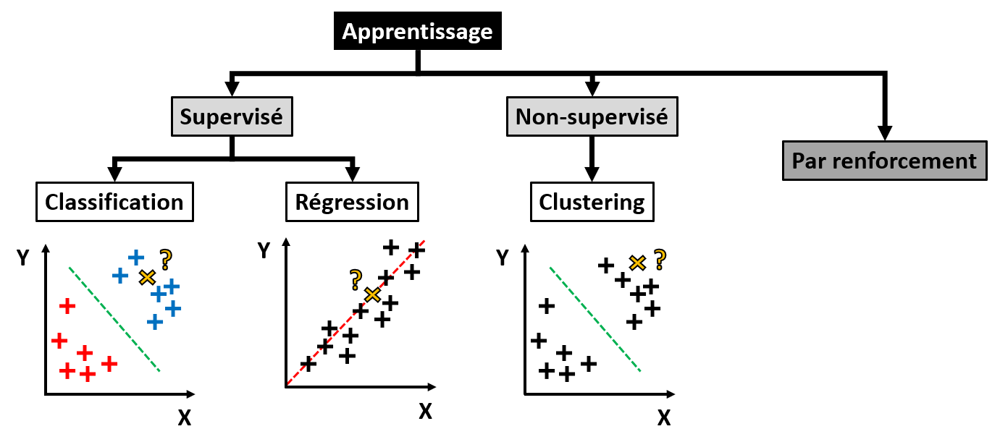

# Chapitre I : Introduction aux sciences des données

Ce chapitre porte sur les grands concepts et les enjeux des sciences des données.

---

## Analyse de données

L'explosion des capacités de stockage de données est à l'origine d'une explosion de la taille des jeux de données à traiter.
D'où la nécessité de trouver de nouvelles manières de manipuler, traiter, analyser et interpréter nos données. 

**La 1ère étape lorsque l'on est confronté à un vaste jeu de données est toujours de l'analyser, afin d'essayer de le comprendre :**

Quels types de données contient-il ?
Ces données sont-elles de qualité ?
Comment ces données sont-elles réparties ?
Peut-on tisser des liens entre les différentes variables ? 
Peut-on regrouper les différentes réalisations de ces variables en groupes ?

Cette étape est essentielle si l'on veut par la suite entrainer un modèle à "apprendre" de nos données.

### Nature et type des données

Une des difficultés rencontrées en sciences des données provient de la **grande variétés des données**.

#### Données de différentes natures

Tout d'abord, les variables étudiées peuvent être de **nature** différente :

* Une donnée **quantitative continue** peut prendre n'importe quelle valeur numérique : par exemple, le prix d'un kilo de farine.

* Une donnée **quantitative discrète** ne peut prendre qu'un nombre fini de valeurs numériques dans un intervalle : par exemple, le nombre de pépites de chocolats dans une brioche.

* Une donnée **qualitative nominale** est descriptive sans ordre hiérarchique : par exemple, la région d'origine d'une pâtisserie.

* Une donnée **qualitative ordinale** est descriptive avec un ordre hiérarchique : par exemple, le niveau de cuisson d'une baguette de pain (blanche, pas trop cuite, bien cuite).

La plupart des modèles d'apprentissage automatique ne prennent que des valeurs numériques en entrée.

On va donc en général **encoder** des données qualitatives avec des **valeurs numériques**. Par exemple :

|Cuisson du pain|Encodage|
|:-------------:|:------:|
|Blanc          |1       |
|Pas trop cuit  |2       |
|Bien cuit      |3       |

Cette méthode fonctionne bien pour des données **ordinales** comme la cuisson du pain, mais pour des données nominales le modèle risque de croire qu'il y a un ordre hiérarchique dans les données qui n'existe pas.
C'est pourquoi on utilise souvent l'encodage **one-hot**.

L'idée est de faire comme si chaque nom possible pour une variable qualitative était une variable en soit. 
On appelle parfois ces variables imaginaires des "dummy variables".

Par exemple, pour la région d'origine des pâtisseries, on passe de :

|Pâtisserie   |Région   |
|:-----------:|:-------:|
|Croissant    |Paris    |
|Merveilleux  |Nord     |
|Kouign-amann |Bretagne |
|Cannelé      |Sud-Ouest|
|Kougelhopf   |Est      |

à l'encodage one-hot suivant :

|Pâtisserie  |Paris|Nord|Bretagne|Sud-Ouest|Est|
|:----------:|:---:|:--:|:------:|:-------:|:-:|
|Croissant   |1    |0   |0       |0        |0  |
|Merveilleux |0    |1   |0       |0        |0  |
|Kouign-amann|0    |0   |1       |0        |0  |
|Cannelé     |0    |0   |0       |1        |0  |
|Kougelhopf  |0    |0   |0       |0        |1  |

Pour le Merveilleux, on donnera donc en entrée d'un modèle le binaire 01000.

On remarque ici que plus la variable a de noms possibles, et plus les binaires d'encodage one-hot seront longs, ce qui peut être problématique.

|Astuce Python|
|:-|
|La bibliothèque Scikit-Learn possède dans son package **preprocessing** une fonction **OrdinalEncoder**, permettant d'assigner un entier à des variables qualitatives ordinales.|
|Dans ce même package, vous trouverez également une fonction **OneHotEncoder**, permettant d'encoder en one-hot des variables qualitatives nominales.|
|Dans les 2 cas, il vous faut créer une instance de **OrdinalEncoder** ou de **OneHotEncoder**, puis utiliser la méthode **fit_transform()** avec vos données en entrée.|

#### Données multidimensionnelles

Les données étudiées peuvent aussi être **multidimensionnelles**.

En effet, dans la pluplart des situations, notre jeu de données peut se mettre sous la forme d'un tableau, dont 

* Les colonnes correspondront aux "**variables**".

* Les lignes correspondront aux "**individus**" : les différentes réalisations de ces variables.

L'ensemble des individus sera nommé "**population**", une sélection des individus un "**échantillon**".

Voici un exemple de jeu de données multidimensionnelles :

|Brioche n°1|Poids (g)|Nombre de pépites de chocolat|Prix (€)|
|:---------:|:-------:|:---------------------------:|:------:|
|1          |70       |13                           |3.5     |
|2          |80       |17                           |3.6     |
|3          |85       |15                           |3.7     |
|4          |83       |16                           |3.4     |
|5          |76       |18                           |3.3     |
|6          |78       |13                           |3.5     |

Nous avons ici 6 individus, les brioches, pour lesquelles nous avons mesuré 3 variables, le poids, le nombre de pépites de chocolat, et le prix.

|Astuce Python|
|:-|
|Pour stocker puis manipuler des données multidimensionnelles, on utilise souvent en Python un type de conteneur de la bibliothèque **Pandas** : les "**DataFrames**".|
|Les DataFrames se présentent comme des tableaux pouvant contenir des variables de types différents, avec un label associé à chaque colonne du tableau (variable).|
|Nous reparlerons de Pandas plus loin dans ce chapitre.|

#### Données structurées

Enfin, les données étudiées peuvent être **structurées**.

On entend par là que des données peuvent avoir un cohérence chronologique (série temporelle, un son) ou spatiale (une carte, une image, un texte, une vidéo).

Par exemple, dans le cas d'une image :

Chaque pixel de l'image doit être compris dans le contexte global de l'image. 
Il est évident que changer la position des pixels les uns par rapport aux autres change le jeu de données : 

Dans certains cas, l'**ordre des données** est donc en soit une information nécessaire à leur interprétation.

Vous l'aurez compris, la nature des données, leur dimensionnalité, ainsi que leur structure, **peuvent rendre leur compréhension difficile**.
Nous allons dans la suite voir comment on peut essayer de tirer des informations pertinentes de nos données.

### Visualisation graphique

La 1ère étape lorsque l'on cherche à comprendre ses données, c'est d'essayer de les **visualiser** de manière pertinente.
Nous allons voir les types de **représentations graphiques** les plus classiques pour visualiser un jeu de données.

#### Courbes et nuages de points :

Lorsque l'on veut afficher les différentes réalisations de 2 variables $X$ et $Y$ **l'une en fonction de l'autre**, on va classiquement utiliser une **courbe** ou un **nuage de points**.

Si les données ne sont **pas structurées**, on peut utiliser un **nuage de points**, qui va simplement afficher chaque réalisation comme un point sur le graphique.

Si les données sont **structurées**, on peut tracer des lignes entre les différentes réalisations, dans l'ordre, ce qui va donner une **courbe**.

#### Diagrammes en barres et histogrammes :

Lorsque l'on veut rapidement comparer des quantités les unes aux autres, on va classiquement utiliser un **diagramme en barres** ou **un histogramme**.

Si on a des individus $A$, $B$ et $C$ et que l'on veut **comparer les valeurs d'une variable** $X$ pour ces 3 individus, on peut utiliser un **diagramme en barres**.
On peut également utiliser un diagramme en barres pour afficher le **nombre d'occurences d'une étiquette** d'une variable qualitative.

Si on veut représenter la distribution des valeurs d'une variable $X$ parmi les différents individus d'une population, on va utiliser un **histogramme**.
Un histogramme affiche le **nombre d'occurences** $N$ des valeurs sur **un intervalle** de $X$.
Ceci implique donc de diviser au préalable les valeurs de $X$ en intervalles. 

#### Boîtes à moustaches :

Lorsque l'on veut afficher de manière visuellement compréhensible la **distribution individus pour différentes variables quantitatives** $X$, $Y$ et $Z$, on peut utiliser des **boîtes à moustaches**.
On peut également l'utiliser pour visualiser la **distribution d'une même variable pour différentes sous-populations**. 

On appelle "boîte à moustaches" une représentation graphique des principaux indicateurs de distribution d'une population pour une variable donnée. 
En général : le minimum, le 1er quartile, la médiane, le 3ème quartile et le maximum.
Nous reparlerons de ces indicateurs plus loin dans ce chapitre.

#### Kernel Density Estimation (KDE) :

La **KDE** ou "estimation par noyau" (Kernel Density Estimation) est une méthode non-paramétrique pour **estimer la distribution de probabilité d'une variable**.
L'avantage est que contrairement à un histogramme, on a des **valeurs continues entre 0 et 1** (on ne divise pas en intervalles).

On peut l'utiliser pour afficher sous la forme d'une courbe la densité de probabilité d'une variable $X$ (KDE 1D).
On peut aussi afficher la densité de probabilité d'une variable $X$ par rapport à une autre variable $Y$, sous la forme d'une carte 2D avec des isolignes de densité de probabilité (KDE 2D).

#### Diagramme circulaire (camembert) :

Lorsque l'on veut afficher des proportions à comparer, on utilise souvent le **diagramme circulaire**, aussi connu sous le nom de "diagramme camembert".

Il s'agit simplement de diviser un cercle en sections, dont la largeur représentera une proportion, et le cercle complet la proportion totale.
On peut par exemple l'utiliser pour vérifier la répartition de variables qualitatives au sein d'une base de données.

#### Graphique en aires :

Lorsque l'on veut afficher l'évolution d'une proportion au cours d'un variable (souvent au cours du temps), on utilise en général un **graphique en aires**.
On peut par exemple l'utiliser pour vérifier la répartition de variables qualitatives au sein d'une base de données, en fonction d'une variable quantitative $X$, par exemple le temps.

#### En Python

|Astuce Python|
|:-|
|La bibliothèque Python "Pandas", dont nous reparlerons plus tard dans ce chapitre, propose une méthode "plot" qui permet des affichages graphiques à partir de jeux de données.|
|Il suffit donner le bon paramètre "kind" en entrée pour obtenir le type d'affichage voulu :|
|- "line" : une courbe.|
|- "scatter" : un nuage de points.|
|- "bar" : un diagramme en barres vertical.|
|- "barh" : un diagramme en barres horizontal.|
|- "hist" : un histogramme.|
|- "box" : des boîtes à moustaches.|
|- "kde" : une "kernel density estimation".|
|- "pie" : un diagramme circulaire.|
|- "area" : un graphique en aires.|

### Statistiques descriptives

Toujours dans l'objectif de comprendre notre jeu de données, on peut essayer de **décrire** chaque variable par des **indicateurs statistiques**.
Nous allons voir ici les indicateurs les plus communs en statistiques descriptives.

Il est important de savoir comment ces indicateurs sont définis afin de comprendre les informations qu'ils donnent ou ne donnent pas sur un jeu de données.

#### Moyenne, médiane et mode

Lorsque l'on veut connaitre l'ordre de grandeur des valeurs d'une variable, là où se rassemblent la plupart des valeurs, on va utiliser un indicateur de **tendance centrale** : moyenne, médiane ou mode.

* Il existe plusieurs façon de définir la moyenne, mais la plus connue est la **moyenne arithmétique** :

$\overline{x} = \frac{1}{N} \sum_{i=1}^{N} x_i$

On note en effet souvent $\overline{x}$ la moyenne d'une variable $x$.

* La **médiane** est la valeur séparant les valeurs de la variable en 2 groupes de même taille : la moitié des valeurs sont supérieures à la médiane, l'autre moitié lui sont inférieures.

* Le **mode** est la valeur la plus représentée dans l'ensemble des valeurs de la variable.

|Astuce Python|
|:-|
|Dans la bibliothèque Python "Pandas", dont nous reparlerons plus tard dans ce chapitre, il y a ces méthodes associées aux objets DataFrames :|
|- ".mean()": la moyenne.|
|- ".median()": la médiane.|
|- ".mode()": le mode.|

#### Variance et écart-type

Lorsque l'on veut savoir à quel point les valeurs d'une variable fluctuent autour de la valeur centrale, on va utiliser des **indicateurs de dispersion**.

* Les valeurs extrêmes de la variable, le **min** et le **max**, pour connaitre l'étendue de la variable.

* La **variance** est définie par la moyenne des carrées des écarts à la moyenne :

$\sigma^2 = \frac{1}{N} \sum_{i=1}^{N} (x_i - \overline{x})^2$

* L'**écart-type** (souvent noté $\sigma$) est la racine carrée de la variance, soit a moyenne quadratique de écarts à la moyenne. 
Contrairement à la variance, il a l'avantage d'être **homogène à la variable étudiée**.

|Astuce Python|
|:-|
|Dans la bibliothèque Python "Pandas", dont nous reparlerons plus tard dans ce chapitre, il y a ces méthodes associées aux objets DataFrames :|
|- ".min()" et ".max()": le minimum et le maximum.|
|- ".var()": la variance.|
|- ".std()": l'écart-type.|

#### Quantiles

Afin d'avoir plus d'informations sur la répartition de valeurs d'une variable, on peut généraliser la notion de médiane en utilisant ce que l'on appelle les **quantiles** :
La division des valeurs de la variables en groupes de tailles égales.

* **Quartiles** : 3 indicateurs en divisant les valeurs de la variable en 4 groupes (25%,50% et 75%).

* **Déciles** : 9 indicateurs en divisant les valeurs de la variable en 10 groupes (10%, 20%, 30%, 40%, 50%, 60%, 70%, 80%, 90%).

* **Centiles** : 99 indicateurs en divisant les valeurs de la variable en 100 groupes (1%, 2%, 3%, ..., 98%, 99%).

#### Asymétrie et kurtosis

Enfin, si l'on veut une information sur la répartition des valeurs d'une variable, sous la forme d'un indicateur unique, on va utiliser un **indicateur de forme**.

* Le coefficient d'**asymétrie** ("skewness" en anglais, souvent noté $\gamma_1$) permet de quantifier le désequilibre de la répartition des valeurs de la variable de chaque côté de sa valeur centrale. 

$\gamma_1 = \frac{1}{N \sigma^3} \sum_{i=1}^{N} (x_i - \overline{x})^3$

Un coefficient négatif indique un décalage à droite, un coefficient positif un décalage à gauche, et un coefficient nul une distribution symétrique.

NB : Pour la loi normale, on a $\gamma_1 = 0$.

* Le **kurtosis** (souvent noté $\gamma_2$) permet de quantifier l'acuité ou l'applatissement de la répartition des valeurs de la variable autour de sa valeur centrale.

$\gamma_2 = \frac{1}{N \sigma^4} \sum_{i=1}^{N} (x_i - \overline{x})^4$

Un kurtosis positif est un indicateur de valeurs anormales de la variable (aux extrêmités, aussi appelées "outliers") plus fréquentes.
Un kurtosis négatif est un indicateur d'une distribution très applatie des valeurs de la variable.

NB : Pour la loi normale, on a $\gamma_2 = 0$.

### Recherche de corrélation

Une fois que l'on a décrit statistiquement les différentes variables de notre jeu de données, on va souvent vouloir essayer des tisser des liens entre ces variables.
Cette **analyse exploratoire** des données a 2 principales utilités :

* Voir si une ou plusieurs variables pourraient servir à en **prédire** une ou plusieurs autres.

* Essayer de **réduire la dimensionnalité** d'un problème basé sur ces variables.

En effet, comme évoqué précédemment, les jeux de données sont souvent multidimensionnels.
Quand la dimension des données devient très grande, la quantité de données devient peu dense en comparaison, ce qui rend difficile leur interprétation.
On appelle communément ce problème le "Fléau de la dimension" ("curse of dimensionality" en anglais).

Nous allons voir dans un 1er temps comment essayer de déterminer ce que l'on appelle des "**corrélations**" entre variables.
Puis nous verrons une méthode classique de réduction de dimension appelée "**Analyse en Composantes Principales**".

#### Matrice de corrélation

Une 1ère approche pour essayer de tisser des liens ou "**corrélations**" entre les variables et de tracer ce que l'on appelle une matrice de nuages de points, ou "**scatter-matrix**" en anglais.

L'idée est d'afficher une **matrice de graphiques**, représentant chacun **une variable en fonction d'une autre**, sous la forme d'un nuage de points.
La diagonale n'étant pas très utile (une variable en fonction d'elle-même), on la remplace en général par un histogramme de la variable en question.

Ce type de représentation permet de détecter visuellement des **relations entre les variables**.

Voici un exemple :

|Astuce Python|
|:-|
|Dans la bibliothèque Python "Pandas", dont nous reparlerons plus tard dans ce chapitre, il y a une méthode "plotting.scatter_matrix()", qui permet d'afficher une "scatter_matrix".|

Pour quantifier la corrélation entre 2 variables $x$ et $y$, on va souvent se contenter de mesurer à quel point une **relation linéaire** $y = a x + b$ peut être tirée de ces variables.
Pour cela, on va calculer le **coefficient de corrélation** de Pearson :

$r = \frac{\sum_{i=1}^{N} (x_i - \overline{x})(y_i - \overline{y})}{\sqrt{\sum_{i=1}^{N} (x_i - \overline{x})^2 \sum_{i=1}^{N} (y_i - \overline{y})^2}}$

La valeur de ce coefficient est toujours compris entre -1 et 1 : 

* Une valeur de 1 signifie une **corrélation** parfaite entre les variables.

* Une valeur de -1 signifie une **anti-corrélation** parfaite entre les variables.

* Une valeur de 0 signifie une **décorrélation** parfaite entre les variables : elles sont **indépendantes**.

Il y a du sens à vouloir prédire une variable à partir d'une autre si elles sont corrélées / anti-corrélées.
On peut aussi imaginer réduire la dimensionnalité d'un problème s'il se base sur plusieurs variables qui ne sont pas indépendantes.

NB : **Attention !** Corrélation entre variables n'implique pas causalité entre variables !

On affiche souvent les coefficients de corrélation obtenus pour toutes les combinaisons de variables possibles sous la forme d'une matrice : la **matrice de corrélation** de ces variables.
La diagonale de la matrice ne contient bien évidemment que des 1.

Voici un exemple où cherche les corrélations entre le diamètre, le temps de cuisson, la masse de frangipane et le prix d'une galette des rois :

|          |Diamètre|Cuisson|Frangipane|Prix|
|:--------:|:------:|:-----:|:--------:|:--:|
|Diamètre  |1       |0.8    |0.7       |0.9 |
|Cuisson   |0.8     |1      |0.5       |0.2 |
|Frangipane|0.7     |0.5    |1         |0.6 |
|Prix      |0.9     |0.2    |0.6       |1   |

La moitié de l'information contenue dans cette matrice étant redondante, on n'affiche parfois que la partie triangulaire supérieure ou inférieure de cette matrice.

|Astuce Python|
|:-|
|Dans la bibliothèque Python "Pandas", dont nous reparlerons plus tard dans ce chapitre, il y a une méthode "corr()" associée aux DataFrames.|
|Elle retourne une matrice de corrélation du jeu de données.|

#### Analyse en Composantes Principales (ACP)

Comme mentionné précédemment, les jeux de données que l'on rencontre sont souvent multidimensionels.
Ceci rend difficile voir impossible un affichage graphique compréhensible des individus d'une variable par rapport à une autre (il faudrait un graphique 2D pour 2 variables, 3D pour 3 variables, 4D pour 4 variables, etc.).

Afin de représenter des données multidimensionnelles sous la forme d'un affichage graphique de **dimension faible** (en général 1, 2 ou 3), on utilise souvent l'**Analyse en Composantes Principales** (ACP).

L'idée est la suivante.
Soit un jeu de données contenant $p$ variables et $n$ individus. 
On va chercher $q$ nouvelles variables par **projections linéaires** des $p$ variables d'origine, avec $q < p$, de manière à **perdre le moins d'information possible** sur le jeu de données.

Ces $q$ nouvelles variables sont alors nommées **composantes principales**.

Il existe plusieurs algorithmes pour obtenir ce résultat, celui implémenté dans la bibliothèque Python Scikit-Learn se base sur la Décomposition en Valeurs Singulières (SVD) de la matrice de données :

$X = 
\begin{pmatrix}
x_{1,1} & x_{1,2} & \cdots & x_{1,p} \\
x_{2,1} & x_{2,2} & \cdots & x_{2,p} \\
\vdots  & \vdots  & \ddots & \vdots  \\
x_{n,1} & x_{n,2} &\cdots & x_{n,p} 
\end{pmatrix}$

où chaque colonne correspond à une variable, et chaque ligne correspond à un individu.

On peut voir l'ACP comme le choix du sous-espace de dimension $q$ tel que le nuage de points projetés ait la variance la plus grande possible.

Les résultats d'une ACP peuvent être affichés sous la forme d'un **nuage de points 2D ou 3D** ($q = 2$ ou $3$) représentant les différents individus, avec pour axes les composantes principales :

L'idée est de voir si on peut séparer les individus en différents groupes à partir des composantes principales.

Pour juger de la qualité d'une ACP, on utilise un type de graphique appelé "**cercle des corrélations**".
Ce graphique 2D représente sur chaque axe la corrélation des $p$ variables d'origine avec les $q$ composantes principales.
Chacune des $p$ variables correspond à un vecteur sur ce graphique, et un cercle de rayon 1 est également affiché pour comparaison.

Voici un exemple :

Un cercle des corrélations permet donc de juger de la corrélation des variables d'origines avec les composantes principales, et de la corrélation des variables d'origine entre elles :

* Plus une variable d'origine est proche du cercle, plus elle est fidèlement représentée par l'ACP. Dans l'idéal, on voudrait donc que toutes les variables soient proches du cercle.

* Pour 2 variables d'origine proches du cercle, si l'angle entre 2 les variables est aigu elles sont corrélées, s'il est obtu elles sont anti-corrélées, et s'il est droit elles sont décorrélées.

On pourra utiliser la projection des données renvoyée par l'ACP pour entrainer des modèles d'apprentissage.

|Astuce Python|
|:-|
|La classe "sklearn.decomposition.PCA" de la bibliothèque "Scikit-Learn" vous permet de réaliser l'ACP d'une matrice de données.|
|Le nombre de composantes principales à trouver est un des attributs de la classe à initialiser ("n_components").|
|Pour obtenir les composantes principales d'une matrice de données, il faut lui appliquer la méthode "fit_transform()" de la classe.|

**Pour aller plus loin** : D'autres méthodes de réduction de dimensionnalité existent, on peut citer entre autres les "auto-encodeurs" et la "t-SNE".

## Préparation des données

Une fois les données analysées, on a normalement une bonne idée de ce qu'un outil automatique pourra en "apprendre" ou non.
Cependant, la plupart de ces outils (dont nous parlerons dans la section suivante), ont besoin que les données soient "**transformées**" d'une certaine manière.

C'est pourquoi nous allons voir dans cette section quelques transformations classiques pour **préparer nos données**.

Tout d'abord, il est possible que le jeu de données contienne des **valeurs erronées** ou **manquantes**, souvent marquées par des NaN ("Not a Number").
Il convient alors de se débarrasser de ces valeurs avant apprentissage, car la plupart des outils ne savent pas gérer ce problème.

|Astuce Python|
|:-|
|Dans la bibliothèque Python "Pandas", dont nous reparlerons plus tard dans ce chapitre, il y a une méthode "dropna" associée aux objets DataFrames.|
|Cette méthode permet de supprimer les NaN d'un DataFrame.|

Nous avons aussi vu précédemment que les données qualitatives doivent être encodées avant apprentissage, soit en "ordinal", soit en "one-hot".

Enfin, les outils d'apprentissage sont affectés par les **différences d'ordre de grandeur entre les variables**.
C'est pourquoi une remise à l'échelle des différentes variables d'un jeu de données est nécessaire avant apprentissage.
On appelle ce processus **recalibration**, ou "**feature scaling**" en anglais.

Nous allons voir en particulier 2 types de transformation pour recalibrer des données : la **transformation min-max** et le **centrage-réduction**.

### Transformation min-max

Certains types de modèles d'apprentissage nécessitent des valeurs d'entrée entre 0 et 1.
C'est pourquoi la **transformation min-max** ("normalization" en anglais) va recalibrer toutes les variables de manière à ce que leurs valeurs restent **entre 0 et 1**.

Pour ce faire, on va appliquer la formule suivante au i-ème individu $x_i$ de la j-ème variable d'un jeu de données  :

$\frac{x_i-min_j}{max_j-min_j}$

avec $min_j$ le minimum et $max_j$ le maximum des individus de la j-ème variable.

(Il est également possible d'adapter cette transformation pour les modèles prenant des valeurs entre -1 et 1 en entrée).

Le problème majeur avec cette transformation est sa sensibilité aux valeurs aberrantes.
En effet, il suffit qu'une variable ait une valeur aberrante pour qu'elle devienne le minimum ou le maximum, impactant ainsi la transformation.

|Astuce Python|
|:-|
|La classe "sklearn.preprocessing" de la bibliothèque "Scikit-Learn" contient une fonction "MinMaxScaler".|

### Centrage-réduction

La transformation **centrage-reduction** ("standardization" en anglais) applique la formule suivante au i-ème individu $x_i$ de la j-ème variable d'un jeu de données :

$\frac{x-\overline{x_p}}{\sigma_p}$

avec $\overline{x_p}$ la moyenne et $\sigma_p$ l'écart-type des individus de la j-ème variable.

Cette transformation est beaucoup moins sensible aux valeurs aberrantes, mais elle ne garanti pas que les valeurs des différentes variables seront entre 0 et 1 (ou -1 et 1).

|Astuce Python|
|:-|
|La classe "sklearn.preprocessing" de la bibliothèque "Scikit-Learn" contient une fonction "StandardScaler".|

### Autres transformations

Nous l'avons précédemment, on peut découvrir que les individus d'une variable ont une distribution asymétrique.
Par exemple, la distribution des individus peut avoir une **longue traîne** d'un côté de la médiane.

On peut aussi avoir une distribution multimodale (c'est-à-dire avec plusieurs pics).

Ceci peut perturber un apprentissage automatique.

Dans ces situations, d'autres types de transformation pourrons alors être envisagées en addition des 2 précédentes : utiliser la racine carrée ou le logarithme de la variable, utiliser les quantiles de la variable, utiliser un encodage de la variable, etc.

|Astuce Python|
|:-|
|La classe "sklearn.preprocessing" de la bibliothèque "Scikit-Learn" permet de créer sa propre transformation, avec "FunctionTransformer".|

## Les apprentissages

Une fois que l'on a bien cerné notre jeu de données, et qu'on l'a transformé de manière adéquate, on va en général vouloir le **modéliser**.
L'idée du modèle sera de prendre une décision sur à partir de nouvelles données, en se basant sur la connaissance des données de la base d'origine.
On parle alors d'"apprendre" des données.

### L'apprentissage automatique

Par "modéliser", on entend trouver une fonction paramétrique $M$ qui permet de déduire une sortie vectorielle $y$ voulue à partir d'une entrée vectorielle de nouvelles données $x$ et de nos connaissances sur les données d'origine :

$y = M(x,\theta)$

avec $\theta$ les paramètres du modèle, qui correspondent à notre connaissance du jeu de données initial.

Il nous faut donc ajuster les paramètres $\theta$ pour obtenir la sortie $y$ attendue en fonction de $x$ qui colle le plus aux données.
C'est ce processus d'**optimisation** de $\theta$ que l'on appelle "**apprentissage**".

Les jeux de données dont on doit apprendre sont en général énormes, ce qui rend souvent un ajustement manuel des paramètres impossible.
C'est pourquoi on va en général choisir **un type de modèle**, et ajuster **automatiquement** les paramètres à nos données.

D'où l'expression "**apprentissage automatique**".

Suivant les applications, il existe différents types d'apprentissage, avec pour chacun différents types de modèles possibles.
Lors de ce cours, nous verrons 3 grands types d'apprentissage, et nous verrons pour chacun quelques exemples de modèles classiques.

### Les 3 grands types d'apprentissages

En apprentissage, on appelle souvent en anglais les entrée d'un modèle les "**features**", et les sortie des "**labels**".

Lors du processus d'**apprentissage** (ajustement des paramètres), on va enseigner au modèle comment déterminer des "labels" correspondant à des "features", en se basant sur ce qu'il a appris d'une **base de données d'"entrainement"** de "features".

Par exemple, on peut vouloir entrainer un modèle à associer à une photo de viennoiserie (feature) le nom de la viennoiserie (label) :

Ou alors, on peut vouloir entrainer un modèle à associer à la masse de farine, la masse de beurre, le volume de lait et le diamètre d'un lot de crêpes (features) le prix de la crêpe (label) :

#### Apprentissage supervisé ou non-supervisé

Dans le cas où les données d'apprentissage ont des "labels" définis, le modèle va apprendre à retrouver ces "labels" (connus) pour ces "features".
On espère alors qu'après apprentissage, le modèle pourra retourner les "labels" corrects une fois confronté à des "features" issus de nouvelles données.
On parle alors de "**généralisation**".

Comme on peut directement vérifier les performances du modèle à prédire les "labels" du jeu de données d'entrainement, on parle d'**apprentissage supervisé**.

Le processus est en général itératif : le modèle va se mettre à jour au fur et à mesure des itérations pour réduire l'erreur de prédiction.
On a donc besoin d'une fonction d'évaluation de l'erreur, aussi appelée "**fonction de coût**".

Voici le concept résumé graphiquement, avec notre exemple de l'association d'un nom de viennoiserie à une photo :

Dans le cas où les données d'apprentissage n'ont pas de "labels", on peut tout de même essayer de diviser les individus des "features" en différent groupes, auxquels on assignera des "labels" plus tard.
On appelle la première étape "**partition**", et la seconde "**labélisation**".

On a besoin d'un critère de proximité entre individus afin de définir ces groupes, souvent une "**distance**".
Il s'agit aussi souvent d'un processus itératif.

Comme nous n'avons pas de "labels" d'entrainement comme référence, on parle d'**apprentissage non-supervisé** ou "clustering" ("partition de données").

Voici le concept résumé graphiquement, toujours avec notre exemple de l'association d'un nom de viennoiserie à une photo :

#### Classification et régression

On peut aussi diviser les apprentissages suivant la nature des sorties attendue, et donc de modèle à entrainer.

Si la sortie est **quantitative discrète** ou **qualitative**, on va parler de "**classification**".

Si la sortie est **quantitative continue**, on va parler de "**régression**".

Si l'on reprend nos 2 exemples précédents :

* Le nom d'une viennoiserie étant une étiquette, soit une variable qualitative, il s'agit d'un problème de classification.

* Le prix d'une crêpe étant une variable quatitative continue, il s'agit d'un problème de régression.

On peut entrainer un modèle de classification **de manière supervisée ou non-supervisée**.

On ne peut entrainer un modèle de régression **que de manière supervisée**.

NB : Seule la classification peut être "non-supervisée", et on parle en général directement de **clustering**.

### Pour aller plus loin...

Il existe un 3ème type d'apprentissage, que nous ne détaillerons pas dans ce cours, qui s'appelle "apprentissage par **renforcement**".

L'idée est la suivante : 

* Le modèle est directement mis en place sur son cas d'application final.

* Le modèle prend des décisions en fonction des situations, et reçoit un retour ("feedback") sur sa décision, positif ou négatif.

* Le modèle se met à jour en fonction du retour qu'il a reçu.

Ce processus se répète pour chaque nouvelle situation, et ainsi **le modèle apprend de ses expériences**.

**Voici un petit schéma récapitulatif des différents types d'apprentissages que nous avons vus :**

## Difficultés de l'apprentissage

Comme expliqué plus haut, l'**apprentissage** est un processus d'**optimisation**, qui consiste en l'**ajustement des paramètres d'un modèle** en se basant sur les données disponibles, dans le but de prendre des décisions correctes à partir de données futures (**généralisation**).

La phase durant laquelle on ajuste les paramètres est appelée **entraînement**, et les données sur lesquelles cet ajustement est fait sont appelées "**base de données d'entraînement**".

Dans la section qui suit, nous aurons un aperçu des grandes difficultées que l'on peut rencontrer lors de l'entrainement d'un modèle, tous types de modèles confondus.

### Quantité et qualité des données

S'il n'y a pas de règle précise pour déterminer la **quantité de données** nécessaire à un apprentissage, il y a 2 maximes à retenir :

* Plus on a données d'entrainement, meilleur sera l'apprentissage par le modèle.

* Plus le problème complexe, plus il faudra de données d'entrainement.

Pour donner un ordre de grandeur, la quantité d'individus nécessaires à un apprentissage va en général **de quelques milliers à des centaines de millions**.
Cependant, il n'est pas aisé de constituer une base de données aussi large, et de surcroit une base de donnée de qualité.

En effet, comme on peut facilement le deviner, la **qualité des données** aura un impact sur l'apprentissage.
La qualité des données peut par exemple être dégradée par :

* La présence d'**individus abérrants** ("outliers"), liée à des erreurs de mesures ou à des cas exceptionnels.

* Des **individus manquants**, liés à notre échantillonnage ou a des erreurs de mesures.

* La présence de **bruit** dans les données.

D'où la nécessité de procéder à un **nettoyage des données** en amont de l'apprentissage : supprimer certaines données, les combler, ou faire de nouvelles mesures.

### Représentativité et équilibre des données

Comme expliqué précedemment, notre but est d'obtenir à partir de notre base de données d'entrainement un modèle qui soit **généralisable** à toutes nouvelles données que l'on peut rencontrer.

Pour atteindre cet objectif, il faut que la base de données que l'on utilise pour entrainer le modèle soit **représentative** de la distribution des différentes variables de manière générale.
Ceci implique de faire attention à la représentativité de notre population au moment de l'**échantillonnage**, sous peine que le modèle ait du mal à généraliser.

Parfois, certains types d'individus sont par nature **sous ou sur-représentés** dans la population générale, et donc le seront toujours si on échantillonne de manière représentative.
Comme on peut s'y attendre, ceci va avoir tendance à biaser notre modèle.

Par exemple, mettons que l'on veuille entrainer un modèle à reconnaitre une photo d'un pain au chocolat d'un pain suisse.
Les pains au chocolat étant plus courants en boulangerie que les pains suisses, on aura un **déséquilibre** dans la base de données d'entrainement, qui fera que notre modèle aura plus tendance à prédire qu'une photo montre un pain au chocolat qu'un pain suisse.

Il existe plusieurs méthodes pour éviter les biais d'entrainement, en jouant soit sur l'échantillonage, soit sur les poids accordés aux différentes données pendant l'entrainement.

Il est à noter qu'un mauvais échantillonage ou un déséquilibre d'une base de données utilisée pour la tester notre modèle après entrainement est aussi problématique : si on teste notre modèle sur une base de données ne contenant que des photos de pains au chocolat, il est évident que notre mesure des performances du modèle ne vaudra pas grand chose.

### Pertinence des variables

### Sur-apprentissage / sous-apprentissage

## Stratégie pour l'apprentissage

### Hyperparamètres

#### Fonction de coût

#### Algorithme d'optimisation

#### Vitesse de convergence et arrêt

#### Architecture du modèle

### Validation et test

#### Tester la généralisation

#### Critères de performance

#### Validation par exclusion

## Import de données et fichiers CSV

## Outils Python pour l'apprentissage

### Pandas

### Scikit-Learn

### Keras-Tensorflow, Pytorch