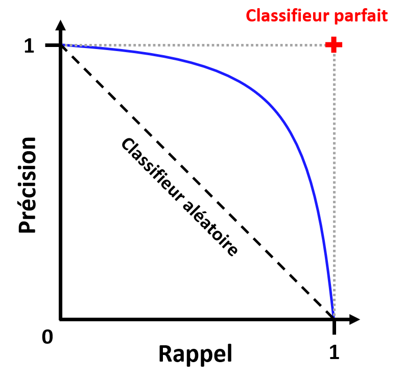
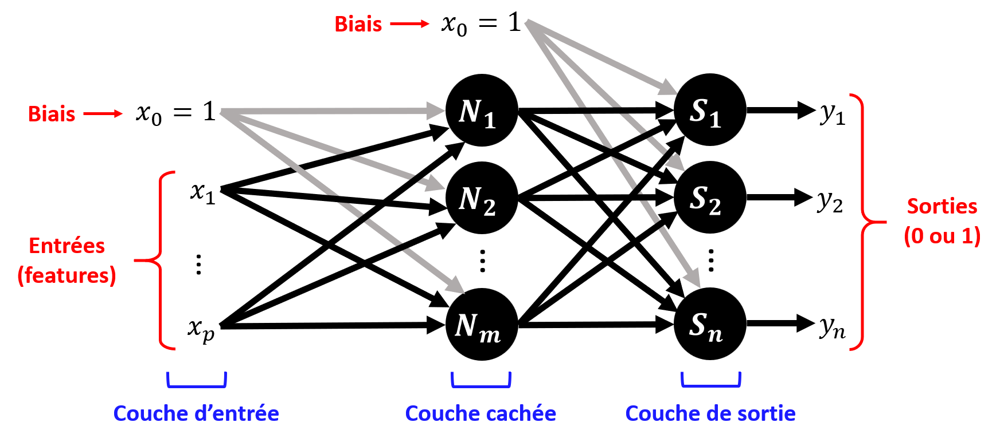

# Chapitre II : Classification supervisée

Ce chapitre est une introduction à la classification supervisée : principe, mesures de performances et méthodes de base.

---

## Problème de classification supervisée

Comme mentionné lors du Chapitre I, par "**classifier**" on entend associer une réalisation d'une variable **quantitative discrète** ou **qualitative** à un individu (labels), à partir des réalisations d'autres variables (features).
On appelle ces labels des "**classes**".

On parlera ici de "classification supervisée" car on va entrainer un modèle (aussi appelé "classifieur") à associer une classe à des individus, en se basant sur des données déjà labélisées.
Il s'agit donc bien d'un **apprentissage supervisé**.

L'idée est que le classifieur soit ensuite capable de **généraliser** : prédire la "classe" d'un nouvel individu.

### Les différents types de classification

Plutôt que de parler de "la" classification, on devrait par "des" classifications, car il existe plusieurs types de problèmes de classification.

Nous allons donc commencer par parler des différents types de classification, en illustrant avec un exemple : reconnaitre sur une photo un instrument de musique breton.

#### Binaire

Le type de classification le plus basique, et pour lequel tous les modèles de classification peuvent être entrainés, est la **classification binaire**.

Comme son nom l'indique, l'idée est simplement de résoudre un problème où l'on veut séparer les individus en **2 classes**.

Il peut s'agir de prédire l'appartenance à 2 classes exclusives dans un cas où il n'y a que 2 labels possibles, par exemple : "L'instrument sur la photo est-il une bombarde ou un biniou ?".
Ou alors il peut s'agir de prédire l'appartenance ou la non appartenance à une classe parmi d'autres, par exemple : "L'instrument sur la photo est-il une bombarde ou un autre instrument ?".

Beaucoup des méthodes et des critères de performances qui sont présentées dans ce cours ont d'abord été définis pour des problèmes binaires, avant d'être généralisés.

|Nota Bene :|
|:-|
|En général, un classifieur binaire ne retourne pas directement une prédiction de la classe de l'individu, mais une **probabilité d'appartenance à la classe** : un score entre 0 et 1.|
|Il faut alors placer un **seuil** sur cette probabilité pour choisir si l'individu appartient à la classe ou non (souvent 0.5 par défaut).|
|On appelle ce seuil **frontière de décision**.|
|Les implémentations Scikit-Learn des méthodes de classification peuvent souvent retourner soit directement la classe prédite, soit la probabilité d'appartenance à la classe.|

#### Multi-classe

Si on veut classer des individus dans **plus de 2 classes**, on va parler de **classification multi-classe**.

Par exemple, "L'instrument sur la photo est-il une bombarde ou un biniou" est un problème de classification binaire, alors que "L'instrument sur la photo est-il une bombarde, un biniou ou un tambour ?" est un problème de classification multi-classe.

Or, si toutes les méthodes sont capables de réaliser une classification binaires, toutes ne sont pas capables de réaliser une classification multi-classe.

Pour contourner ce problème, on va ramener ce problème à de **multiples classifications binaires**, avec une stratégie pour choisir la prédiction à retourner :

* **One-versus-All** : on entraine un classifieur binaire par classe, et la classe prédite pour un individu donné sera celle dont le classifieur aura retourné la probabilité la plus élevée.

* **One-versus-One** : on entraine un classifieur pour chaque couple de classes possible, et la classe prédite est celle qui aura gagné le plus de "duels" parmi les sorties des différents classifieurs.

Pour $N$ classes, la stratégie "One-versus-One" implique d'entrainer $N(N-1)/2$ classifieurs, là où la stratégie "One-versus-All" n'a besoin d'en entrainer que $N$.
Mais chaque modèle est entrainé sur un plus petit jeu de données pour la méthode "one-versus-one" que pour la méthode "one-versus-all"

**Le choix de stratégie dépendra donc de l'application**.

Les méthodes disponibles sous Scikit-Learn choisissent une stratégie par défaut, mais il est possible de la modifier.

#### Multi-étiquettes

Dans les types de classification précédents, on ne pouvait associer qu'une seule classe à un individu.

Cependant, pour certains problèmes il est possible qu'**un individu puisse faire partie de plusieurs classes à la fois**.

Par exemple, si le problème est "Quel instrument est sur cette photo ?", et que la photo contient une bombarde et un biniou, alors le morceau appartient à la fois à la classe "bombarde" et à la classe "biniou".

Certaines méthodes implémentées dans Scikit-Learn accèptent une matrices de labels en entrainement au lieu d'un vecteur, et d'autres non.
Il faut donc vérifier si la méthode que vous voulez utiliser supporte bien la classification multi-étiquettes.

Si un classifieur est multi-étiquettes, et que chaque étiquette est multi-classe, on dira le classifieur "**multi-sorties**".

### Exemple de problème

**Pourquoi est-on capables de reconnaitre le son d'un instrument de musique d'un autre ?**

Lorsqu'un instrument joue une note, le son émit ne contient jamais qu'une seule fréquence.
Il est en réalité constitué d'une "fréquence fondamentale" (la note que l'on veut jouer), et des "harmoniques" (des fréquences multiples de la fondamentale).

Pour une même note jouée, suivant l'instrument, les harmoniques n'auront pas la même amplitude comparée à la fondamentale.
C'est ce que l'on appelle le "timbre" de l'instrument.
Lorsque nous écoutons de la musique, et que nous reconnaissons le son d'un instrument, c'est grâce à son timbre.

Voici 3 exemples de spectres issus d'enregistrements d'une flute, d'un hautbois et d'une trompette jouant un La (440 Hz) :

On voit nettement la différence de timbre entre les 3 instruments.

D'où l'idée suivante : **peut-on entrainer un modèle à reconnaitre un instrument à partir d'un enregistrement ?**

Voici un jeu de données au format CSV, collectées à partir de milliers d'enregistrements d'une flute, d'un hautbois et d'une trompette jouant un La (440 Hz) : [Chap2_instruments_dataset](https://github.com/NicOudart/UVSQ_LSSI633_data_science/tree/master/datasets/Chap2_instruments_dataset.csv)

Le tableau de données qu'il contient est de la forme suivante :

|instrument|harmo1 |harmo2 |harmo3 |
|:--------:|:-----:|:-----:|:-----:|
|oboe      |11.842 |11.58  |10.28  |
|flute     |-17.083|-17.384|-21.496|
|trumpet   |-8.152 |-24.089|-23.813|
|oboe      |9.381  |12.434 |11.905 |
|oboe      |-1.217 |2.082  |16.275 |
|trumpet   |-3.294 |-13.812|-17.934|
|trumpet   |-4.118 |-13.485|-18.985|
|...       |...    |...    |...    |
|trumpet   |-7.762 |-5.934 |-23.308|
|flute     |-17.96 |-19.406|-22.409|
|oboe      |7.764  |6.618  |13.361 |

Il contient pour chacun des 5612 enregistrements le nom de l'instrument, et l'amplitude en dB des 3 premières harmoniques relativement à la fondamentale.

Notre problème de classification sera le suivant : **prédire l'instrument ayant joué un La à partir des amplitudes des 3 premières harmoniques**.

Voyons d'abord si une telle classification est possible à partir de ces données.

Une fois le fichier CSV téléchargé, il peut être importé sous Python en tant que DataFrame Pandas à partir de son chemin d'accès "input_path" :

~~~
import pandas as pd
df_dataset = pd.read_csv(input_path)
~~~

Il est possible avec Seaborn d'afficher ces données sous la forme d'une **matrice de corrélations**, avec chaque classe d'une couleur différente.
Ce type de représentation permet de vérifier la séparabilité des différentes classes à partir des features sélectionnés.

Voici la commande Seaborn :

~~~
import seaborn as sns
sns.pairplot(df_dataset,hue='instrument')
~~~

On obtient alors le graphique suivant :

On observe que les classes "flute", "oboe" et "trumpet" sont plutôt bien séparables à partir des amplitudes des 3 premières harmoniques.
Vouloir entrainer un modèle à reconnaitre un de ces instruments à partir de ces données à donc du sens.

**Il est à noter que nous avons ici grandement simplifié le problème et sa résolution pour les besoins de ce cours.**
**Une vraie stratégie de validation pour optimiser les hyperparamètres et éviter le sur-apprentissage ne sera pas appliquée**.

**L'idée est que nous verrons un exemple plus en détails en TP.**

## Mesures de performance

Nous allons passer en revue dans cette section les principaux indicateurs de performances applicables à tous les types de classification.

### Matrice de confusion

Pour chaque classe $C$ possible, lorsqu'un classifieur réalise une prédiction sur un individu, il y a 4 possibilités :

* Le classifieur a prédit $C$, et l'individu appartient bien à $C$ : c'est un **vrai positif** (noté TP).

* Le classifieur a prédit $C$, et l'individu n'appartient pas à $C$ : c'est un **faux positif** (noté FP).

* Le classifieur n'a pas prédit $C$, et l'individu n'appartient pas à $C$ : c'est un **vrai négatif** (noté TN).

* Le classifieur n'a pas prédit $C$, et l'individu appartient bien à $C$ : c'est un **faux négatif** (noté FN).

Tous les scores de performance pour la classification que nous allons voir se basent sur le nombre de TP, FP, TN et FN obtenus par le modèle sur un jeu d'individus labélisé.

Les indicateurs brutes que sont le nombre de TP, FP, TN et FN sont en général mis sous la forme d'un tableau, que l'on appelle **matrice de confusion**.

Voici à quoi ressemble ce tableau pour une seule classe d'un problème multi-classe, ou pour un problème de classification binaire :

On peut également représenter les résultats d'une classification multi-classe pour toutes les classes sous la forme d'une matrice de confusion.

Voici un exemple pour 5 classes $C_1$, $C_2$, $C_3$, $C_4$ et $C_5$ :

On peut alors lire ce tableau d'un point de vue général : la diagonale correspond aux vrais positifs à maximiser.
Mais on peut aussi le lire du point de vue d'une classe ($C_3$ dans notre illustration), et calculer les nombres de TP, FP, TN et FN correspondant.

La matrice de confusion est la représentation **la plus exhaustive possible** des performances d'un classifieur, mais elle est **d'autant plus difficile à lire que le nombre de classes est grand**.
Ceci peut rendre complexe la comparaison entre 2 classifieurs.

Pour cette raison, on va souvent utilisé des scores dérivés du tableau de confusion.

### Exactitude

Le score d'**exactitude** ("accuracy" en anglais) est le plus classique pour évaluer les performances d'un classifieur.

|Définition|
|:-|
|L'**exactitude** : est la taux d'individus classés correctement parmi tous les individus classés.|

Dans le cas d'une classification binaire, il s'agit donc de :

$\frac{TP+TN}{TP+FP+TN+FN}$

Dans le cas d'une classification multi-classe, il s'agira de la trace de la matrice de confusion divisée par le nombre total d'individus classés.

Si cet indicateur est intuitif et permet de condenser l'information en un score unique, il aura tendance à être biaisé s'il y a un fort déséquilibre entre classes.
En effet, comme on somme TP et TN, l'exactitude aura tendance à **favoriser la classe majoritaire**.

C'est pourquoi dans un cas déséquilibré, on préfèrera utiliser un duo de scores de performances : précision-rappel ou rappel-fausse alarme.

### Précision-rappel et score F1

Si la classe considérée est **majoritaire**, ou si pour notre application nous préférons **réduire les faux positifs** quitte à augmenter les faux négatifs, on utilisera plutôt les indicateurs de **précision** et de **rappel**.

|Définitions|
|:-|
|- La **précision** : est le taux d'individus attribués correctement à une classe parmi toutes les prédictions de cette classe.|
|- Le **rappel** ("sensibilité" ou "recall" en anglais) : est le taux d'individus attribués correctement à une classe tous les individus appartenant réellement à cette classe.|

Dans un cas binaire, il s'agit donc de :

* Précision : $\frac{TP}{TP+FP}$

* Rappel : $\frac{TP}{TP+FN}$

Ces 2 scores sont **antagonistes** : on doit donc choisir un **compromis** entre les 2 suivant notre application.

Si on veut obtenir un compromis donnant une précision et un rappel similaires, on peut utiliser la moyenne harmonique de ces 2 scores :

$F_1 = \frac{2}{\frac{1}{precision}+\frac{1}{rappel}}$

C'est ce que l'on appelle le **score F1**.

Mais si on veut trouver un compromis donnant une précision et un rappel en particulier, il faut utiliser une **courbe précision-rappel**.

L'idée est de faire varier le seuil de décision pour chaque classe, et d'afficher les compromis entre précision et rappel obtenus pour chaque seuil :

La ligne diagonale correspond à la performance théorique d'un classifieur aléatoire.

### Courbe ROC

Si la classe considérée est **minoritaire**, ou si pour notre application nous préférons **réduire les faux négatifs** quitte à augmenter les faux positifs, on utilisera plutôt les indicateurs de **rappel** et de **fausse alarme**.

|Définitions|
|:-|
|- Le taux de **fausse alarme** : est taux d'individus attribués incorrectement à une classe parmi tous les individus n'appartenant pas à cette classe.|

Pour des raisons historiques, on appelle souvent dans ce contexte le rappel "**taux de vrais positifs**" (TPR) et le taux de fausse alarme "**taux de faux positifs**" (FPR).

Dans un cas binaire, il s'agit donc de :

* TPR : $\frac{TP}{TP+FN}$

* FPR : $\frac{FP}{FP+TN}$

Ces 2 scores sont également **antagonistes** : on doit donc aussi choisir un **compromis** entre les 2 suivant notre application.

Une fois encore, pour trouver un compromis donnant un TPR et un FPR en particulier, on peut tracer les compromis obtenus pour différents seuils de décision.

On appelle ce type de courbe "Reicever Operating Caracteristic" (ROC) :

Le nom étrange de cette courbe a une origine historique : elle aurait été inventée durant la 2nde guerre mondiale, dans le cadre de la classification binaire de signaux radar entre "avion ennemi" et "bruit".  

## Méthodes de base

### Décision Bayesienne

La **décision Bayesienne**, aussi connue sous le nom de "classification Bayesienne naïve" est une méthode de classification se basant sur un **modèle probabiliste** des features, considérées **indépendantes**, et du **théorème de Bayes**.

#### Principe

Imaginons que nous avons un problème de classification avec $q$ **classes** $C_1$, $C_2$, ..., $C_q$.
Nous voulons prédire la classe à laquelle appartient un individu.

La probabilité de chaque classe $i$ notée $p(C_i)$, aussi appelée "**probabilité a priori**".

On a $\sum_{i=1}^{q} p(C_i) = 1$ et on peut facilement estimer les différents $p(C_i)$ à partir du nombre d'occurences de $C_i$ dans les données divisée par la taille de la base de données.

En ne connaissant que les probabilités a priori de chaque classe, nous serions obligés de classer n'importe quel individu comme appartenant à la classe $C_i$ ayant le $p(C_i)$ le plus élevé.
Nous aurions alors un classifieur retournant toujours la même classe. 
Pas très utile...

Or, nous avons en réalité accès à plus d'informations : nos fameuses "features", dont nous voulons nous servir pour prédire la classe d'un individu.

Mettons que nous avons accès à une feature d'intérêt pour cette classification. 
On notera $X$ l'espace des **observations** associé.

Pour déterminer la classe d'un individu, on peut alors partir du principe suivant : choisir le $C_i$ tel que $p(C_i \mid x)$ **soit maximal**.
Nous expliquerons pourquoi dans la suite.

On nomme $p(C_i \mid x)$ "**probabilités a posteriori**".

D'après le **théorème de Bayes** :

$p(C_i \mid x) = \frac{p(x \mid C_i)p(C_i)}{p(x)}$

avec $p(x) = \sum_{i=1}^{q} p(x \mid C_i)p(C_i)$

On nomme $p(x)$ la densité de "**probabilité d'observation**", et $p(x \mid C_i)$ la densité de "**probabilité conditionnelle d'observation**".

Toute la difficulté de la méthode est d'**estimer** $p(x \mid C_i)$.
On va en général chercher à **modéliser** ces densités de probabilité conditionnelle.

**NB :** Il est à noter que rechercher la classe $C_i$ maximisant $p(C_i \mid x)$ **est équivalent** à rechercher $C_i$ maximisant $p(x \mid C_i)p(C_i)$.
Il n'est donc en théorie pas utile de calculer $p(x)$ pour obtenir le classifieur.
Mais il est nécessaire d'avoir $p(x)$ pour obtenir des probabilités d'appartenance à une classe.

**Attention !** En général, il y a des recouvrements entre les différentes densités de probabilité conditionnelle.
On ne peut alors pas obtenir classifieur parfait.
On cherchera juste le modèle permettant de minimiser les erreurs de classification. 

**Cas particulier :** Si tous les $p(x \mid C_i)$ sont égaux, alors la feature sélectionnée n'est pas pertinente pour la classification.

Ce principe est **généralisable** aux cas de classifications avec $m$ features d'espaces de probabilité $X_1$, $X_2$, ... $X_m$.
On cherchera la classe $C_i$ qui maximise $p(C_i) \prod_{j=1}^{m}p(x_j \mid C_i)$.

#### Frontière de décision et erreur

Comme nous l'avons expliqué précédemment, sauf cas particulier, on ne peut pas obtenir un classifieur parfait.

On va donc essayer d'établir des **frontières de décision** entre les classes : des intervalles de $x$ pour lesquels on attribura une classe.
Et nous recherchons même les frontières de décision optimales : celles qui minimisent le risque d'erreurs.

Prenons un cas simple de classification binaire entre 2 classes $C_1$ et $C_2$.
Nous noterons $x = D$ la frontière de décision choisie.

On a alors 2 types d'erreurs de classification possibles : 

* Classifier l'individu en $C_1$ alors qu'il appartient à $C_2$.

* Classifier l'individu en $C_2$ alors qu'il appartient à $C_1$.

Les probabilités d'erreurs associées sont $\int_{-\infty}^{D} p(x \mid C_2)p(C_2) dx$ et $\int_{D}^{+\infty} p(x \mid C_1)p(C_1) dx$.

Elles correspondent aux aires représentées sur ce schéma : 

Pour obtenir la frontière de décision optimale $x = O$, on va chercher à minimiser la somme de ces erreurs.

L'aire entourée en vert correspond à ce que l'on appelle "l'**erreur réductible**" : c'est la portion de l'erreur totale que l'on peut réduire pour obtenir la frontière optimale.

On retrouve bien que :

* Si $p(C_1 \mid x) > p(C_2 \mid x)$ alors on classifie l'individu comme appartenant à $C_1$.

* Si $p(C_1 \mid x) < p(C_2 \mid x)$ alors on classifie l'individu comme appartenant à $C_2$.

On peut généraliser à $q$ classes : comme dit précédemment, pour obtenir les frontières de décision optimales, on choisi le $C_i$ tel que $p(C_i \mid x)$ **soit maximal**.

#### Choix du modèle

Comme nous l'avons expliqué, la décision Bayesienne nécessite un modèle des probabilités conditionnelles d'observation $p(x \mid C_i)$ pour chaque classe $C_i$.

Pour ce faire, on **ajuste une fonction de densité de probabilité** pour chaque $p(C_i \mid x)$ à notre jeu d'entrainement.

Ceci implique donc 2 choix :

- Une **fonction de densité de probabilité**, ce qui implique de faire une **hypothèse forte** sur la distribution des observations pour chaque classe.

- Une **méthode d'ajustement de loi de probabilité**.

La fonction de densité de probabilité la plus classique est celle de la **loi normale** : 

$f(x) = \frac{1}{\sigma \sqrt{2 \pi}} e^{- \frac{1}{2} (\frac{x - \mu}{\sigma})^2}$

avec 2 paramètres à ajuster $\mu$ (la moyenne) et $\sigma$ (l'écart-type).

La méthode d'ajustement la plus classique pour la décision Bayesienne est celle du **maximum de vraisemblance**.
C'est elle que nous allons détailler.

#### Maximum de vraisemblance

|Définition|
|:-|
|Soit une loi de probabilité $f(x,\theta)$, définie par des paramètres $\theta$.|
|Pour un échantillon observé $(x_1,x_2,...,x_n)$, on nomme **vraisemblance** ("likelihood" en anglais) la probabilité que cet échantillon provienne d'un tirage de $f(x,\theta)$.|
|Si les tirages sont indépendants, on peut exprimer la vraisemblance de la manière suivantes :|
|$L(x_1,x_2,...,x_n,\theta) = \prod_{k=1}^{n} f(x_k,\theta)$|

La méthode du **maximum de vraisemblance** découle du fait que le modèle $f$ de paramètres $\theta$ représentant le mieux les observations est celui qui **maximise** la vraisemblance, c'est-à-dire **la probabilité que l'échantillon provienne de cette loi**.

L'idée est donc de rechercher les $\theta$ maximisant $L(x_1,x_2,...,x_n,\theta)$.

Souvent, pour simplifier les calculs, on ne va pas rechercher le maximum de la vraisemblance, mais de la log-vraisemblance :

$log(L(x_1,x_2,...,x_n,\theta)) = \sum_{k=1}^{n} log(f(x_k,\theta))$

En effet, rechercher les paramètres $\theta$ maximisant $L$ ou $logL$ est équivalent, et rechercher un maximum implique un calcul de dérivée, ce qui est plus simple pour des sommes que pour des produits.

On va donc pour chaque paramètre $\theta_j$ de $\theta$ la valeur qui vérifie $\frac{\partial}{\partial{\theta_j}} \sum_{k=1}^{n} log(f(x_k,\theta)) = 0$.

Prenons l'exemple de la loi normale :

$f(x,\mu,\sigma) = \frac{1}{\sigma \sqrt{2 \pi}} e^{- \frac{1}{2} (\frac{x - \mu}{\sigma})^2}$

On cherchera alors les paramètres $\theta = (\mu,\sigma)$ vérifiant :

$\frac{\partial}{\partial{\theta}} \sum_{k=1}^{n} (-log(\sigma) - log(\sqrt{2 \pi}) - \frac{1}{2} (\frac{x - \mu}{\sigma})^2) = 0$

soit $\frac{\partial}{\partial{\theta}} (- n log(\sigma) - n log(\sqrt{2 \pi}) - \sum_{k=1}^{n} \frac{1}{2} (\frac{x - \mu}{\sigma})^2) = 0$

soit pour chaque paramètre :

$\frac{\partial}{\partial{\mu}} (- n log(\sigma) - n log(\sqrt{2 \pi}) - \sum_{k=1}^{n} \frac{1}{2} (\frac{x - \mu}{\sigma})^2) = 0$

$\frac{\partial}{\partial{\sigma}} (- n log(\sigma) - n log(\sqrt{2 \pi}) - \sum_{k=1}^{n} \frac{1}{2} (\frac{x - \mu}{\sigma})^2) = 0$

On montre alors que les paramètres vérifiant ces équations sont :

$\mu = \frac{1}{n} \sum_{k=1}^{n} x_k$ et $\sigma^2 = \frac{1}{n} \sum_{k=1}^{n} (x_k - \mu)^2$

Ce qui était attendu.

#### Implémentation Scipy

Afin de réaliser un ajustement de loi de probabilité, on peut utiliser la bibliothèque de calculs scientifiques Scipy, et en particulier son module de statistiques "scipy.stat".

Par exemple, pour un ajustement avec une loi normale, on pourra importer l'objet "norm" avec :

~~~
from scipy.stats import norm
~~~

On peut alors ajuster une loi normale à un ensemble d'observations contenu dans un conteneur `x_obs`, et récupérer la moyenne `mu` et l'écart-type `sigma` avec :

~~~
mu,sigma = norm.fit(x_obs)
~~~

Par défaut, la méthode du maximum de vraisemblance est utilisée.
Mais on peut également utiliser la "méthode des moments" (que nous ne présenterons pas dans ce cours), en ajoutant un paramètre `method = 'MM'` en entrée.

Une fois la loi normale ajustée, on a accès à la densité de probabilité `dp` associée à une réalisation `x` avec :

~~~
dp = norm.pdf(x,mu,sigma)
~~~

Bien d'autres lois de probabilité sont disponibles dans le module "scipy.stats", et fonctionnent sur le même principe que "norm".

#### Implémentation Scikit-Learn

Il est à noter qu'il existe aussi une implémentation de la classification Bayesienne dans Scikit-Learn, dans l'hypothèse de distributions des features suivant des lois normales.

Elle peut être importée avec :

~~~
from sklearn.naive_bayes import GaussianNB
~~~

On doit alors créer un objet "GaussianNB" qui contiendra notre modèle, ici `bayes_classifier` :

~~~
bayes_classifier = GaussianNB()
~~~

Il faut ensuite l'entrainer avec nos features et labels d'entrainement, nommés ici `feature_train` et `label_train` :

~~~
bayes_classifier.fit(feature_train,label_train)
~~~

Et enfin, on peut réaliser une prédiction à partir de features de test, nommés `feature_test` :

~~~
label_test = bayes_classifier.predict(feature_test)
~~~

Cette implémentation peut être pratique dans certains cas, mais elle ne permet pas de jouer sur les hyperparamètres suivants : la loi de probabilité et la méthode d'ajustement.
Une optimisation de ces hyperparamètres n'est donc pas possible avec Scikit-Learn.

#### Application à notre exemple

Nous allons à présent appliquer la classification Bayesienne à notre problème exemple.

Afin de rendre la visualisation plus facile, nous allons simplifier le problème :

Mettons que nous voulons juste effectuer une classification binaire de nos enregistrements, entre les classes "flute" ou "trompette", en utilisant comme unique feature l'amplitude relative de la 1ère harmonique.

Pour ce faire, nous importons le fichier CSV depuis son chemin `input_path` sous la forme d'un DataFrame, et nous sélectionnons les variables et les individus qui nous intéressent :

~~~
df_dataset = pd.read_csv(input_path)

df_dataset = df_dataset[['instrument','harmo1']]
df_dataset = df_dataset[(df_dataset['instrument']=='flute')|(df_dataset['instrument']=='trumpet')]
~~~

Nous diviserons ici nos données en un jeu d'entrainement (80%) et un jeu de test (20%), sous la forme de 2 DataFrames : 

~~~
df_train=df_dataset.sample(frac=0.8,random_state=0)
df_test=df_dataset.drop(df_train.index)
~~~

On peut alors tracer un histogramme de notre feature pour les données d'entrainement, en sépararant les 2 classes :

On peut noter qu'il y a peu de recouvrement entre les 2 distributions, ce qui laisse entrevoir qu'il est possible d'entrainer un modèle à classifier ces données.

En 1ère approche, nous choisissons d'ajuster à ces 2 distributions des modèles de lois normales.
Il faudra se poser la question de la pertinence de ce choix.

Tout d'abord, nous allons séparer le jeu d'entrainement en 2 Series (DataFrame Pandas ne contenant qu'une colonnes) suivant si l'instrument est une flute ou une trompette :

~~~
sr_harmo1_flute_train = df_train[df_train['instrument']=='flute']['harmo1']
sr_harmo1_trumpet_train = df_train[df_train['instrument']=='trumpet']['harmo1']
~~~

On peut alors réaliser nos 2 ajustements, et récupérer les paramètres $mu$ et $\sigma$ correspondants :

~~~
from scipy.stats import norm

mu_harmo1_flute,sig_harmo1_flute = norm.fit(sr_harmo1_flute_train)
mu_harmo1_trumpet,sig_harmo1_trumpet = norm.fit(sr_harmo1_trumpet_train)
~~~

Maintenant que nous avons les paramètres de nos modèles, nous pouvons évaluer la densité des probabilités conditionnelles pour la classe "flute" et la classe "trompette".

Voici par exemple 301 évaluations pour des valeurs d'amplitude de la 1ère harmonique entre -30 et 0 dB :

~~~
x_axis = np.linspace(-30,0,301)

proba_norm_flute = norm.pdf(x_axis,mean_harmo1_flute,sig_harmo1_flute)
proba_norm_trumpet = norm.pdf(x_axis,mean_harmo1_trumpet,sig_harmo1_trumpet)
~~~

Nous pouvons alors tracer les courbes correspondantes par-dessus notre histogramme (affiché en densité de probabilité) :

Si nos modèles ne paraissent pas complément inadaptés, on peut noter qu'ils ne capturent pas la légère asymétrie de nos distributions.
On pourrait donc se poser la question d'essayer d'autres lois de probabilités, asymétriques.

Continuons avec nos modèles pour les probabilités conditionnelles.

La prochaine étape est d'estimer la probabilité de chaque classe, à partir de leurs densités relatives :

~~~
proba_flute = len(sr_harmo1_flute_train)/len(df_train)
proba_trumpet = len(sr_harmo1_trumpet_train)/len(df_train)
~~~

On peut alors utiliser estimer la densité de probabilité d'observation :

~~~
proba_obs = proba_norm_flute*proba_flute + proba_norm_trumpet*proba_trumpet
~~~

Si nous l'affichons avec les histogrammes, nous pouvons vérifier qu'elle est bien cohérente avec la distribution des observations.

Enfin, nous pouvons calculer les probabilités a posteriori, en se basant sur la formule de Bayes :

~~~
proba_bayes_flute = proba_norm_flute*proba_flute/proba_obs
proba_bayes_trumpet = proba_norm_trumpet*proba_trumpet/proba_obs
~~~

On peut alors afficher ces probabilités, et tracer la frontière de décision :

La frontière de décision se trouve à environ -13.16 dB : 

* Si on mesure une 1ère harmonique ayant une amplitude inférieure, on classifiera l'instrument comme étant une flute.

* Si on mesure une 1ère harmonique ayant une amplitude supérieure, on classifiera l'instrument comme étant une trompette.

Comme nous l'avons mentionné précédemment, si la probabilité d'appartenance aux classes ne nous intéresse pas, nous pourrions juste comparer $p(x \mid C = 'flute')p(C='flute')$ et $p(x \mid C = 'trumpet')p(C='trumpet')$ pour classifier les observations. 

Maintenant que nous avons vu le principe, on voudrait pouvoir ré-entrainer notre modèle afin d'optimiser les hyperparamètres, et réaliser des prédictions sur les jeux d'entrainement et de test, le tout de manière efficace.

Dans ce but, nous pouvons mettre notre classification binaire Bayesienne sous la forme d'une classe `binary_bayes` avec 2 méthodes `train` et `predict` pour l'entrainement et la prédiction.
Voici un exemple d'implémentation :

~~~
class binary_bayes:
    
    def __init__(self,stat_model):
        
        self.stat_model = stat_model
        
        self.true_params = None
        self.false_params = None
        
        self.proba_true = None
    
    def train(self,x_true,x_false):
        
        self.true_params = self.stat_model.fit(x_true)
        self.false_params = self.stat_model.fit(x_false)
        
        len_true = len(x_true)
        len_false = len(x_false)
        self.proba_true = len_true/(len_true+len_false)
        
    def predict(self,x):
        
        proba_norm_true = self.stat_model.pdf(x,*self.true_params)
        proba_norm_false = self.stat_model.pdf(x,*self.false_params)
        
        proba_obs = proba_norm_true*self.proba_true + proba_norm_false*(1-self.proba_true)

        proba_bayes_true = proba_norm_true*self.proba_true/proba_obs
        
        return proba_bayes_true
~~~

On peut alors facilement définir un classifieur binaire "est-ce une flute ?" utilisant la loi normale telle qu'implémentée par Scipy :

~~~
from scipy.stats import norm

is_a_flute = binary_bayes(norm)
~~~

Entrainer ce classifieur sur notre jeu d'entrainement :

~~~
is_a_flute.train(sr_harmo1_flute_train,sr_harmo1_trumpet_train)
~~~

Et réaliser des prédictions sur nos données d'entrainement et de test :

~~~
prediction_train = (is_a_flute.predict(df_train['harmo1']))

prediction_test = (is_a_flute.predict(df_test['harmo1']))
~~~

En partant du principe que nous positionnons la frontière de décision à une probabilité d'appartenance à classe "flute" de 0.5, nous pouvons obtenir les matrices de confusion en entrainement et en test avec les commandes suivantes :

~~~
from sklearn.metrics import confusion_matrix

#Label encoding:
ground_truth_train = (df_train['instrument']=='flute').astype(int)
ground_truth_test = (df_test['instrument']=='flute').astype(int)

cm_train = confusion_matrix(ground_truth_train, prediction_train>0.5)
cm_test = confusion_matrix(ground_truth_test, prediction_test>0.5)
~~~

Voici les résultats en entrainement obtenus pour notre exemple :

On observe que les performances du modèle sont très similaires entre les données d'entrainement et de test.
Ceci tend à montrer que l'on a pas de problème de sur-ajustement important, ce qui laisse présager des performances similaires en généralisation.

Il n'y a aucun faux positif, mais on a quelques faux négatifs : parfois notre modèle classifie des enregistrements de flutes comme n'étant pas des flutes.

Suivant les applications, on peut vouloir choisir une frontière de décision différente, pour diminuer le nombre de faux négatifs, au prix d'une augmentation du nombre de faux positifs.
Afin de voir les effets d'un tel choix, on tracer une courbe ROC à partir des probabilités prédites par notre modèle :

~~~
from sklearn.metrics import roc_curve
fp_rate_train, tp_rate_train, thresholds_train = roc_curve(ground_truth_train, prediction_train)
fp_rate_test, tp_rate_test, thresholds_test = roc_curve(ground_truth_test, prediction_test)
~~~

#### Remarques

La méthode de la classification de Bayes a les **avantages** suivants :

* Elle fonctionne pour **tous les types de classification et variables**.

* Elle est relativement **simple** à mettre en place, avec **peu de paramètres**.

* Les décisions qu'elle prend sont complètement **expliquées** et **interprétables** : un humain peut les comprendre.

Mais cette méthode a aussi les **limites** suivantes :

* Elle fait l'hypothèse de l'**indépendance des variables** entre elles, ce qui dans la pratique limite son application aux problèmes avec peu de features.

* Elle fait une hypothèse forte sur la **distribution des observations** pour chaque variable. Il s'agit souvent d'une hypothèse de **normalité**.

### K Plus Proches Voisins

#### Principe

La méthode de la classification Bayesienne que nous venons de voir avait pour désavantage de nécessiter une hypothèse sur la distribution des observations.

Dans cette section, nous allons présenter une méthode ne nécessitant aucun a priori sur les données : les **K Plus Proches Voisin**, aussi connue sous l'acronyme KPPV.

Les KPPV est une méthode dite de "lazy learning" : il n'y a pas de réel apprentissage préalable à la prédiction.
Le jeu de données d'apprentissage est **stocké en mémoire**, et utilisé au moment de la prédiction.

L'idée est la suivante : pour classer un nouvel individu, on va calculer sa **distance aux $k$ individus les plus proches** dans les données d'entrainement.
On attibura alors à l'individu la classe **la plus représentée** parmi ses $k$ "plus proches voisins".

Prédire la classe d'un individu avec cette méthode implique :

(1) De mesurer la distance entre l'individu à classifier et **tous les individus du jeu d'entrainement**.
C'est ce que l'on appelle "l'approche brute". 
Et plus le jeu d'entrainement est grand, plus le temps de calcul sera long.
Pour cette raison, on choisi de stocker le jeu d'entrainement dans une **structure de donnée la plus efficace à parcourir** possible (exemple : KD-Tree).

(2) De choisir une **mesure de distance** adaptée au problème.

(3) De choisir le **nombre de "plus proches voisins"** à l'individu à considérer.

(4) De choisir de quelle manière on va affecter une classe à l'individu à partir de la classe de ses voisins : Un **vote majoritaire** ? 
S'il y a un gros déséquilibre entre classes, ce type de vote risque d'être biaisé.
On préférera alors un vote avec des **poids différents** suivant les classes.

#### Choix de la distance

Suivant le problème de classification auquel on est confronté, la "distance" entre 2 individus n'a pas le même sens.

En effet, on comprend bien qu'on utilisera pas les mêmes critères pour mesurer la distance entre 2 valeurs réelles, entre 2 images, ou entre 2 mots du dictionnaire.

D'où l'importance lorsqu'on utilise les KPPV de **choisir une mesure de distance pertinente** pour notre problème.

Parmi les mesures de distances classiques, on peut citer :

* **Distance Euclidienne** : 

Si on veut mesurer la distance Euclidienne entre $x$ et $y$, 2 vecteurs de dimension $n$ :

$D(x,y) = \sqrt{\sum_{i=1}^{n} (x_i - y_i)^2}$

Il s'agit de la mesure de distance la plus connue et la plus utilisée.
Elle fonctionne bien lorsque l'on est confrontés à des valeurs réelles continues, normalisées, et avec une dimensionnalité faible.

Cette distance peut être vue comme la mesure de distance associée à la norme 2.

* **Distance de Manhattan** :

Si on veut mesurer la distance de Manhattan entre $x$ et $y$, 2 vecteurs de dimension $n$ :

$D(x,y) = \sum_{i=1}^{n} \mid x_i - y_i \mid$

Suivant l'espace des features de notre problème, tracer une "ligne droite" entre individus peut ne pas avoir de sens.
La distance de Manhattan est alors une alternative à la distance Euclidienne.

Cette distance peut être vue comme la mesure de distance associée à la norme 1.

* **Distance de Chebychev** :

Si on veut mesurer la distance de Chebychev entre $x$ et $y$, 2 vecteurs de dimension $n$ :

$D(x,y) = max(\mid x_i - y_i \mid)$

La distance de Chebychev est assez peu utilisée, car elle a des cas d'applications très spécifiques.
(Par exemple, les déplacements d'un roi sur un jeu d'échec ou les automates cellulaires).

Cette distance peut être vue comme la mesure de distance associée à la norme infinie.

* **Minkowski** :

Si on veut mesurer la distance de Minkowski entre $x$ et $y$, 2 vecteurs de dimension $n$ :

$D(x,y) = (\sum_{i=1}^{n} \mid x_i - y_i \mid^p)^{1/p}$

La distance de Minkowski est une généralisation des 3 distances précédentes.
En effet, on remarque que si $p=1$ elle revient à la distance de Manhattan, si $p=2$ elle revient à la distance Euclidienne, et si $p$ tend vers l'infini elle revient à la distance de Chebychev.

Elle permet donc de chercher un compromis entre ces différentes distances.

* **Hamming** :

Soit 2 chaines de caractères de même taille. 
La distance de Hamming entre ces 2 chaines est alors égale au nombre de positions pour lesquelles les caractères sont différents.

Cette mesure de distance est couramment utilisée lorsque l'on veut comparer des morceaux de textes caractère par caractère, ou de manière générale pour des données qualitatives.

* **Similarité cosinus** :

Si on veut mesurer la "similarité cosinus" entre 2 vecteurs $x$ et $y$ :

$D(x,y) = cos(\theta) = \frac{x.y}{\|x\| \|y\|}$

Il s'agit du cosinus de l'angle entre les 2 vecteurs.

Cette mesure de distance est couramment utilisée lorsque l'on doit comparer des vecteurs de haute dimensionnalité, et où la norme du vecteur a peu d'importance.
Par exemple, c'est la mesure de distance privilégiée pour de la "fouille de texte" (comparaison mot à mot de chaines de caractère).

La distance est donc un **hyperparamètre à optimiser** lorsque l'on utilise les KPPV.

#### Choix du paramètre K

Il est évident que le choix de $k$ va avoir un impact sur les prédictions obtenues à partir des données d'entrainement.
C'est donc également un **hyperparamètre à optimiser**.

Pour choisir des valeurs de $k$ à tester, on peut partir des grands principes suivants :

* S'il y a un fort **déséquilibre** entre classes, il vaut mieux ne pas choisir un $k$ **faible**.

* S'il y a beaucoup de **recouvrement** entre les classes, il vaut mieux choisir un $k$ **élevé**.

* Avec un $k$ trop **faible** on risque le **sur-apprentissage**.

* Avec un $k$ trop **grand** on risque le **sous-apprentissage**.

Pour éviter les cas d'égalité, on va en général choisir une valeur de $k$ impaire.

#### Implémentation Scikit-Learn

Il existe une implémentation Scikit-Learn de la méthode des KPPV.

Elle peut être importée avec :

~~~
from sklearn.neighbors import KNeighborsClassifier
~~~

On peut ensuite initialiser un classifieur KPPV `knn` avec un objet "KNeighborsClassifier" de paramètre `k` correspondant au nombre de plus proches voisins :

~~~
knn = KNeighborsClassifier(n_neighbors=k)
~~~

Pour donner le jeu d'entrainement (features avec `feature_train` et labels avec `label_train`) à ce classifieur, on utilise la méthode :

~~~
knn.fit(feature_train,label_train)
~~~

On peut à présent réaliser des prédictions `label_test` à partir de features de test `feature_test` :

~~~
label_test = knn.predict(feature_test)
~~~

Si on veut effectuer un test de notre classifieur sur un jeu de données labéliser, on peut obtenir un score d'exactitude avec la commande :

~~~
knn.score(feature_test,label_test)
~~~

#### Outils de visualisation MLxtend

Pour afficher les frontières de décision données par un classifieur dans un cas 1D ou 2D, il existe une fonction de la bibliothèque "MLxtend".

Une fois la bibliothèque installée, vous pouvez importer la fonction avec :

~~~
from mlxtend.plotting import plot_decision_regions
~~~

Pour afficher les frontières de décision d'une classifieur `model`, avec les données d'entrainement `feature_train` et `label_train`, on utilisera la méthode :

~~~
plot_decision_regions(feature_train, label_train, clf=model)
~~~

Pour un problème de dimensionnalité plus élevée que 2, la visualisation des frontières de décision est toujours difficile.

#### Application à notre exemple

Nous allons à présent appliquer les KPPV à notre problème exemple.

Afin de rendre la visualisation plus facile, nous allons simplifier le problème :

Mettons que nous voulons effectuer une classification de nos enregistrements entre les classes "flute", "hautbois" ou "trompette", en utilisant en features l'amplitude relative de la 1ère harmonique et de la 2ème harmonique.

Tout d'abord, nous importons notre fichier CSV sous la forme d'un DataFrame, depuis le chemin `input_path` :
~~~
df_dataset = pd.read_csv(input_path)
~~~

Même si en théorie les KPPV n'ont pas besoin de labels numériques pour fonctionner, certaines des fonctions que nous utiliserons dans la suite ne fonctionnent qu'avec des valeurs numériques.
Nous allons donc encoder les labels "par étiquette" :

~~~
from sklearn.preprocessing import LabelEncoder
encoder = LabelEncoder()
df_dataset['instrument'] = encoder.fit_transform(df_dataset['instrument'])
~~~

Nous récupérons ensuite les features et les labels que nous allons utiliser dans 2 DataFrames :

~~~
df_features = df_dataset[['harmo1','harmo2']]
df_labels = df_dataset['instrument']
~~~

Nous séparons ensuite nos données en un jeu d'entrainement (80%) et un jeu de test (20%), sous la forme de 4 DataFrames (2 pour les features, 2 pour les labels) : 

~~~
from sklearn.model_selection import train_test_split
df_features_train, df_features_test, df_labels_train, df_labels_test = train_test_split(df_features,df_labels,test_size=0.2,random_state=0)
~~~

Maintenant que les données sont prêtes, nous pouvons créer notre classifieur.
Voici comment initialiser un classifieur KPPV avec $k=3$ :

~~~
from sklearn.neighbors import KNeighborsClassifier
knn = KNeighborsClassifier(n_neighbors=3)
~~~

Pour lui fournir les données d'entrainement, comme vu précédemment, il nous suffit d'utiliser la commande suivante :

~~~
knn.fit(df_features_train,df_labels_train)
~~~

Nous pouvons à présent utiliser notre modèle pour classifier des données.
Tout d'abord, nous allons évaluer les performances de notre modèle en entrainement et en test.

On peut déjà mesurer l'exactitude de notre classifieur sur ces 2 jeux de données :

~~~
print(knn.score(df_features_train,df_labels_train))
print(knn.score(df_features_test,df_labels_test))
~~~

Pour $k=3$, on obtient plus de 99.4% d'exactitude en entrainement, et environ 98.8% d'exactitude en test.

Ces scores laissent à penser que notre modèle aura de plutôt bonnes performances en généralisation. 
Mais n'oublions pas que l'exactitude peut être biaisée en cas de déséquilibre entre classes.
Dans de tels cas, d'autres indicateurs doivent être utilisés.

Voici une matrice de confusion complète pour nous aider à conclure :

On observe qu'à l'entrainement comme en test, le hautbois est très bien séparé des autres instruments, alors que la trompette et la flute sont parfois confondus.
Ce résultat était prévisible au vu de la matrice de corrélations que nous avions obtenue lors de notre étude préliminaire.
Les proportions d'erreurs restent cependant relativement faibles comparées aux nombres d'observations.

Nous n'avons pour l'instant testé qu'une valeur de $k$.
Pour visualiser l'effet de cet hyperparamètre, nous pouvons utiliser les affichages graphiques de la bibliothèque MLxtend.

Voici les graphiques obtenus pour $k=3$ (volontairement faible) et $k=31$ (volontairement élevé) :

On peut noter que comme attendu, le choix de $k$ a le plus d'effet à la frontière entre "flute" et "trompette".
En effet, comme il y a du recouvrement entre ces 2 classes, on sait qu'il vaut mieux choisir un $k$ élevé pour éviter le sur-apprentissage.
Ceci est confirmé par le "lissage" de la frontière de décision lorsque l'on utilise $k=31$.

Le choix d'un $k$ élevé a donc l'air plus approprié ici, mais il faudrait réaliser une réelle optimisation de cet hyperparamètre.

Par défaut, la distance utilisée par l'implémentation Scikit-Learn des KPPV est la distance Euclidienne.
Nous pouvons également réaliser des affichages pour visualiser l'impact de différentes distances pour une même valeur de $k$.

Voici le résultat pour la distance Euclidienne et la distance de Manhattan, avec $k=31$.

On observe en effet que le choix de la distance impacte significativement les frontières de décision obtenues, même s'il est difficile ici de juger de la pertinence d'une des 2 distances essayées.
Tout comme pour $k$, il faudrait réaliser une véritable optimisation de cet hyperparamètre.

#### Remarques

La méthode des KPPV a les **avantages** suivants :

* Il s'agit d'une méthode non-paramétrique, qui ne fait **aucune hypothèse** sur la structure des données.

* Elle est relativement simple, et n'a **que 2 hyperparamètres** ($k$ et la distance), ce qui est peu comparé à certaines méthodes.

* Si de nouvelles observations doivent être ajoutées au jeu d'entrainement, **la mise à jour du modèle est directe**.

Mais cette méthode a aussi les **limites** suivantes :

* Le modèle ayant besoin de stocker les données d'entrainement, il peut vite devenir **très lourd**.

* Elle fonctionne mal avec des données de **grande dimension**.

* Elle est très sujette au **sur-apprentissage**.

### Perceptron multicouche

La méthode de classification que nous allons voir à présent est une ouverture vers les **réseaux de neurones artificiels**, et la discipline qui leur est associée : l'**apprentissag profond** (ou "Deep Learning" en anglais).

#### Perceptron : un neurone artificiel

Lorsque l'on parle d'apprentissage pour un humain, on pense tout de suite à son cerveau, et plus particulièrement à ses **neurones**.

Un neurone est en effet une **machine à apprendre** : 

Il prend plusieurs signaux électriques en entrée, donne plus ou moins d'importance à chacun, et transmet ou non un signal électrique en sortie en fonction de ces entrées pondérées avec un seuil.
Le neurone apprendra les poids à donner à chaque entrée pour fournir une sortie pertinente pour une application.

Un neurone se comporte donc comme un **classifieur binaire**.
D'où l'idée séduisante de s'inspirer des neurones pour l'apprentissage de ce type de modèle.

Le 1er modèle mathématique d'un neurone, appelé "neurone formel" ou "neurone artificiel", est proposé par McCulloch et Pitts en 1943.
Dans le cadre de l'apprentissage automatique, il est plus connu sous le nom de "**perceptron**", concept inventé par Rosenblatt en 1957.

Voici le principe du perceptron "historique" de 1957 :

* Les $p$ réalisations de nos $p$ features correspondant à un individu sont fournies comme $p$ **entrées** à notre neurone.
Une entrée supplémentaire toujours fixée à 1 sera également fournie, on la nommera "**biais**".

* On applique à chaque entrée $x_i$ un coefficient $w_i$.
C'est ce que l'on appellera les **paramètres** du modèle.

* Toutes les entrées $x_i$ pondérées par $w_i$ sont **sommées**, donnant la combinaison **linéaire** $w_0 + w_1 x_1 + w_2 x_2 + ... + w_p x_p$.

* Un **seuil** est finalement appliqué à cette somme : suivant si elle dépasse ou non une certaine valeur, la **sortie** sera soit 0 ou 1, soit -1 ou 1 suivant la fonction de seuil choisie.

L'apprentissage de ce modèle consistera en l'**optimisation des paramètres**, afin qu'à partir des features il soit capable d'associer ou non l'individu à une classe (0 ou 1 en sortie).

On utilisera le processus d'entrainement suivant :

* On initialise les paramètres aléatoirement.

* On fait passer un à un les individus du jeu d'entrainement à travers le modèle.

* Pour chaque individu on compare la sortie du modèle à celle attendue, et on met à jour les paramètres en conséquence.

* On repète les 2 étapes précédentes jusqu'à convergence.

On appelle la fonction apprise $f(x_1,x_2,...,x_p) = w_0 + w_1 x_1 + w_2 x_2 + ... + w_p x_p$ la **fonction discriminante**.

Comme cette fonction est linéaire, le modèle ne pourra établir que des **frontières de décision linéaires** (un point en 1D, une droite en 2D, un plan en 3D, un hyperplan dans le cas général).

Nous verrons que ceci est assez limitant en pratique : **tous les problèmes ne sont pas linéairement séparables !**

Voici une représentation schématique d'une frontière de décision 2D :

Comme nous l'avons expliqué précédemment, on peut réaliser de la classification multi-classe à partir de plusieurs classifieurs binaires, avec une stratégie One-versus-All ou One-Versus-One.
Pour un perceptron, il suffira donc d'utiliser **plusieurs neurones en parallèle** avec les mêmes entrées.

Voici un exemple de $n$ perceptrons $N$ en parallèle pour $n$ classes :

Pour pouvoir entrainer un perceptron, il reste à choisir une méthode pour **mettre à jour les paramètres** du modèle à partir des erreurs de prédiction.

La "règle d'apprentissage du perceptron" proposée par Rosenblatt est la suivante.
A l'itération $k$, pour le $i$-ème paramètre, on applique :

$w_i^{(k+1)} = w_i^{(k)} - \gamma (y^{(k)}-\hat{y}^{(k)})$

avec $y$ la sortie attendue, et $\hat{y}$ la prédiction.

On reconnait une méthode type **descente de gradient** (voir Chapitre 1), mais très simple.

Ici, on ne calcule pas le gradient de la fonction de coût à partir de la totalité du jeu d'entrainement, mais à partir d'un seul individu.
Ce qui rend cet algorithme d'optimisation rapide, mais aussi sensible aux minima locaux.

Néanmoins, on peut montrer que **si les classes sont linéairement séparables** alors la méthode **convergence forcément**.
C'est le "théorème de convergence du perceptron".

Par contre, dans les cas **non-linéairement séparables**, cette méthode **ne donnera pas de résultats satisfaisants**.

#### Perceptron multicouche : un réseau de neurones artificiels

Le perceptron est une 1ère approche simple à mettre en place et à entrainer.
Mais il n'est applicable en pratique que pour les problèmes linéairement séparables.

C'est pourquoi dans les années 1960, a émergé l'idée de relier plusieurs perceptron en sens direct.
On appellera ce type de **réseau de neurones** un **perceptron multicouche** (PMC).

L'idée est la suivante : si une combinaison linéaire avec un seuil ne peut produire que des frontières de décisions linéaires, une combinaison de séparateurs linéaires avec chacun un seuil peut donner un **séparateur non-linéaire**. 

Le PMC le plus basique possède **3 couches** totalement connectées :

* La **couche d'entrée** : il s'agit simplement des différentes features d'entrée du modèle.

* La **couche cachée** : une couche de neurones (perceptrons), chacun ayant ses paramètres, son biais, son seuil.
Elle est "cachée" car ses sorties sont invisibles pour l'utilisateur.

* La **couche de sortie** : une couche de neurone en fin de réseau, chacun ayant ses paramètres, son biais, son seuil, qui va renvoyer la sortie du modèle pour chaque classe.

On peut démontrer que ce modèle est capable de tracer **n'importe quelle frontière de décision**, à condition d'avoir assez de neurones dans la couche cachée.
C'est ce que l'on appelle le **théorème de l'approximation universelle**.

Le problème est que plus la frontière de décision à tracer est complexe, et plus il faut de neurones dans la couche limite.

Pour résoudre ce problème, on peut ajouter plusieurs couches cachées entre les couches d'entrée et de sortie : pour un nombre de neurones par couche donné, plus on aura de couches, et plus complexes les frontières de décisions pourront être.
Dès que l'on a plus d'une couche cachée, on parle d'**apprentissage profond** ("Deep Learning").

Nous comprenons bien le potentiel du PMC... à condition de pouvoir l'entrainer !

En effet, comment réussir à optimiser efficacement les paramètres de nos différentes couches, sachant que les couches sont totalement connectées ?

Ce problème est resté un point de blocage jusqu'en 1985, grâce aux travaux de Rumlhart et son équipe.
La méthode qu'ils ont proposée pour entrainer un PMC, encore utilisée aujourd'hui, est connue sous le nom de **rétropropagation du gradient**.

#### Retropropagation du gradient

Voici le principe sur lequel fonctionne l'algorithme de la propagation du gradient :

|Algorithme de retropropagation du gradient|
|:-|
|Les paramètres du modèle sont initialisés aléatoirement.|
|A chaque itération (époque) de l'algorithme :|
|- Un échantillon d'individus est sélectionné.|
|- **Passage direct** : cet échantillon est fourni en entrée du modèle, et la sortie est récupérée.|
|- Une **fonction de coût** est utilisée pour évaluer l'erreur entre la sortie du modèle et ce qui était attendu.|
|- **Passage inverse** : le gradient de l'erreur associée à chaque paramètre est calculé en évaluant la contribution de chaque paramètre à l'erreur, en allant de la sortie vers l'entrée.|
|- Ces gradients sont fournis à l'algorithme de **descente de gradient** (voir Chapitre 1), qui va mettre à jour les paramètres du modèle.|

On en déduit que plus le nombre de couches cachée et de neurones par couche cachée sera élevé, plus l'apprentissage sera long.
Aussi, un nombre de couches trop élevé peut rendre difficile l'apprentissage des couches les plus en amont : un phénomène connu sous le nom de "problème de la disparition du grandient".

Pour que cet algorithme fonctionne avec le PMC, il a fallu modifier la fonction de sortie des neurones.

En effet, la fonction "seuil" ne permet pas de calculer un gradient : elle a un problème de différentiabilité, et une pente nulle partout sauf en un point.

C'est pourquoi d'autres "**fonctions d'activation**" sont utilisées en sortie des neurones d'un PMC.

On peut citer les 3 plus utilisées :

* **Sigmoïde** : $g(u) = \frac{1}{1+exp(-u)}$

Il s'agit de la fonction historique, directement inspirée de la fonction d'activation d'un neurone biologique.
Elle a l'avantage d'être continue et à dérivée non nulle partout.
Elle retourne un score entre 0 et 1.

* **Tangente hyperbolique** : $g(u) = tanh(u)$

Tout comme la sigmoïde, elle a une forme proche de la fonction d'activation d'un neurone biologique.
Elle est également continue et à dérivée non nulle partout.
Elle retourne un score entre -1 et 1.

* **ReLU** : $g(u) = max(0,u)$
Très utilisée depuis les années 2010, cette fonction n'a aucune inspiration biologique.
Elle a un problème de dérivabilité en 0, et elle ne retourne pas un score borné.
Par contre, elle permet de lutter contre les problème de "disparition du gradient".

Lorsque l'on veut résoudre un problème de classification multi-classe (mais pas multi-sorties) avec un PMC, au lieu d'une approche One-versus-All ou One-versus-One, on peut utiliser la fonction d'activation suivante :

* **Softmax** : pour chaque neurone de sortie $i$ on calcule $g(y_i) = \frac{e^{y_i}}{\sum_{j=1}^{n} e^{y_j}}$ et on retient la classe correspondant à la sortie maximisant cette fonction.

L'idée est que cette fonction prend en entrée les scores renvoyés par chaque neurone de sortie, et les transforme en probabilité d'appartenance à chaque classe (la somme donnant 1).

|Nota Bene|
|:-|
|Pour que l'apprentissage d'un perceptron ou d'un PMC se déroule correctement, il est recommandé d'effectuer une **transformation des données** d'entrée (voir Chapitre 1), afin d'éviter que le modèle donne artificiellement plus de poids à une feature juste parce qu'elle varie sur une plus grande plage de valeurs.|

#### Choix des hyperparamètres

Une des difficulté de l'apprentissage d'un PMC est le nombre élevé de paramètres et d'hyperparamètres à optimiser.
Ceci rend le PMC particulièrement **sensible au sur-apprentissage**.

Une stratégie de validation par exclusion ou de validation croisée est donc plus que recommandée !

Parmi les **hyperparamètres** à optimiser, on peut citer :

* Le nombre de couches cachées.

* Le nombre de neurones par couche cachée.

* La fenêtre d'activation pour les couches cachées.

* La fenêtre d'activation pour la couche de sortie.

* Le taux d'apprentissage pour la descente de gradient.

* Le nombre maximum d'époques d'apprentissage, et pratiquer ou non de l'arrêt prématuré.

* La fonction de coût utilisée pour l'apprentissage.

De plus, l'initialisation des paramètre du modèle se faisant de manière aléatoire, 2 apprentissages ne donneront pas le même modèle.
Il convient donc de tester plusieurs initialisations.

#### Implémentation Scikit-Learn

Il existe une implémentation Scikit-Learn du PMC pour la classification.

Elle peut être importée avec :

~~~
from sklearn.neural_network import MLPClassifier
~~~

On peut ensuite initialiser un classifieur PMC `mlp` avec les hyperparamètres par défaut en utilisant la commande :

~~~
mlp = MLPClassifier()
~~~

Nous verrons plus loin quels sont ces hyperparamètres.

Pour donner le jeu d'entrainement (features avec `feature_train` et labels avec `label_train`) à ce classifieur, on utilise la méthode :

~~~
mlp.fit(feature_train,label_train)
~~~

On peut à présent réaliser des prédictions `label_test` à partir de features de test `feature_test` :

~~~
label_test = mlp.predict(feature_test)
~~~

Si on veut effectuer un test de notre classifieur sur un jeu de données labéliser, on peut obtenir un score d'exactitude avec la commande :

~~~
mlp.score(feature_test,label_test)
~~~

Voici les hyperparamètres par défaut de l'implémentation Scikit-Learn du PMC :

* Nombre de couches cachées : 1

* Nombre de neurones par couche cachée : 100

* La fenêtre d'activation pour les couches cachées : ReLU

* La fenêtre d'activation pour la couche de sortie : Sigmoïde si binaire, Softmax si multi-classe (non modifiable)

* Le taux d'apprentissage pour la descente de gradient : 0.001

* Le nombre maximum d'époques d'apprentissage : 200 (par défaut sans arrêt prématuré, mais on peut l'activer)

* La fonction de coût : Log-loss (non modifiable)

Ces hyperparamètres sont presque tous modifiables par l'utilisateur.

#### Application à notre exemple

Nous allons à présent appliquer le PMC par défaut de Scikit-Learn à notre problème exemple.

Cette fois-ci, nous n'allons pas simplifier notre exemple : nous traiterons directement le problème 3D.

Comme pour les exemples précédents, nous importons notre fichier CSV sous la forme d'un DataFrame, depuis le chemin `input_path` :

~~~
df_dataset = pd.read_csv(input_path)
~~~

Nous allons ensuite encoder les labels "par étiquette" :

~~~
from sklearn.preprocessing import LabelEncoder
encoder = LabelEncoder()
df_dataset['instrument'] = encoder.fit_transform(df_dataset['instrument'])
~~~

Nous récupérons ensuite les features et les labels que nous allons utiliser dans 2 DataFrames :

~~~
df_features = df_dataset[['harmo1','harmo2','harmo3']]
df_labels = df_dataset['instrument']
~~~

Nous séparons ensuite nos données en un jeu d'entrainement (80%) et un jeu de test (20%), sous la forme de 4 DataFrames (2 pour les features, 2 pour les labels) : 

~~~
from sklearn.model_selection import train_test_split
df_features_train, df_features_test, df_labels_train, df_labels_test = train_test_split(df_features,df_labels,test_size=0.2,random_state=0)
~~~

Afin d'aider le PMC à converger, nous allons effectuer une transformation min-max (voir Chapitre 1).

**Attention ! Il faut calibrer la transformation sur les données d'entrainement, puis l'appliquer aux jeux d'entrainement et de test !**

~~~
from sklearn.preprocessing import MinMaxScaler
scaler = MinMaxScaler()
scaler.fit(df_features_train)
df_features_train = scaler.transform(df_features_train)
df_features_test = scaler.transform(df_features_test)
~~~

Maintenant que les données sont prêtes, nous pouvons créer notre classifieur.
Voici comment initialiser un classifieur PMC avec les paramètres par défaut :

~~~
from sklearn.neural_network import MLPClassifier
mlp = MLPClassifier()
~~~

Pour l'entrainer, il nous suffit d'utiliser la commande suivante :

~~~
mlp.fit(df_features_train,df_labels_train)
~~~

Nous pouvons à présent utiliser notre modèle pour classifier des données.
Tout d'abord, nous allons évaluer les performances de notre modèle en entrainement et en test.

On peut déjà mesurer l'exactitude de notre classifieur sur ces 2 jeux de données :

~~~
print(mlp.score(df_features_train,df_labels_train))
print(mlp.score(df_features_test,df_labels_test))
~~~

On obtient facilement plus de 99% d'exactitude en entrainement, et plus de 98.5% d'exactitude en test.
Ces résultats laissent à pense que les performances en généralisation de notre modèle seront plutôt bonnes.

Mais comme nous l'avons fait remarquer plus tôt, le PMC est sensible au sur-apprentissage.
Pour cette raison, on peut vouloir appliquer la méthode de régularisation par "arrêt prématuré" (voir Chapitre 1).

Si on active le paramètre `early_stopping` du classifieur PMC de Scikit-Learn, au moment de l'apprentissage il va automatiquement mettre de côté une partie du jeu d'entrainement pour faire un jeu de validation.
On peut même choisir la fraction du jeu d'entrainement à utiliser pour la validation, avec le paramètre `validation_fraction`.

Voici un exemple de définition d'un classifieur, avec de l'arrêt prématuré et 20% des données d'entrainement utilisées pour la validation :

~~~
mlp = MLPClassifier(early_stopping=True,validation_fraction=0.2)
~~~

Il y a aussi une astuce pour afficher l'évaluation de la fonction de coût au cours des époques, pour l'ensemble d'entrainement et de validation.
Elle se base sur :

* Extraire le jeu de validation avec la méthode `train_test_split` de Scikit-Learn.

* Utiliser la méthode `partial_fit` de notre classifieur PMC, qui permet de réaliser une itération à la fois.

* Récupérer la valeur de la fonction de coût sur le jeu d'entrainement, avec l'attribut `loss_` de notre classifieur.

* Evaluer la valeur de la fonction de coût sur le jeu de validation, en utilisant la fonction `log_loss` de Scikit-Learn.

Voici l'affichage des 2 courbes Matplotlib obtenues sur notre base de données, pour 50 époques :

~~~
import matplotlib.pyplot as plt
from sklearn.metrics import log_loss

df_features_train, df_features_validation, df_labels_train, df_labels_validation = train_test_split(df_features_train,df_labels_train,test_size=0.2,random_state=0)

mlp = MLPClassifier()

loss_train = []
loss_validation = []

for idx in range(50):
    mlp.partial_fit(df_features_train,df_labels_train,classes=[0,1,2])
    loss_train.append(mlp.loss_)
    loss_validation.append(log_loss(df_labels_validation,mlp.predict_proba(df_features_validation)))

plt.plot(loss_train, label="train loss",c='r')
plt.plot(loss_validation, label="validation loss",c='g')
plt.xlabel('Epoques')
plt.ylabel('Fonction de coût')
plt.legend()
~~~

Les performances obtenues avec ce modèle sont déjà excellentes, mais **il faudrait à présent se baser sur ces codes pour effectuer une optimisation des hyperparamètres.**

#### Remarques

La méthode du Perceptron Multi-Couche a les **avantages** suivants :

* Elle permet de dessiner des **frontières de décision complexes** entre les classes sans faire de grosses hypothèses statistiques au préalable.

* Une fois le modèle entrainé, il prend **moins de mémoire** et est **plus rapide** pour faire des prédiction que les KPPV.

* On peut entrainer ce type de modèle sur de **très grandes bases de données**.

Mais cette méthode a aussi les **limites** suivantes :

* Elle a de **nombreux paramètres et hyperparamètres** à optimiser.

* Elle est **sensible au sur-apprentissage**.

* Les décisions qu'elle prend sont **difficilement expliquées** et **interprétables** : il est difficile voir impossible pour un humain de les comprendre.
On parle de "boîte noire".

* L'initialisation de la méthode se faisant de manière **aléatoire**, 2 apprentissages ne donneront pas exactement le même modèle.

Les réseaux de neurones sont à la base des modèles d'apprentissage modernes, fondant ainsi une nouvelle sous-discipline : l'**apprentissage profond**.

**Nous verrons dans le chapitre suivant que le PMC peut aussi être utilisé pour résoudre des problèmes de régression...**