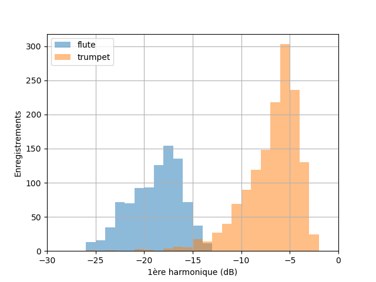

# Chapitre II : Classification supervisée

Ce chapitre est une introduction à la classification supervisée : principe, mesures de performances et méthodes de base.

---

## Problème de classification

### Principe de la classification supervisée

Comme mentionné lors du Chapitre I, par "**classifier**" on entend associer une réalisation d'une variable **quantitative discrète** ou **qualitative** à un individu (labels), à partir des réalisations d'autres variables (features).

### Les différents types de classification

#### Binaire

#### Multi-classes

#### Multi-étiquettes

#### Multi-sorties

### Exemple de problème

**Pourquoi est-on capables de reconnaitre le son d'un instrument de musique d'un autre ?**

Lorsqu'un instrument joue une note, le son émit ne contient jamais qu'une seule fréquence.
Il est en réalité constitué d'une "fréquence fondamentale" (la note que l'on veut jouer), et des "harmoniques" (des fréquences multiples de la fondamentale).

Pour une même note jouée, suivant l'instrument, les harmoniques n'auront pas la même amplitude comparée à la fondamentale.
C'est ce que l'on appelle le "timbre" de l'instrument.
Lorsque nous écoutons de la musique, et que nous reconnaissons le son d'un instrument, c'est grâce à son timbre.

Voici 3 exemples de spectres issus d'enregistrements d'une flute, d'un hautbois et d'une trompette jouant un La (440 Hz) :

On voit nettement la différence de timbre entre les 3 instruments.

D'où l'idée suivante : **peut-on entrainer un modèle à reconnaitre un instrument à partir d'un enregistrement ?**

Voici un jeu de données au format CSV, collectées à partir de milliers d'enregistrements d'une flute, d'un hautbois et d'une trompette jouant un La (440 Hz) : [Chap2_instruments_dataset](https://github.com/NicOudart/UVSQ_LSSI633_data_science/tree/master/datasets/Chap2_instruments_dataset.csv)

Le tableau de données qu'il contient est de la forme suivante :

|instrument|harmo1 |harmo2 |harmo3 |
|:--------:|:-----:|:-----:|:-----:|
|oboe      |11.842 |11.58  |10.28  |
|flute     |-17.083|-17.384|-21.496|
|trumpet   |-8.152 |-24.089|-23.813|
|oboe      |9.381  |12.434 |11.905 |
|oboe      |-1.217 |2.082  |16.275 |
|trumpet   |-3.294 |-13.812|-17.934|
|trumpet   |-4.118 |-13.485|-18.985|
|...       |...    |...    |...    |
|trumpet   |-7.762 |-5.934 |-23.308|
|flute     |-17.96 |-19.406|-22.409|
|oboe      |7.764  |6.618  |13.361 |

Il contient pour chacun des 5612 enregistrements le nom de l'instrument, et l'amplitude en dB des 3 premières harmoniques relativement à la fondamentale.

Notre problème de classification sera le suivant : **prédire l'instrument ayant joué un La à partir des amplitudes des 3 premières harmoniques**.

Voyons d'abord si une telle classification est possible à partir de ces données.

Une fois le fichier CSV téléchargé, il peut être importé sous Python en tant que DataFrame Pandas à partir de son chemin d'accès "input_path" :

~~~
df_dataset = pd.read_csv(input_path)
~~~

Il est possible avec Seaborn d'afficher ces données sous la forme d'une **matrice de corrélations**, avec chaque classe d'une couleur différente.
Ce type de représentation permet de vérifier la séparabilité des différentes classes à partir des features sélectionnés.

Voici la commande Seaborn :

~~~
sns.pairplot(df_dataset,hue='instrument')
~~~

On obtient alors le graphique suivant :

On observe que les classes "flute", "oboe" et "trumpet" sont plutôt bien séparables à partir des amplitudes des 3 premières harmoniques.
Vouloir entrainer un modèle à reconnaitre un de ces instruments à partir de ces données à donc du sens.

**Il est à noter que nous avons ici grandement simplifié le problème et sa résolution pour les besoins de ce cours.**
**Nous verrons cet exemple plus en détails en TP.**

## Mesures de performance

### Matrice de confusion

### Précision / rappel

### Courbe ROC

## Méthodes de base

### Décision Bayesienne

#### Formule de Bayes

#### Prise de décision

#### Application à notre exemple

#### Vraisemblance

#### Implémentation Scikit-Learn

#### Application à notre exemple

### K Plus Proches Voisins

#### Principe

#### Choix de la distance

#### Choix du paramètre K

#### Implémentation Scikit-Learn

#### Application à notre exemple

### Perceptron

#### Neurone artificiel

#### Apprentissage et descente de gradient

#### Réseau de neurones

#### Implémentation Scikit-Learn

#### Application à notre exemple
