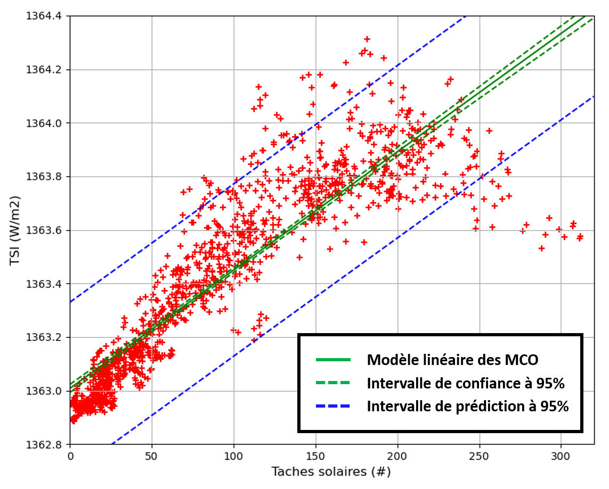
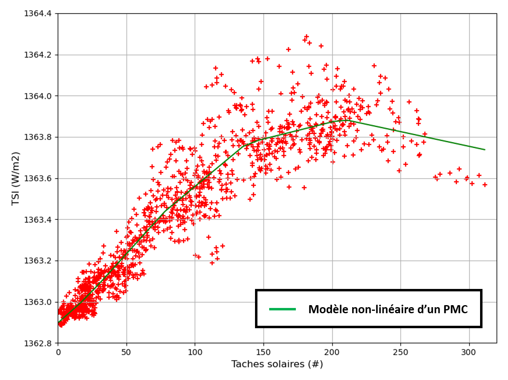

# Chapitre III : Régression

Ce chapitre est une introduction à la régression : principe, mesures de performances et méthodes de base.

---

## Problème de régression

Comme mentionné lors du Chapitre I, par "**régression**" on entend associer une réalisation d'une variable **quantitative continue** à un individu (labels), à partir des réalisations d'autres variables (features).

On cherche donc une **relation entre les variables** d'entrée (aussi appelées "variables explicatives") et la variable de sortie (aussi appelée "variable de réponse").

Il existe 2 grands types de relations entre variables :

* La relation est **déterministe** si on considère que la variable de sortie peut être **connue exactement** à partir des variables d'entrée.

Par exemple, si je veux déterminer le rayon $R$ d'une étoile par rapport à sa luminosité $L$ et sa température $T$, en m'appuyant sur la théorie du corps noir, j'utilise la formule $R = \sqrt{\frac{L}{4 \pi \sigma T^4}}$.

* La relation est **probabiliste** si on considère que d'**autres facteurs** que les variables d'entrée vont influer sur la valeur de la variable de sortie.

Dans ce cas, une même réalisation des variables d'entrée pourra être associée à plusieurs valeurs de la variable de sortie, et inversement.

Mais si les variables d'entrée et de sortie sont **corrélées**, la relation sera tout de même utile pour réaliser des **prédictions** avec une certaine marge d'erreur.

C'est souvent le cas en Physique, lorsque l'on réalise des mesures pour expliquer un phénomène.
Si on reprend notre exemple précédent : la théorie du corps noir n'explique pas parfaitement la rayonnement d'une étoile, et on peut avoir des erreurs de mesures de $L$, $T$ et $R$.
Mais si $L$, $T$ et $R$ sont correlées, alors on peut essayer de prédire $R$ à partir de $L$ et $T$, moyennant une certaine erreur.

C'est tout le principe de la régression : **déterminer une relation probabiliste entre les variables d'entrée et la variable de sortie**.

Nous avions aussi mentionné lors du Chapitre I qu'entrainer un modèle de régression ne peut se faire que par **apprentissage supervisé**.
L'idée est encore une fois que le modèle soit ensuite capable de **généraliser** à de nouvelles observations.

|Anecdote historique|
|:-|
|Le nom de "régression" vient du généticien Francis Galton, qui l'utilisa pour son étude sur la "régression vers la moyenne".|
|En fait, Galton cherchait à modéliser un phénomène d'hérédité qu'il observait dans la population humaine :|
|La taille des fils avait tendance à se rapprocher de la moyenne de la population par rapport à celle de leur père.|

### Les différents types de régression

Suivant le nombre d'entrées et le type de modèle à ajuster aux données, on a différents types de problèmes de régression.
Nous allons voir ici les 3 plus courants.

#### Régression linéaire simple

La **régression linéaire simple** est le problème de régression le plus basique qui soit.

On recherche une relation linéaire entre une variable d'entrée $x$ et une variable de sortie $y$.
L'erreur est une variable aléatoire notée $\epsilon$.

Le modèle à ajuster est le suivant :

$y = \alpha x + \beta + \epsilon$

avec les paramètres $\alpha$ et $\beta$ à déterminer.

Il s'agit d'un problème d'**inférence statistique** : nous disposons d'un jeu d'entrainement qui est un **échantillon** de la population totale, et nous voulons en déduire une estimation de $\alpha$ et $\beta$ nous permettant de réaliser des prédictions.

Nous verrons que l'on fait en général les hypothèses suivantes sur $\epsilon$ :

* **Indépedance** de ses réalisations.

* **Moyenne nulle**.

* **Ecart-type constant** avec $x$.

Afin de pouvoir donner un "intervalle de confiance" aux prédictions, on va en plus ajouter une hypothèse de **normalité** : $\epsilon$ suit une loi normale.
Nous en reparlerons plus tard.

#### Régression linéaire multiple

On peut généraliser le modèle de la section précédente aux problèmes avec **plusieurs variables d'entrée**.

Si on note $x_1$, $x_2$, ..., $x_n$ les $n$ variables d'entrée, et $y$ notre variable de sortie.

Le modèle à ajuster devient :

$y = \alpha_1 x_1 + \alpha_2 x_2 + ... + \alpha_n x_n + \beta + \epsilon$

On reconnait la formule d'un hyperplan de dimension $n$.

On peut mettre cette formule sous forme matricielle :

$y = A.x + \epsilon$

avec $A = 
      \begin{pmatrix}
	  \beta\\
      \alpha_1\\
      \alpha_2\\
	  \vdots\\
      \alpha_n 
      \end{pmatrix}$
	  
et $x = 
      \begin{pmatrix}
	  1\\
      x_1\\
      x_2\\
	  \vdots\\
      x_n 
      \end{pmatrix}$
	  
Nous verrons dans la suite comment généraliser les méthodes aux problèmes multiples.

#### Régression polynomiale

Comment faire lorsqu'un modèle linéaire n'est pas pertinent pour représenter la relation entre nos variables ?

Afin de réaliser une **régression non-linéaire**, il y a une astuce : on cherche à ajuster un modèle **polynomial**.

Pour un ordre $k$, il aura la forme :

$y = \alpha_1 x + \alpha_2 x^2 + ... + \alpha_n x^n + b + \epsilon$

Il y a alors une astuce : si on considère $x$, $x^2$, ..., $x^n$ comme $n$ variables d'entrée, alors on reconnait un problème de **régression multiple** !

On peut donc le traiter avec les mêmes méthodes qu'un problème linéaire.

Il existe d'autres techniques d'ajustement de modèles non-linéaires, que nous ne traiterons pas dans le cadre de ce cours.

### Exemple de problème

**Est-il possible de prédire l'intensité du rayonnement solaire à partir du nombre de taches solaires ?**

Les taches solaires sont des zones de "faible" température (4500 K contre 5800 K) la surface du soleil (photosphère).
Elles apparaissent lorsque l'apport de chaleur à la surface par convection est inhibé par une concentration de lignes de champs magnétique.

On sait observer les taches solaires depuis l'antiquité, et on a des mesures du nombre taches solaires depuis le XVIIème, qui varie entre 0 et 350 environ.
On l'utilise comme un marqueur de l'activité solaire depuis le milieu XIXème siècle.

Un autre marqueur connu de l'activité solaire est l'"irradiance solaire" totale ou TSI en anglais.
Il s'agit de la puissance du rayonnement solaire reçue en haut de l'atmosphère ter restre, par unité de surface.
Sa valeur est d'environ 1363 $W/m^2$, avec de légères variations suivant l'activité solaire.

La TSI est un paramètre clé en climatologie, puisqu'il correspond à l'énergie apportée par le soleil à la Terre.
Mais sa mesure n'est pas aisée : il ne peut être obtenu que par des satellites.

Voici l'évolution du nombre de taches solaires et du TSI depuis 1948 jusqu'à 2024 :

On a ici 20 points par an, avec un filtrage de moyenne glissante sur une 1/2 année, soit 1531 points au total.
Elles sont issues de l'Observatoire Royal de Belgique (SILSO, Dewitte et al. 2022).

On observe que le nombre de taches solaires comme la TSI suivent les mêmes cycles de 11 ans environ, correspondant aux cycles de l'activité solaire.
On imagine alors que la corrélation entre les 2 grandeurs doit être forte.

D'où l'idée suivante : **peut-on entrainer un modèle à estimer la TSI à partir du nombre de taches solaires ?**

Voici les données d'où sont issues les courbes précédentes, au format CSV : [Chap3_sunspots_dataset](https://github.com/NicOudart/UVSQ_LSSI633_data_science/tree/master/datasets/Chap3_sunspots_dataset.csv)

Le tableau de données qu'il contient est de la forme :

|year   |tsi     |sunspots|
|:-----:|:------:|:------:|
|1948.25|1363.743|193.667 |
|1948.30|1363.729|196.541 |
|1948.35|1363.722|205.891 |
|1948.40|1363.713|215.623 |
|1948.45|1363.729|218.060 |
|...    |...     |...     |
|2024.65|1364.015|172.536 |
|2024.70|1364.013|170.525 |
|2024.75|1364.038|171.563 |

Il contient pour chacun des 1531 points l'année (sous forme décimale), la TSI moyenne (en $W/m^2$) et le nombre de taches solaires moyen sur une fenêtre d'une 1/2 année.

Notre problème de régression sera la suivant : **prédire la TSI moyenne sur une 1/2 année à partir du nombre de taches solaires moyen sur cette même fenêtre**.

Voyons d'abord si une telle régression est possible à partir de ces données.

Une fois le fichier CSV téléchargé, il peut être importé sous Python en tant que DataFrame Pandas à partir de son chemin d'accès "input_path" :

~~~
import pandas as pd
df_dataset = pd.read_csv(input_path)
~~~

On peut alors utiliser la méthode "plot" des DataFrames pandas pour afficher la TSI en fonction du nombre de taches solaires, sous la forme d'un **nuage de points** :

~~~
df_dataset.plot(x='sunspots',y='tsi',kind='scatter',c='r',marker='+')
~~~

Voici le résultat :

On observe comme attendu que les 2 grandeurs ont l'air **fortement corrélées**.
Cependant, on peut déjà constater que : (1) la relation n'a l'air linéaire que pour des nombres de taches solaires faibles (moins de 150-200), (2) la dispersions des points a l'air d'augmenter avec le nombre de taches solaires.

Ces observations seront importantes dans la suite.

On peut également calculer le coefficient de corrélation entre la TSI et le nombre taches solaires, en utilisant la méthode "corr" des DataFrames Pandas :

~~~
df_dataset['tsi'].corr(df_dataset['sunspots'])
~~~

On trouve un coefficient de corrélation de 0.89 environ, ce qui confirme une forte corrélation entre les variables.
Vouloir entrainer un modèle à prédire la TSI à partir du nombre de taches solaires a donc un sens.

**Il est à noter que nous avons ici grandement simplifié le problème et sa résolution pour les besoins de ce cours.**
**Une vraie stratégie de validation pour optimiser les hyperparamètres et éviter le sur-apprentissage ne sera pas appliquée**.

**L'idée est que nous verrons cet exemple plus en détails en TP.**

## Mesures de performances

Nous allons passer en revue dans cette section les principaux indicateurs de performances applicables à la régression linéaire.

### Table ANOVA

Soit un problème de régression dont la variable de sortie est notée $y$.
On veut évaluer les performances d'un modèle de régression sur un jeu de données issu de ce problème.

La moyenne des valeurs de $y$ au sein de cet échantillon est notée $\overline{y}$.
La valeur de $y$ pour le i-ème individu de cet échantillon sera notée $y_i$.

Admettons que l'on a ait déterminé un modèle de regression linéaire pour ces données.
On note $\hat{y_i}$ la prédiction de ce modèle linéaire pour le i-ème individu.

Pour juger de la qualité du modèle, on divise les écarts en 2 groupes :

* Les **écarts résiduels**, ou "résidus" : $y_i - \hat{y_i}$

Il s'agit des écarts non-expliqués par le modèle. 
On remarque qu'ils correspondent aux $\epsilon_i$ de notre modèle.

* Les écarts **écarts de régression**, ou "écarts expliqués" : $\hat{y_i} - \overline{y}$

Il s'agit des écarts expliqués par le modèle.

On a alors l'**écart total** :

$y_i - \overline{y} = (y_i - \hat{y_i}) - (\hat{y_i} - \overline{y})$

On met en général ces écarts sous la forme de variances, en prenant la somme des carrés des $p$ individus de cet échantillon :

* SCR ("somme des carrés des résidus") : $\sum_{i=1}^{p} (y_i - \hat{y_i})^2$

* SCE ("somme des carrés expliqués") : $\sum_{i=1}^{p} (\hat{y_i} - \overline{y})^2$

* SCT ("somme des carrés totale") : $\sum_{i=1}^{p} (y_i - \overline{y})^2$

avec $SCT = SCR + SCE$

**Un modèle sera d'autant plus performant que la SCR sera faible comparée à la SCT**.

L'idée est la suivante : plus la SCE est grande (et donc plus la SCR est faible), et plus le modèle **explique** $y$ à partir des entrées.

On range en général ces valeurs sous la forme d'un tableau, nommé "table ANOVA" (contraction en anglais de "ANalysis Of VAriance") :

|$x_i$|$y_i$|$\hat{y_i}$|$\hat{y_i} - \overline{y}$|$(\hat{y_i} - \overline{y})^2$|$y_i - \hat{y_i}$|$(y_i - \hat{y_i})^2$|
|:---:|:---:|:---------:|:------------------------:|:----------------------------:|:---------------:|:-------------------:|
|...  |...  |...        |...                       |...                           |...              |...                  |

|$\overline{x}$|$\overline{y}$|SCE|SCR|SCT|
|:------------:|:------------:|:-:|:-:|:-:|
|...           |...           |...|...|...|

On peut trouver des variantes de cette table, mais elle contient toujours au moins la SCE, la SCR et la SCT.

### Coefficient de détermination

La table ANOVA est une représentation plutôt exhaustive des performances en régression linéaire.

Mais comme souvent, on voudrait pouvoir résumer au mieux les performances avec un score unique dérivé de cette table.

Le critère le plus utilisé est le **coefficient de détermination**, noté $R^2$ :

$R^2 = \frac{SCE}{SCT} = \frac{\sum_{i=1}^{p} (\hat{y_i} - \overline{y})^2}{\sum_{i=1}^{p} (y_i - \overline{y})^2} = 1 - \frac{SCR}{SCT} = 1 - \frac{\sum_{i=1}^{p} (y_i - \hat{y_i})^2}{\sum_{i=1}^{p} (y_i - \overline{y})^2}$

Le $R^2$ s'interprète comme **la proportion de l'écart total expliquée par le modèle**.

Il s'agit donc d'un score entre 0 et 1 : plus la valeur est proche de 1, et meilleur est le modèle.

Par exemple, mettons que l'on utilise la luminosité d'une étoile pour essayer de prédire son rayon, grâce à une régression linéaire.
Si le $R^2$ du modèle est de 0.75 sur un échantillon de données, cela veut dire que le modèle explique 75% de la variation du rayon de l'étoile.
Les 25% restants sont expliqués par les erreurs.

On remarque que le $R^2$ correspond au carré du coefficient de corrélation (voir Chapitre 1) entre les valeurs observées $y_i$ et les valeurs prédites $\hat{y_i}$.

|Nota Bene|
|:-|
|En régression linéaire simple, le $R^2$ est égal au carré du coefficient de corrélation entre $x$ et $y$.|
|Ce n'est pas vrai pour la régression linéaire multiple.|

### Analyse des résidus

Lorsque les performances d'un modèle de régression linéaire ont l'air mauvaises, on a envie de comprendre pourquoi.

La bonne approche est de réaliser une **analyse des résidus**.

Dans un 1er temps, cette analyse peut être **visuelle**.
On affiche simplement les résidus en fonction de $x$, ou sous la forme d'un histogramme, et on vérifie s'ils ont l'air d'avoir le comportement attendu de $\epsilon$ : 

* Indépendance des observations.

* Moyenne nulle.

* Ecart-type constant, aussi appelé "homoscédasticité".

* Normalité.

Dans l'idéal, on attend donc **un nuage de points aléatoires**, d'écart-type constant, sans tendances en fonction de $x$.

Si ce n'est pas le cas, alors il faut soit :

* **Revoir notre modèle** (une régression linéaire simple n'est peut-être pas adaptée).

* **Nettoyer nos données** (des outliers ou des données abérrantes sont peut-être la cause du mauvais ajustement).

* **Ajouter des variables explicatives** ($x$ n'est peut-être pas suffisant pour expliquer $y$ de manière satisfaisante).

En cas de doute, on peut procéder à des tests de ces hypothèses, mais ils ne sont pas tous simples à mettre en place.
En voici quelques exemples :

|Hypothèse       |Test                                                                        |
|:--------------:|:--------------------------------------------------------------------------:|
|Normalité       |Droite de Henry (quantiles des résidus en fonction de ceux attendus)        |
|Homoscédasticité|Test de White (hypothèse nulle : variance des résidus sachant $x$ constante)|
|Indépendance    |Test de Durbin-Watson (hypothèse nulle : non-corrélation des résidus)       |

## Méthodes de base

### Moindres carrés ordinaire

Les **moindres carrés ordinaire** (MCO) est la méthode de régression linéaire la plus basique qui soit.
S'il s'agit originellement d'une méthode de **statistiques descriptives**, nous verrons que l'on peut s'en servir pour faire de l'**inférence statistique**.

#### Principe

Comme nous venons de le mentionner, les MCO a originellement un but descriptif.

Si on a un jeu de données contenant une variable explicative $x$ et une variable de réponse $y$, on cherche :  **quelle droite d'équation $y = a x + b$ représente le mieux la distribution des $p$ points $(x_i,y_i)$ de cet échantillon ?**

$a$ et $b$ seront alors 2 indicateurs statistiques caractérisant notre échantillon.

Mais comment déterminer qu'une droite représente au mieux un nuage de points ?

La méthode des MCO considère que la droite d'équation $y = a x + b$ représentant le mieux les $p$ point de notre échantillon est celle qui **minimise** :

$\sum_{i=1}^{p} (y_i - a x_i - b)^2$

c'est-à-dire la SCR du modèle.

D'où le nom de la méthode : on cherche les "moindres carrés".

On peut montrer que les paramètres $a$ et $b$ minimisant cette fonction sont :

$a = \frac{\sum_{i=1}^{p} (x_i-\overline{x})(y_i-\overline{y})}{\sum_{i=1}^{p} (x_i-\overline{x})^2}$

$b = \overline{y} - a \overline{x}$

On notera pour simplifier les expressions :

$sc_{xx} = \sum_{i=1}^{p} (x_i-\overline{x})^2$

$sc_{yy} = \sum_{i=1}^{p} (y_i-\overline{y})^2$

$sc_{xy} = \sum_{i=1}^{p} (x_i-\overline{x})(y_i-\overline{y})$

D'où $a = \frac{sc_{xy}}{sc_{xx}}$

|Nota Bene|
|:-|
|La droite déterminée par les MCO passera toujours par le point $(\overline{x},\overline{y})$.|

#### Meilleur Estimateur Linéaire Non-biaisé (BLUE)

Revenons à notre problème de régression linéaire simple : à partir de notre échantillon, nous voulons trouver un modèle liant nos variables $x$ et $y$, de la forme $y = \alpha x + \beta + \epsilon$.

Sous certaines conditions sur $\epsilon$, nous pouvons appliquer le **théorème de Gauss-Markov** à notre problème :

|Théorème de Gauss-Markov|
|:-|
|On cherche à modéliser une relation $y = \alpha x + \beta + \epsilon$ entre 2 variables $x$ et $y$, à partir d'un échantillon de réalisations $(x_i,y_i)$.|
|Si $\epsilon$ vérifie :|
|- Une moyenne nulle.|
|- Un écart-type constant avec $x$.|
|- Une non-corrélation de ses réalisations.|
|Alors, les paramètres $a$ et $b$ de la droite déterminée par les MCO est le **Meilleur Estimateur Linéaire Non-biaisé** ("BLUE" en anglais) de $\alpha$ et $\beta$.|

On peut donc se servir de la méthode des MCO pour estimer $\alpha$ et $\beta$ à partir de notre échantillon de points $(x_i,y_i)$.

Il est même possible d'estimer l'**écart-type de $\epsilon$** avec l'estimateur suivant :

$s = \sqrt{\frac{\sum_{i=1}^{p} (y_i-\hat{y_i})^2}{p-2}} = \sqrt{\frac{\sum_{i=1}^{p} \epsilon_i^2}{p-2}}$

Reste alors une problématique : 

Si j'utilise mon modèle pour réaliser une prédiction $\hat{y_{p+1}}$ à partir d'une nouvelle valeur $x_{p+1}$, c'est-à-dire en calculant $\hat{y_{p+1}} = \alpha x_{p+1} + \beta$, **à quel point puis-je avoir confiance en ma prédiction ?**

#### Intervalles de confiance et de prédiction

Comme pour tout problème d'inférence statistique, lorsque l'on a obtenu notre modèle de régression linéaire, on se pose alors les questions suivantes :

* Quelle est mon **incertitude sur les $\alpha$ et $\beta$** trouvés à partir de mon échantillon ?

* Pour une valeur de $x$ fixée, quelle est mon **incertitude sur la moyenne des $y$** avec mon modèle de régression linéaire ?

* Pour un nouvelle observation de $x$, quelle est mon **incertitude sur la valeur de $y$ prédite** par mon modèle de régression linéaire ?

Pour répondre à ces questions, nous allons utiliser des **intervalles de confiance**.

L'hypothèse de **normalité** de $\epsilon$ implique que les estimations de $\alpha$ et de $\beta$ à partir d'un échantillon **suivent une loi normale**.
Mais nous ne pouvons qu'estimer son écart-type, puisque nous ne disposons que d'un échantillon.

Il nous faut donc utiliter la **loi de Student**, et plus particulièrement le "t de Student".

|Rappels sur le t de Student|
|:-|
|Soit une population de moyenne $\mu$ et d'écart-type inconnu, dont on récupère un échantillon de $p$ points, de moyenne estimée $\overline{x}$ et d'écart-type estimé $s$.|
|Alors la variable aléatoire $t = \frac{\overline{x}-\mu}{s/\sqrt{p}}$ suit une loi de Student, dont on peut se servir pour établir un intervalle de confiance sur l'estimation $\overline{x}$ de $\mu$.|
||
|On note $t_{\gamma}^{k}$ le **quantile** de seuil d'erreur $\gamma$ de la loi de Student à $k$ **degrés de liberté**.|
||
|Le **seuil de confiance** est alors $1-\gamma$ : pour seuil de confiance à 99% on prendra $\gamma = 0.01$.|
|La loi normale étant symétrique, pour déterminer un **intervalle de confiance** de seuil $1-\gamma$, il faut en réalité utiliser $t_{\gamma/2}^{k}$.|
|Donc pour un intervalle de confiance à 99% on prendra $\gamma = 0.005$.|
||
|On a alors :|
|$p(\overline{x} - t_{\gamma/2}^{p-1} \frac{s}{\sqrt{p}} \leq \mu \leq \overline{x} + t_{\gamma/2}^{p-1} \frac{s}{\sqrt{p}}) = 1 - \gamma$|
|avec $k = p-1$ car on a utilisé 1 degré de liberté pour estimer $\mu$.|
||
|Nota Bene :|
|Il est à noter que plus $p$ est grand (et donc plus $k$ est grand) et plus le $t$ se rapproche d'une loi normale.|

Dans notre cas, nous avons utilisé 2 degrés de liberté pour estimer $\alpha$ et $\beta$, nous utiliserons donc le t de Student pour $p-2$ degrés de liberté.

On peut donc établir les **intervalles de confiance** à $1-\gamma$ suivants **sur $a$ et $b$** :

$\alpha \in [a - t_{\gamma/2}^{p-2} s(a) ; a + t_{\gamma/2}^{p-2} s(a)]$

$\beta \in [b - t_{\gamma/2}^{p-2} s(b) ; b + t_{\gamma/2}^{p-2} s(b)]$

avec les écart-types estimés :

$s(a) = \frac{s}{\sqrt{sc_{xx}}}$

$s(b) = s \sqrt{\frac{1}{p} + \frac{\overline{x}^2}{sc_{xx}}}$

|Nota Bene|
|:-|
|Il est à noter que si tous les $x_i$ de l'échantillon sont égaux, alors $x_i = \overline{x}$, d'où $sc_{xx} = 0$ et donc les intervalles de confiance deviennent infinis.|
|Ce résultat est attendu, puisqu'on ne peut pas tirer d'information sur la relation entre $x$ et $y$ avec des points pour un seul $x_i$.|

De la même manière, on peut estimer pour une valeur de $x$ donnée $x=u$ l'**intervalle de confiance** à $1-\gamma$ **sur la moyenne des $y$ sachant $x=u$** :

$\alpha u + \beta \in [a u + b - t_{\gamma/2}^{p-2} s(\hat{y}(u)) ; a u + b + t_{\gamma/2}^{p-2} s(\hat{y}(u))]$

avec

$s(\hat{y}(u)) = s \sqrt{\frac{1}{p} + \frac{(u-\overline{x})^2}{sc_{xx}}}$

Enfin, on peut estimer l'**intervalle de prédiction** sur $y_{p+1}$ pour une **nouvelle donnée** $x_{p+1}$ : 

$y_{p+1} \in [a x_{p+1} + b - t_{\gamma/2}^{p-2} s(y_{p+1}) ; a x_{p+1} + b + t_{\gamma/2}^{p-2} s(y_{p+1})]$

avec

$s(y_{p+1}) = s \sqrt{1 + \frac{1}{p} + \frac{(x_{p+1}-\overline{x})^2}{sc_{xx}}}$

En général, lorsque l'on affiche par-dessus le nuage de points la droite du modèle obtenu par MCO, on affiche aussi l'intervalle de confiance sur la moyenne des $y$, et l'intervalle de prédiction choisis.
Le graphique obtenu est de la forme suivante :

|Nota Bene|
|:-|
|Il est à noter que :|
|- Les intervalles de confiance sur la moyenne des $y$ sont toujours plus petits que les intervalles de prévision.|
|- La droite obtenue par MCO passe toujours par $(\overline{x},\overline{y})$, donc plus on s'éloigne de ce point, plus les intervalles de confiance et de prédiction vont augmenter.|

#### Implémentation Scipy

Afin de réaliser une régression linéaire simple avec la méthode des MCO, on peut utiliser la bibliothèque de calculs scientifiques Scipy, et en particulier son module de statistiques "scipy.stat".

Il suffit d'importer l'objet "linregress" avec :

~~~
from scipy.stats import linregress
~~~

Pour ajuster un modèle de régression linéaire `mco` à une variable d'entrée `x` et une variable de sortie `y` on utilise la commande :

~~~
mco = linregress(x,y)
~~~

On peut alors récupérer le coefficient directeur `a` et l'ordonnée à l'origine `b` de ce modèle linéaire avec :

~~~
a = mco.slope
b = mco.intercept
~~~

Il suffit alors d'utiliser ces 2 paramètres pour réaliser une prédiction.

Pour déterminer les intervalles de confiance et de prédiction, la bibliothèque Scipy propose aussi une implémentation de la loi de Student, que l'on peut importer avec :

~~~
from scipy.stats import t
~~~

Pour obtenir le quantile `tq` de seuil `s` correspondant à $1-\gamma$, de la loi de Student de à `k` degrés de libertés, on alors simple utiliser la méthode :

~~~
tq = t.ppf(s,k)
~~~

Il ne reste alors qu'à implémenter les formules des estimateurs d'écart-types que nous avons vues précédemment pour calculer les intervalles de confiances et de prédiction.

Il est également possible d'obtenir le $R^2$ de la régression grâce au paramètre `r_value` du modèle :

~~~
r_2 = mco.rvalue**2
~~~

(On reconnait que `r_value` correspond au coefficient de corrélation tel que vu au Chapitre 1).

Si cette implémentation est pratique pour faire de l'inférence statistique, elle ne gère malheureusement que la régression linéaire simple.
Pour de la régression linéaire multiple, nous verrons que l'on peut utiliser Scikit-Learn.

#### Généralisation à la régression linéaire multiple

Les MCO peut être généralisée pour les problèmes à plus d'une variable explicative (nombre de variables explicatives $n>1$).

(Comme mentionné précédemment, un problème de régression polynomiale peut également être résolu en utilisant de la régression linéaire multiple).

Rappelons que le modèle de régression linéaire multiple à ajuster est le suivant :

$y = \alpha_1 x_1 + \alpha_2 x_2 + ... + \alpha_n x_n + \beta + \epsilon$

Si nous disposons de $p$ observations dans notre jeu de données d'entrainement, il faut que nos paramètres $\alpha_1$, ..., $\alpha_n$ et $\beta$ vérifient : 

$\begin{cases}
y_1 = \alpha_1 x_{1,1} + \alpha_2 x_{1,2} + ... + \alpha_n x_{1,n} + \beta + \epsilon_1\\
y_2 = \alpha_1 x_{2,1} + \alpha_2 x_{2,2} + ... + \alpha_n x_{2,n} + \beta + \epsilon_2\\
...\\
y_p = \alpha_1 x_{p,1} + \alpha_2 x_{p,2} + ... + \alpha_n x_{p,n} + \beta + \epsilon_p\\
\end{cases}$

Un système d'équations linéaires que l'on peut mettre sous la forme matricielle suivante :

$Y = X A + E$

avec

$Y = 
    \begin{pmatrix}
	y_1\\
    y_2\\
	\vdots\\
    y_p	
    \end{pmatrix}$
	
$X = 
    \begin{pmatrix}
    1 & x_{1,1} & x_{1,2} & \cdots & x_{1,n} \\
    1 & x_{2,1} & x_{2,2} & \cdots & x_{2,n} \\
    \vdots  & \vdots  & \ddots & \vdots  \\
    1 & x_{p,1} & x_{p,2} &\cdots & x_{p,n} 
    \end{pmatrix}$

$A = 
    \begin{pmatrix}
	\beta\\
    \alpha_1\\
    \alpha_2\\
	\vdots\\
    \alpha_n 
    \end{pmatrix}$
	
$E = 
    \begin{pmatrix}
	\epsilon_1\\
    \epsilon_2\\
	\vdots\\
    \epsilon_p 
    \end{pmatrix}$
	
Avec les mêmes hypothèses sur $\epsilon$ que pour la régression linéaire simple, on peut appliquer les MCO pour trouver le **meilleur estimateur linéaire non-biaisé de $A$**.

Cette fois-ci, il s'agit de la matrice $\hat{A}$ minimisant l'**erreur quadratique moyenne** (ou "MSE" en anglais) :
	
$MSE = \frac{1}{p} \sum_{i=1}^{p} (y_i - \sum_{j=1}^{n} \alpha_j x_{i,j} - \beta)^2$

On peut montrer que ce minimum est obtenu pour $\hat{A}$ vérifiant l'**équation normale** suivante :
	
$\hat{A} = (X^T X)^{-1} X^T Y$

En pratique, il est rare que l'on résolve directement l'équation normale : (1) sa résolution est complexe, (2) la matrice $X^T X$ peut ne pas être inversible (si $p<n$ ou si certaines equations sont redondantes).

C'est pourquoi la plupart des implémentations des MCO pour de la régression linéaire multiple calculent plutôt :

$\hat{A} = X^{+} Y$

avec $X^{+}$ le pseudo-inverse de $X$.

Celui-ci est calculé en utilisant la décomposition en valeurs singulières (SVD) de $X$.

Cette méthode à l'avantage d'être plus rapide que de résoudre l'équation normale directement, et que le pseudo-inverse de $X$ existe toujours.

On peut également généraliser les formules de détermination des **intervalles de confiance** et de **prédiction** vues précédemment.

Tout d'abord, dans le cas multiple l'estimateur de l'écart-type de $\epsilon$ devient :

$s = \sqrt{\frac{\sum_{i=1}^{p} (y_i-\hat{y_i})^2}{p-n-1}} = \sqrt{\frac{\sum_{i=1}^{p} \epsilon_i^2}{p-n-1}}$

Soit une réalisation donnée des variables d'entrée :

$\begin{pmatrix}
x_0 & x_1 & \cdots & x_n
\end{pmatrix}
= \begin{pmatrix}
u_0 & u_1 & \cdots & u_n
\end{pmatrix}
= U$

L'intervalle de confiance à $1-\gamma$ sur la moyenne des $y$ sachant que les variables d'entrée sont à $U$ est alors :

$U A \in [U \hat{A} - t_{\gamma/2}^{p-n-1} s(\hat{y}(U)) ; U \hat{A} + t_{\gamma/2}^{p-n-1} s(\hat{y}(U))]$

avec

$s(\hat{y}(U)) = s \sqrt{U(X^T X)^{-1}U^T}$

Soit une nouvelle réalisation des variables d'entrées :

$\begin{pmatrix}
x_{p+1,0} & x_{p+1,1} & \cdots & x_{p+1,n}
\end{pmatrix}
= V$

L'intervalle de prédiction à $1-\gamma$ de $V$ est :

$y_{p+1} \in [V \hat{A} - t_{\gamma/2}^{p-n-1} s(y_{p+1}) ; V \hat{A} + t_{\gamma/2}^{p-n-1} s(y_{p+1})]$

avec 

$s(y_{p+1}) = s \sqrt{1+V(X^T X)^{-1}V^T}$
	
#### Implémentation Scikit-Learn

Il existe une implémentation Scikit-Learn des MCO, qui permet la régression linéaire multiple (et donc la régression polynomiale).

Elle peut être importée avec :

~~~
from sklearn.linear_model import LinearRegression
~~~

On peut ensuite initialiser un modèle de régression linéaire `mco` avec un objet "LinearRegression" :

~~~
mco = LinearRegression()
~~~

Pour donner le jeu d'entrainement (matrice des variables d'entrée `X` et vecteur de la variable de sortie `y`) à ce modèle, on utilise la méthode :

~~~
mco.fit(X,y)
~~~

On peut à présent réaliser des prédictions `y_pred` à partir d'une matrice `X_pred` :

~~~
y_pred = mco.predict(X_pred)
~~~

Pour obtenir le $R^2$ de notre modèle sur ses données d'entrainement `X` et `y`, il suffit d'utiliser la méthode suivante :

~~~
r_2 = mco.score(X,y)
~~~

On peut de même le calculer sur des données de test.

Malheureusement, contrairement à Scipy, Scikit-Learn ne permet pas de faire l'inférence statistique avec les MCO : il n'y a pas de fonctionnalité pour déterminer des intervalles de confiance ou de prédiction.
On doit donc calculer nous même ces intervalles, à partir de la loi de Student implémentée par Scipy, et des formules généralisées.

#### Application à notre exemple

Nous allons à présent appliquer la régression linéaire avec les Moindres Carrés Ordinaires à notre problème exemple.

Tout d'abord, nous importons le fichier CSV depuis son chemin `input_path` sous la forme d'un DataFrame, puis nous sélectionnons les variables d'entrée et de sortie sous la forme de matrices Numpy :

~~~
df_dataset = pd.read_csv(input_path)

df_train=df_dataset.sample(frac=0.8,random_state=0)
df_test=df_dataset.drop(df_train.index)

x_train = df_train['sunspots'].to_numpy()
y_train = df_train['tsi'].to_numpy()

x_test = df_test['sunspots'].to_numpy()
y_test = df_test['tsi'].to_numpy()
~~~

Si les hypothèses associées sont bien respectées, les MCO permettent en théorie d'obtenir des intervalles de confiance et de prédiction fiables.
Dans la réalité, il est compliqué d'avoir ces hypothèses exactement vraies.
D'où le fait que l'on applique ici une stratégie de séparation entre ensemble d'entrainement et de test (80% / 20%), afin de **vérifier les performances en généralisation**.

On détermine notre modèle de régression linéaire `mco` par les MCO en utilisant la bibliothèque Scipy :

~~~
from scipy.stats import linregress
mco = linregress(x_train,y_train)
~~~

Nous pouvons à présent estimer des TSI à partir de nombres de tâches solaires.
Voici par exemple pour 321 nombres de tâches solaires entre 0 et 320 :

~~~
x_mco = np.linspace(0,320,321)
y_mco = mco.intercept+mco.slope*x_mco
~~~

Nous avons ainsi les prédictions de notre modèle pour chaque nombre entiers de tâches solaires sur l'intervalle possible.

Pour obtenir les intervalles de confiance et de prédiction de notre modèle, il nous faut d'abord estimer l'écart-type des résidus :

~~~
res_train = y_train-(mco.intercept+mco.slope*x_train)

s = np.sqrt(np.sum(res_train**2)/(len(x_train)-2))
~~~ 

Ensuite, il nous faut calculer $sc_{xx}$ :

~~~
x_mean_train = np.mean(x_train)

sc_xx_train = np.sum((x_train-x_mean_train)**2)
~~~

Nous pouvons alors en déduire l'estimation de l'écart-type sur la moyenne conditionnelle de $y$, et l'estimation de l'écart-type sur les prédictions :

~~~
s_y_conf = s*np.sqrt((1/len(x_train))+(((x_mco-x_mean_train)**2)/sc_xx_train))
s_y_pred = s*np.sqrt(1+(1/len(x_train))+(((x_mco-x_mean_train)**2)/sc_xx_train))
~~~

Nous avons à présent tous les élements pour calculer les intervalles de confiance et de prédiction à 95% pour chaque nombre de tâches solaires entre 0 et 320.
Il suffit d'utiliser le t de Student adapté :

~~~
from scipy.stats import t
t_student = t.ppf(1-(0.05/2),len(x_train)-2)

y_conf_inf = y_mco - (t_student*s_y_conf)
y_conf_sup = y_mco + (t_student*s_y_conf)

y_pred_inf = y_mco - (t_student*s_y_pred)
y_pred_sup = y_mco + (t_student*s_y_pred)
~~~

On peut tracer le modèle linéaire obtenu par les MCO par-dessus le nuage de points des données d'entrainement, avec les intervalles de confiance et de prédiction :

Pour évaluer les performances du modèle en entrainement, on peut simplement calculer le $R^2$ sur les données d'entrainement :

~~~
print(mco.rvalue**2)
~~~

On obtient $R^2 \approx 0.792$, ce qui veut dire que 79.2% des écarts sont expliqués par le modèle.
Un score relativement bon, mais pas excellent puisque plus de 1/5 des écarts restent inexpliqués par le modèle.

Pour évaluer les performances du modèle en test, on a pas d'autre choix que de calculer le $R^2$ sur les données de test "à la main" :

~~~
y_mean_test = np.mean(y_test)

sct_test = np.sum((y_test-y_mean_test)**2)
scr_test = np.sum((y_test-(mco.intercept+mco.slope*x_test))**2)

r2_test = 1-(scr_test/sct_test)

print(r2_test)
~~~

On obtient alors $R^2 \approx 0.795$ soit un score très similaire aux performances en entrainement.
Des performances similaires peuvent donc être attendues en généralisation.

Pour valider ou invalider notre modèle, et comprendre d'où viennent ses limites en terme de performances, affichons les résidus en fonction de la variable d'entrée :

On observe qu'il y a clairement une tendance des résidus en fonction de la variable d'entrée.
Les hypothèses sur les résidus ne sont donc pas respectées, ce qui peut expliquer les performances modestes du modèle.

Pour d'obtenir un modèle plus performant, nous proposons donc d'essayer une régression polynomiale de degré 2.

Cette régression polynomiale de degré 2 va revenir à faire une régression linéaire multiple, avec pour variables d'entrée le nombre de tâches solaires et son carré.

Cette fois-ci, on va donc rassembler les variables d'entrée au sein d'une matrice :

~~~
x_train = np.ones((len(df_train),3))
x_train[:,1] =  df_train['sunspots'].to_numpy()
x_train[:,2] = x_train[:,1]**2

x_test = np.ones((len(df_test),3))
x_test[:,1] =  df_test['sunspots'].to_numpy()
x_test[:,2] = x_test[:,1]**2
~~~

La 1ère colonne correspond à l'ordonnée à l'origine et ne contient que des 1, la 2nde colonne correspond au nombre de tâches solaires, la 3ème au carré du nombre de tâches solaires.
La variable de sortie reste inchangée par rapport à la régression linéaire simple.

On détermine notre modèle de régression linéaire multiple `mco` par les MCO en utilisant la bibliothèque Scikit-Learn :

~~~
from sklearn.linear_model import LinearRegression 
mco = LinearRegression()

mco.fit(x_train[:,1:],y_train)
~~~

**Attention**, la méthode `fit` des objets `LinearRegression` Scikit-Learn ne prend pas en entrée la 1ère colonne de la matrice des variables d'entrée (correspondant à l'ordonnée à l'origine) !
Cependant, nous aurons bien besoin de la matrice complète pour calculer les intervalles de confiance et de prédiction.

Voici comment estimer les TSI correspondant à 321 de nombres de tâches solaires entre 0 et 320 :

~~~
x_mco = np.ones((100,3))
x_mco[:,1] = np.linspace(0,320,100)
x_mco[:,2] = np.linspace(0,320,100)**2

y_mco = mco.predict(x_mco[:,1:])
~~~

Comme pour `fit`, la méthode `predict` ne prend pas en entrée la 1ère colonne de la matrice des variables d'entrée.

On calcule l'estimation de l'écart-type des résidus, en faisant attention au fait qu'il y a maintenant une variable d'entrée de plus :

~~~
res_train = y_train-mco.predict(x_train[:,1:])
s = np.sqrt(np.sum(res_train**2)/(len(x_train)-3)) 
~~~

On peut alors estimer les écart-types sur la moyenne conditionnelle de $y$, et sur les prédictions.
Ce calcul se fait en sélectionnant chaque ligne de la matrice `x_mco` crée précédemment, de manière itérative :

~~~
s_y_conf = np.zeros(len(x_mco))
s_y_pred = np.zeros(len(x_mco))

for idx in range(len(x_mco)):
    
    x_mco_idx = x_mco[idx,:]
	
    s_y_conf[idx] = s*np.sqrt(x_mco_idx@np.linalg.inv(x_train.T@x_train)@x_mco_idx.T)
    s_y_pred[idx] = s*np.sqrt(1+x_mco_idx@np.linalg.inv(x_train.T@x_train)@x_mco_idx.T)
~~~

On peut à présent déterminer les intervalles de confiance et de prédiction de notre modèle linéaire multiple :

~~~
from scipy.stats import t
t_student = t.ppf(1-(0.05/2),len(x_train)-3)

conf_inf = y_mco - (t_student*s_y_conf)
conf_sup = y_mco + (t_student*s_y_conf)

pred_inf = y_mco - (t_student*s_y_pred)
pred_sup = y_mco + (t_student*s_y_pred)
~~~

Il est maintenant possible d'afficher par dessus le nuage de points des données d'entrainement le modèle polynomial, ainsi que ses intervalles de confiance et de prédiction :

Pour évaluer les performances du modèle en entrainement et en test, on calcule le $R^2$ :

~~~
print(mco.score(x_train[:,1:],y_train))
~~~

On obtient $R^2 \approx 0.896$ sur les données d'entrainement, ce qui veut dire que 89.6% des écarts sont expliqués par le modèle.
Un très bon score ! Maintenant seul 1/10 des écarts restent inexpliqués par le modèle.

En test, on obtient un score très similaire de $R^2 \approx 0.904$, ce qui laisse présager ce niveau de performance en généralisation.

Pour valider ou invalider notre modèle, vérifions que les résidus en fonction de la variable d'entrée se comportent conformément à nos hypothèses :

Cette fois-ci, on n'observe aucune tendance claire se dégager des résidus en fonction de la variable d'entrée : ce qui est attendu.

Par contre, on peut noter que l'écart-type des résidus a l'air de varier légèrement avec le nombre de tâches solaires, et l'hypothèse de normalité est assez difficile à confirmer.
C'est pourquoi il faudrait en toute rigueur appliquer des tests statistiques de nos hypothèses.

#### Remarques

La méthode des Moindres Carrés Ordinaire a les **avantages** suivants :

* Elle est relativement **simple** à mettre en place, avec **peu de paramètres**, et **aucun hyperparamètre**.

* Les prédictions qu'elle réalise sont complètement **expliquées** et **interprétables** : un humain peut les comprendre.
On peut établir des **intervalles de confiance** sur les prédictions.

* Une fois le modèle entrainé, le temps de **calcul des prédictions** est **rapide** (linéaire par rapport au nombre de prédictions).

Mais cette méthode a aussi les **limites** suivantes :

* Le temps de calcul de la SVD **augmente quadratiquement avec le nombre de variables explicatives !**

* Elle demande **beaucoup de mémoire** pour manipuler la matrice $X$.

Ces 2 désavantages sont les raisons pour lesquelles **on utilise très peu les MCO dans les cas où le nombre de variables explicatives est grand**.

Même s'il est possible d'utiliser les MCO pour de la régression non-linéaire, avec l'astuce de la régression polynomiale, plus l'ordre du polynôme est grand et plus le nombre de variables explicatives est grand.
**On utilise donc rarement les MCO pour des modèles non-linéaires complexes**.

### Perceptron multicouche

#### Perceptron multicouche pour la régression

Nous avons vu lors du chapitre précédent que le **perceptron multicouche** (PMC) est un **réseau de neurones** initialement inventé pour résoudre des problèmes de classification binaire, qui peut être adapté pour résoudre n'importe quel problème de classification.
Et bien le PMC peut également être utilisé pour résoudre des problèmes de **régression non-linéaire**, à condition de choisir des hyperparamètres adaptés.

Si on applique le **théorème de l'approximation universelle** à la régression, il en ressort que le PMC est capable de tracer **n'importe quelle relation**, à condition d'avoir assez de neurones en couche cachée.
D'où l'intérêt de ce type de modèle.

Pour adapter le PMC à la régression, il faut tout d'abord adapter l'**architecture** :

* Le **nombre d'entrées** correspond au nombre de variables d'entrée $n$ du problème.

* Le **nombre de sorties** correspond au nombre de variables de sortie du problème (1 dans notre cas, mais on peut imaginer un modèle multi-sorties).

Ensuite, il faut choisir une **fonction de coût** pertinente pour l'entrainement.
La fonction la plus couramment utilisée est l'**erreur quadratique moyenne** (notée "MSE" en anglais) :

$MSE = \frac{1}{p} \sum_{i=1}^{p} (y_i-\hat{y_i})^2$

On reconnait une généralisation de la formule des "moindres carrés" utilisée précédemment.
D'autres fonctions donnant plus ou moins de poids aux outliers existent.

Autre particularité du PMC pour la régression : nous ne voulons pas en sortie un seuil entre 0 et 1 (ou -1 et 1), mais une valeur continue correspondant à la variable de sortie prédite.
Il faut donc que le neurone de **sortie** soit **sans fonction de seuil**.

Et voilà, nous avons un PMC adapté à la régression !

De la même manière que pour la classification, pour un nombre de neurones par couche cachée donné, plus on aura de couches et plus complexes les frontières de décisions pourront être.
Et dès que l'on a plus d'une couche cachée, on parle d'**apprentissage profond** ("Deep Learning").

|Nota Bene|
|:-|
|Pour que l'apprentissage d'un PMC pour de la régression se déroule correctement, il est recommandé d'effectuer une **transformation des données** d'entrée et de sortie (voir Chapitre 1).|

#### Implémentation Scikit-Learn

Il existe une implémentation Scikit-Learn du PMC pour la régression.

Elle peut être importée avec :

~~~
from sklearn.neural_network import MLPRegressor
~~~

On peut ensuite initialiser un PMC pour de la régression `mlp` avec les hyperparamètres par défaut en utilisant la commande :

~~~
mlp = MLPRegressor()
~~~

Nous verrons plus loin quels sont ces hyperparamètres.

Pour donner le jeu d'entrainement (variables d'entrée avec `x_train` et variables de sortie avec `y_train`) à ce modèle, on utilise la méthode :

~~~
mlp.fit(x_train,y_train)
~~~

On peut à présent réaliser des prédictions `y_test` à partir de variables d'entrée de test `x_test` :

~~~
y_test = mlp.predict(x_test)
~~~

Si on veut effectuer un test de notre modèle de régression sur un jeu de données, on peut obtenir un $R^2$ avec la commande :

~~~
mlp.score(x_test,y_test)
~~~

Voici les hyperparamètres par défaut de l'implémentation Scikit-Learn du PMC :

* Nombre de couches cachées : 1

* Nombre de neurones par couche cachée : 100

* La fenêtre d'activation pour les couches cachées : ReLU

* La fenêtre d'activation pour la couche de sortie : Aucune.

* Le taux d'apprentissage pour la descente de gradient : 0.001

* Le nombre maximum d'époques d'apprentissage : 200 (par défaut sans arrêt prématuré, mais on peut l'activer)

* La fonction de coût : erreur quadratique moyenne

Ces hyperparamètres sont presque tous modifiables par l'utilisateur.

#### Application à notre exemple

Nous allons à présent entrainer un PMC à résoudre notre problème de régression.

Comme précédemment, nous importons le fichier CSV depuis son chemin `input_path` sous la forme d'un DataFrame, puis nous sélectionnons les variables d'entrée et de sortie sous la forme de matrices Numpy :

~~~
df_dataset = pd.read_csv(input_path)

df_train=df_dataset.sample(frac=0.8,random_state=0)
df_test=df_dataset.drop(df_train.index)

x_train = df_train[['sunspots']].to_numpy().reshape(-1, 1) 
y_train = df_train[['tsi']].to_numpy().reshape(-1, 1) 

x_test = df_test[['sunspots']].to_numpy().reshape(-1, 1) 
y_test = df_test[['tsi']].to_numpy().reshape(-1, 1) 
~~~

Afin d'aider le PMC à converger, nous allons effectuer une transformation min-max des entrées et des sorties (voir Chapitre 1).
C'est pourquoi nous avons fait attention à ce que les dimensions des variables d'entrée et de sortie soient celles attendues par `MinMaxScaler`.

**Attention ! Il faut calibrer la transformation sur les données d'entrainement, puis l'appliquer aux jeux d'entrainement et de test !**

~~~
from sklearn.preprocessing import MinMaxScaler

x_scaler = MinMaxScaler()
x_scaler.fit(x_train)

x_train = x_scaler.transform(x_train)
x_test = x_scaler.transform(x_test)

y_scaler = MinMaxScaler()
y_scaler.fit(y_train)

y_train = y_scaler.transform(y_train)
y_test = y_scaler.transform(y_test)
~~~

Maintenant que les données sont prêtes, nous pouvons créer notre modèle de régression. 
Voici comment initialiser un PMC pour de la régression, avec les paramètres par défaut :

~~~
from sklearn.neural_network import MLPRegressor
mlp = MLPRegressor()
~~~

Pour l'entrainer, il nous suffit ensuite d'utiliser la commande suivante :

~~~
mlp.fit(x_train,y_train.ravel())
~~~

On a fait attention ici à ce que les dimensions de la sortie soient celles attendues par `MLPRegressor`.

Et pour obtenir le $R^2$ de notre modèle en entrainement et en test :

~~~
print(mlp.score(x_train,y_train))
print(mlp.score(x_test,y_test))
~~~

Pour réaliser des prédictions `y_predict` à partir d'entrées `x_predict`, il ne faudra pas oublier d'effectuer une transformation min-max inverse des sorties :

~~~
x_scaler.fit(x_predict)
y_predict = mlp.predict(x_predict)
y_scaler.inverse_transform(y_predict)
~~~

Mais comme nous l'avons fait remarquer dans le chapitre précédent, le PMC est sensible au sur-apprentissage.
Pour cette raison, on peut vouloir appliquer la méthode de régularisation par "arrêt prématuré" (voir Chapitre 1).

Si on active le paramètre `early_stopping` du classifieur PMC de Scikit-Learn, au moment de l'apprentissage il va automatiquement mettre de côté une partie du jeu d'entrainement pour faire un jeu de validation.
On peut même choisir la fraction du jeu d'entrainement à utiliser pour la validation, avec le paramètre `validation_fraction`.

Voici un exemple de définition d'un classifieur, avec de l'arrêt prématuré et 20% des données d'entrainement utilisées pour la validation :

~~~
mlp = MLPRegressor(early_stopping=True,validation_fraction=0.2)
~~~

Il y a aussi une astuce pour afficher l'évaluation de la fonction de coût au cours des époques, pour l'ensemble d'entrainement et de validation.
Elle se base sur :

* Subdiviser le jeu d'entrainement en un nouveau jeu d'entrainement et un jeu de validation.

* Utiliser la méthode `partial_fit` de notre PMC, qui permet de réaliser une itération à la fois.

* Récupérer la valeur de la fonction de coût sur le jeu d'entrainement, avec l'attribut `loss_` de notre classifieur.

* Evaluer la valeur de la fonction de coût sur le jeu de validation, en utilisant la fonction `mean_squared_error` de Scikit-Learn.

Voici l'affichage des 2 courbes Matplotlib obtenues sur notre base de données, pour 50 époques :

~~~
import matplotlib.pyplot as plt
from sklearn.metrics import mean_squared_error

df_train2=df_train.sample(frac=0.8,random_state=0)
df_validation=df_dataset.drop(df_train2.index)

x_train = df_train2[['sunspots']].to_numpy().reshape(-1, 1) 
y_train = df_train2[['tsi']].to_numpy().reshape(-1, 1) 

x_validation = df_validation[['sunspots']].to_numpy().reshape(-1, 1) 
y_validation = df_validation[['tsi']].to_numpy().reshape(-1, 1) 

x_scaler = MinMaxScaler()
x_scaler.fit(x_train)

x_train = x_scaler.transform(x_train)
x_validation = x_scaler.transform(x_validation)

y_scaler = MinMaxScaler()
y_scaler.fit(y_train)

y_train = y_scaler.transform(y_train)
y_validation = y_scaler.transform(y_validation)

mlp = MLPRegressor()

loss_train = []
loss_validation = []

for idx in range(50):
    mlp.partial_fit(x_train,y_train.ravel())
    loss_train.append(mlp.loss_)
    loss_validation.append(mean_squared_error(y_validation,mlp.predict(x_validation)))

plt.plot(loss_train, label="train loss",c='r')
plt.plot(loss_validation, label="validation loss",c='g')
plt.xlabel('Epoques')
plt.ylabel('Fonction de coût')
plt.legend()
~~~

Voici un exemple de modèle de régression obtenu avec un PMC ayant les hyperparamètres par défaut :

On voit bien que le PMC a été capable d'apprendre une fonction non-linéaire entre les variables d'entrée et de sortie.

Avec ce modèle, on obtient $R^2 \approx 0.900$ en entrainement, et $R^2 \approx 0.907$ en test.
On s'attend donc à de très bonnes performances en généralisation pour ce modèle, mais on peut probablement obtenir mieux avec d'autres hyperparamètres.

**Il faudrait donc à présent se baser sur ces codes pour effectuer une optimisation des hyperparamètres.**

#### Remarques

La méthode du Perceptron Multi-Couche a les **avantages** suivants pour la régression :

* Elle permet de dessiner de déterminer des **relations complexes** entre les variables d'entrée et de sortie sans faire de grosses hypothèses statistiques au préalable.

* Pour des **nombres de variables d'entrées importants**, et des **nombres d'échantillons importants**, l'entrainement d'un PMC devient plus intéressant en termes de **temps de calcul** que les MCO.

* Une fois le modèle entrainé, l'**espace mémoire** pour contenir le modèle est **plus faible** que celui nécessaire pour manipuler le $X$ des MCO

Mais cette méthode a aussi les **limites** suivantes, les mêmes que pour la classification :

* Elle a de **nombreux paramètres et hyperparamètres** à optimiser.

* Elle est **sensible au sur-apprentissage**.

* Les décisions qu'elle prend sont **difficilement expliquées** et **interprétables** : on a aucun intervalle de confiance ou de prédiction sur les sorties.
On parle encore une fois de "boîte noire".

Comme nous l'avons déjà évoqué, les réseaux de neurones sont à la base des modèles d'apprentissage modernes, fondant ainsi une nouvelle sous-discipline : l'**apprentissage profond**.
