# Chapitre IV : Partitionnement

Ce chapitre est une introduction au partitionnement (ou "classification non-supervisée") : principe, mesures de performances et méthodes de base.

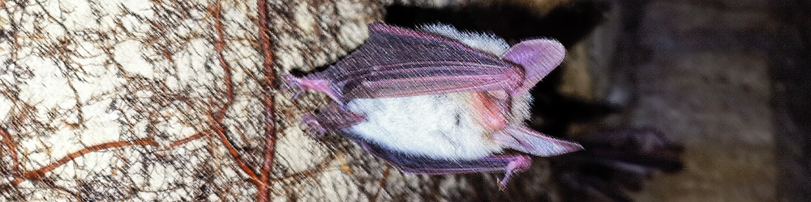

---

## Problème de partitionnement

Comme mentionné lors du Chapitre I, par "**partitionnement**" on entend diviser des individus non-labélisés en groupes suivant leur proximité dans l'espace des features.
On essayera d'assigner des labels à ces groupes par la suite.

L'idée est de **mieux comprendre** un jeu de données, et d'essayer de **classifier de nouvelles données**.

### Différents types de partitionnement

Suivant le problème à résoudre, il existe 2 grands types de partitionnement : **par partition** et **hiérarchique**.

On parle de partitionnement "**par partition**" lorsque l'on cherche à diviser les individus d'une base de donnée en un nombre fini de groupes $k$, sans tisser de lien entre eux.
On a alors aucune information sur la proximité des classes entre elles.

Par opposition, on parle de partitionnement "**hiérarchique**" lorsque l'on va diviser les individus d'une base de données en $k$ groupes, hiérarchisés selon leur similarité.
Cette hiérarchisation sera dite "**descendante**" ou "**ascendante**" suivant si on part de 1 classe vers $k$ classes, ou inversement.

On représente souvent la hiérarchisation des classes sous la forme d'un diagramme appelé **dendrogramme** : un arbre représentant les liens entre classes (en abscisse) et leurs distances (en ordonnée).

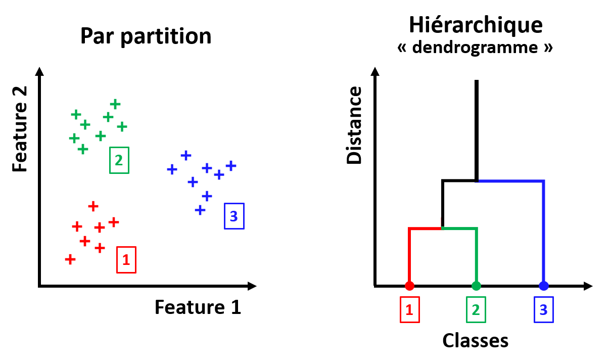

### La labélisation

Une fois les données séparées en $k$ groupes, l'étape suivante est souvent d'essayer d'attribuer des labels aux classes ainsi déterminées.
Ceci permettra de donner une interprétation à notre partition, et à nos futures prédictions.
On appelle ce processus "**labélisation**".

En l'absence de vérité terrain pour chacun des individus, la labélisation est délicate.
On peut néanmoins proposer la méthode suivante :

* Essayer de caractériser chaque groupe avec les outils de **statistiques descriptives** vus au Chapitre 1 (moyenne, écart-type, etc.).

* Si une partition hiérarchique a été réalisée, étudier aussi les **liens entre les groupes**. Sinon, analyser les distances entre groupes.

* Comparer les caractéristiques de chaque groupe, ainsi que les liens entre groupes, aux **connaissances établies** sur le domaine d'application, ou à un petit échantillon de données labélisées si disponible.

* Attribuer un label à chaque groupe en se basant sur ces éléments.

La labélisation implique donc une certaine **expertise** dans le domaine où on cherche à appliquer de la classification non-supervisée.

### Exemple de problème

**Comment recenser les espèces de chauves-souris présentes sur le site de l'OVSQ ?**

Les chiroptérologues (spécialistes des chauves-souris), utilisent souvent l'identification acoustique pour faire un relevé des espèces de chauves-souris présentes sur un site donné.
En effet, les ultrasons émis par les chauves-souris sont caractéristiques de leur espèce, et contrairement à la capture, cette méthode n'a aucun impact sur ces animaux, qui sont protégés en France.

Situé en bordure de la forêt des Sources de la Bièvre à Guyancourt, l'Observatoire de Versailles Saint-Quentin-en-Yvelines (OVSQ) est traversé toutes les nuits d'été par des chauves-souris.
C'est pourquoi depuis 2024, l'OVSQ installe un enregistreur d'ultrasons sur son site, afin de recenser les différentes espèces présentes.

Voici quelques exemples de "sonogrammes" obtenus à partir des enregistrements de l'OVSQ :

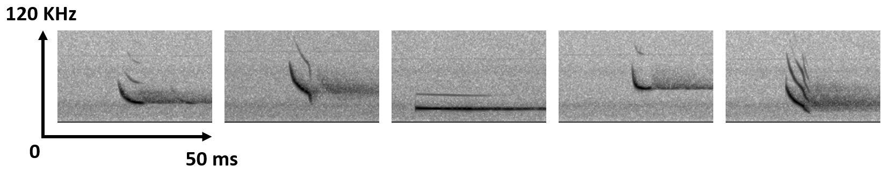

Chaque image représente un cri de chauve-souris : en abscisse le temps, en ordonnée la fréquence, et en nuance de gris l'amplitude.
On a l'impression que ces 5 cris proviennent de 5 espèces différentes : fréquences moyennes différentes, plage de fréquences différentes, durées différentes, formes différentes et nombre d'harmoniques différentes.

Pour les besoins de ce cours, ont été sélectionnés 474 enregistrements de cris de chauves-souris provenant de l'OVSQ.
Nous aimerions entrainer un modèle à reconnaitre les espèces de chauves-souris enregistrées, mais nous n'avons pas de vérité terrain pour vérifier ses prédictions. 
**Est-il tout de même possible de diviser ces enregistrements en plusieurs classes selon leurs similarités, et d'identifier par la suite l'espèce correspondant à chaque classe ?**

Dans ce but, les 2 features suivantes ont été retenues pour chaque enregistrement de cri de chauve-souris : la fréquence moyenne du fondamental (kHz) et la durée du cri (ms).

Voici le jeu de données complet, au format CSV : [Chap4_bats_dataset](https://github.com/NicOudart/UVSQ_LSSI633_data_science/tree/master/datasets/Chap4_bats_dataset.csv)

Le tableau de données qu'il contient est de la forme :

|freq_mean|time_len|
|:-------:|:------:|
|31.000   |7.500   |
|30.340   |6.250   |
|28.921   |4.750   |
|27.218   |9.750   |
|29.574   |6.750   |
|...      |...     |
|26.605   |4.750   |
|23.630   |5.750   |
|26.000   |4.500   |

Notre problème de partitionnement sera le suivant : **Identifier les différentes espèces de chauves-souris dans les enregistrements de l'OVSQ, à partir de la fréquence moyenne du fondamental et de la durée du cri**.

Assurons-nous d'abord qu'une telle partition est possible à partir de ces données.

Une fois le fichier CSV téléchargé, il peut être importé sous Python en tant que DataFrame Pandas à partir de son chemin d'accès "input_path" :

~~~
import pandas as pd
df_dataset = pd.read_csv(input_path)
~~~

Il est possible avec Seaborn d'afficher ces données sous la forme d'un **histogramme 2D**, avec une résolution de 30 intervalles par axes :

~~~
import seaborn as sns
sns.histplot(data=df_dataset, x='time_len', y='freq_mean',bins=30,cbar=True)
~~~

Voici le résultat, à côté du nuage de points correspondant :

On observe que ces 2 features font apparaitre différents regroupements d'enregistrements : les distributions sont clairement multimodales.
Si les frontières entre groupes, ainsi que le nombre exact de groupes restent difficiles à établir, il n'y a aucun doute sur la présence de plusieurs groupes.
Et ces classes sont probablement liées à l'espèce de chauves-souris.

Essayer de partitionner notre base de données à partir de ces features a donc du sens.
Restera alors à labéliser les classes ainsi délimitées.

Cependant, on peut noter que certains groupes visibles ont l'air moins denses que d'autres.
Ceci est plausible : on imagine bien que certaines espèces sont plus communes sur le site que d'autres.
Un tel déséquilibre pourrait être problématique pour entrainer notre modèle.

Aussi, les différents groupes visibles ont l'air d'avoir des formes et des densités différentes.
On observe même quelques outliers qui pourraient déranger l'entrainement.

Tout ceci sera à prendre en compte dans notre interprétation des résultats de nos modèles.

**Il est à noter que nous avons ici grandement simplifié le problème et sa résolution pour les besoins de ce cours.**
**Une vraie stratégie de validation pour optimiser les hyperparamètres et éviter le sur-apprentissage ne sera pas appliquée**.

**L'idée est que nous verrons un exemple plus en détails en TP.**

## Mesures de performances

Pour mettre au point des méthodes d'apprentissage automatique d'une partition de données, **nous avons besoin de critères pour juger de la qualité de notre partition**.

Un des grands problèmes en classification non-supervisée est que le nombre de classes est une entrée de la plupart des méthodes de résolution.
**Mais comment connaitre le nombre de classes pertinentes pour un jeu de données ?**

Il faut tester différents nombres de classes plausibles, et évaluer les performances du modèle obtenu pour chacun.

Problème : les données auxquelles on veut appliquer une méthode de partitionnement étant par définition non-labélisées, **on ne peut pas calculer une erreur par rapport à une vérité terrain**.
Il existe néanmoins des critères pour évaluer la pertinence d'un partitionnement.

Nous allons voir dans cette section différents **critères pour évaluer un partitionnement**, et différentes méthodes pour **déterminer un nombre de classes optimal** pour un jeu de données.

### Inertie intra-classe et internie inter-classe

Un bon partitionnement a les 2 caractéristiques suivantes :

* **Les individus au sein d'un groupe sont les plus similaires possibles** (leurs distances dans l'espace des features sont les plus faibles possibles).

* **Les différents groupes sont les plus différents possibles** (leurs distances dans l'espace des features sont les plus grandes possibles).

On utilise souvent comme indicateurs de ces 2 caractéristiques l'**inertie** intra-classe et inter-classe.

L'**inertie d'une classe** $i$ contenant $n_i$ individus est définie comme la somme des distances au centre de gravité $g_i$ de la classe :

$I_i = \sum_{j=1}^{n_i} d(x_{i,j},g_i)^2$

où chaque $x_{i,j}$ est un vecteur contenant les réalisations des différentes features pour un individu de la classe $i$.

|Nota Bene|
|:-|
|Il s'agit d'une analogie avec la notion de moment d'inertie en Physique : la répartition de la masse dans un objet autour de son centre de gravité va rendre plus ou moins difficile sa mise en mouvement.|
|D'une manière analogue, la répartition des individus dans un groupe va rendre plus ou moins coûteuse en termes de performances un changement de centre de gravité des groupes (idem pour les groupes vis-à-vis du centre de gravité du jeu de données total).|

Cette formule dépend bien évidemment de la définition du **centre de gravité** $g_i$ de la classe $i$, et de la **mesure de distance** $d$ choisie.

Pour le centre de gravité, on va souvent considérer le **barycentre** :

$g_i = \frac{1}{n_i} \sum_{j=1}^{n_i} x_{i,j}$

Pour les mesures de distances, reportez-vous à la section "K plus proches voisins" du Chapitre 2.
Dans le cas où on se servirait des inerties pour entrainer un modèle de partitionnement, la mesure de distance sera un **hyperparamètre à optimiser**.

On définit alors l'**inertie intra-classe** comme étant la somme des inerties des $k$ classes :

$I = \sum_{i=1}^{k} I_i = \sum{i=1}^{k} \sum_{j=1}^{n_i} d(x_{i,j},g_i)^2$

Il s'agit d'un indicateur de la **similarité des individus au sein de chaque classe**.

L'**inertie inter-classe** est quant à elle définie comme :

$J = \sum_{i=1}^{k} n_i d(g_i,g)^2$

avec $g = \frac{1}{\sum_{i=1}^{k} n_i} \sum_{i=1}^{k} \sum_{j=1}^{n_i} x_{i,j}$ le barycentre du jeu de données complet.

Il s'agit d'un indicateur de la **séparabilité des différentes classes**.

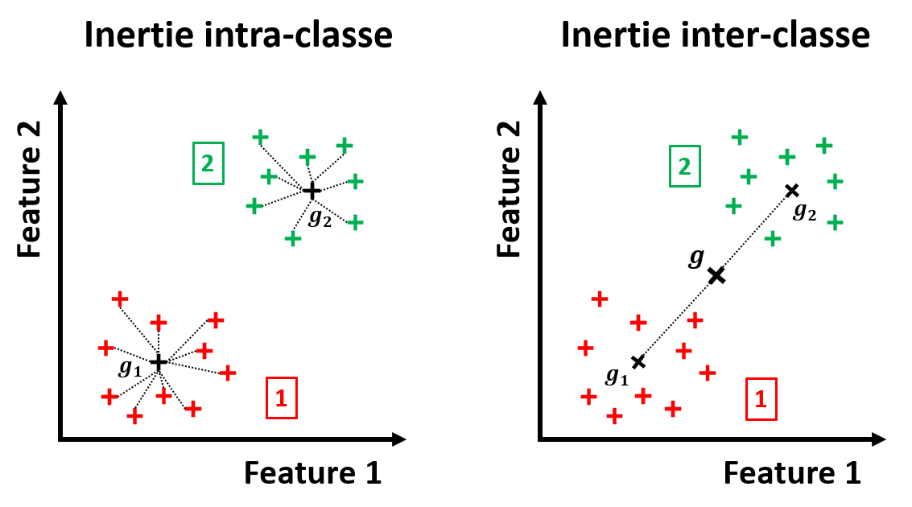

|Théorème de Huygens|
|:-|
|On note $T$ l'**inertie totale** d'un jeu de données :|
|$T = \sum_{i=1}^{k} \sum_{j=1}^{n_i} d(x_{i,j},g)^2$|
|De manière analogue au théorème de Huygens en Physique, on a conservation de l'inertie totale d'un jeu de données :|
|$T = I + J$|
|Cette somme est **indépendante de la partition** choisie.|

Une bonne partition **minimise l'inertie intra-classe**, ce qui d'après le théorème de Huygens revient à **maximiser l'inertie inter-classe**.

Les inerties peuvent être utilisées pour comparer les performances de 2 partitions d'un **même jeu de données**, à **$k$ constant**, mais elles ne permettent pas de comparer 2 partitions de données différentes, ou de $k$ différents.

De plus, l'inertie intra-classe **diminue toujours à mesure que l'on augmente le nombre classes** d'une partition de données optimisée pour chaque valeur de $k$ : alors comment choisir un nombre de classe pertinent ?

Nous allons voir 2 critères pour résoudre ces problèmes.

### La méthode du coude

Comme nous venons de le mentionner, l'inertie intra-classe diminue toujours à mesure que l'on augmente le nombre de classe $k$ de notre partition de données (optimisée pour chaque $k$).

Mais cette diminution a tendance à ralentir à mesure que $k$ augmente : plus $k$ est élevé, moins on gagne en inertie intra-classe en augmentant $k$.

Plus précisément, si on trace l'inertie intra-classe en fonction de $k$, on observe typiquement une courbe en forme de coude : au début l'inertie diminue fortement, puis soudainement elle diminue de manière marginale.

On va alors considérer que la valeur de $k$ optimale est celle qui correspond à l'**angle du coude**, c'est-à-dire quand augmenter $k$ n'apporte plus grand chose en termes d'inertie intra-classe.
C'est ce que l'on appelle assez logiquement la "**méthode du coude**".

|Nota Bene|
|:-|
|La méthode du coude n'est pas spécifique aux problèmes de partitionnement.|
|On la retrouve dans la détermination d'un paramètre optimal pour de nombreux types de modèles.|

En pratique, cette méthode n'est pas toujours simple à appliquer "visuellement".
En effet, on peut parfois obtenir une courbe de l'inertie intra-classe en fonction de $k$ sans coude évident.
Dans un tel cas, le choix de $k$ peut s'avérer arbitraire.

Pour obtenir un résultat plus objectif, on peut baser sa décision sur un **critère statistique**.
Le plus connu est le **Critère d'Information d'Akaike** (AIC) :

$AIC(k) = 2 p - 2 log(L(k))$

avec $p$ le nombre de paramètres à estimer, et $L(k)$ la vraisemblance du modèle pour $k$ classes.

L'idée est ici que le nombre de classe optimal est celui qui **minimise l'AIC** : la formule cherche un modèle vraisemblable, tout en pénalisant le choix d'un nombre de classes trop grand.

Si la méthode de partitionnement choisie ne se base pas sur un modèle statistique, il faudra faire des **hypothèses statistiques** afin de déterminer une fonction de vraisemblance.

### Coefficient de silhouette

Nous avons vu que la méthode du coude peux aider à trouver le nombre de classes optimal dans certains cas, mais ce choix peut s'avérer difficile en pratique.
Et les critères statistiques tels que l'AIC impliquent de faire des hypothèses statistiques plus ou moins justes sur la méthode de partitionnement choisie.

Dans l'idéal, nous aimerions un critère qui permette de comparer des modèles de partitionnement obtenus pour différents jeux de données, pour différents nombre de classes, et sans hypothèses sur la méthode choisie.

C'est pourquoi le "**coefficient de silhouette**" est un des critères les plus utilisés pour évaluer une partition de données.

Pour chaque individu de la base de données, il est définit comme :

$s(x_{i,j}) = \frac{D_2(x_{i,j})-D_1(x_{i,j})}{max(D_1(x_{i,j}),D_2(x_{i,j}))}$

Avec $D_1$ la **distance moyenne intra-classe** :

$D_1(x_{i,j}) = \frac{1}{n_i-1} \sum_{m=1,m \neq j}^{n_i} d(x_{i,m},x_{i,j})$

Il s'agit d'un indicateur de la **similarité** d'un individu au reste de sa classe : plus il est faible, plus l'individu est proche du reste de sa classe.

Et $D_2$ la **distance moyenne à la classe la plus proche** :

$D_2(x_{i,j}) = min_{1 \leq l \leq k, l \neq i}(\frac{1}{n_l} \sum_{m=1}^{n_l} d(x_{l,m},x_{i,j}))$

Il s'agit d'un indicateur de **séparabilité** d'un individus par rapport à la classe la plus proche de la sienne : plus il est élevé, plus l'individu est séparable des autres classes

Le coefficient de silhouette est un score compris entre -1 et 1.
Si pour un individu :

* $s(x_{i,j}) \approx 1$ alors l'individu est correctement identifié à sa classe.

* $s(x_{i,j}) = 0$ alors l'individu est à la frontière entre 2 classes.

* $s(x_{i,j}) < 0$ alors l'individu est mal identifié à sa classe.

On peut alors utiliser le coefficient de silhouette moyen $S = \frac{1}{\sum_{i=1}^{k} n_i} \sum_{i=1}^{k} \sum_{j=1}^{n_i} s(x_{i,j})$ comme mesure de la qualité d'une partition de données : il doit être le plus proche possible de 1.

Dans le but de choisir un nombre de classes optimal pour une partition, on peut simplement tracer la courbe de $S$ obtenu pour les modèles optimisés par chaque $k$, et choisir la valeur de $k$ maximisant $S$.

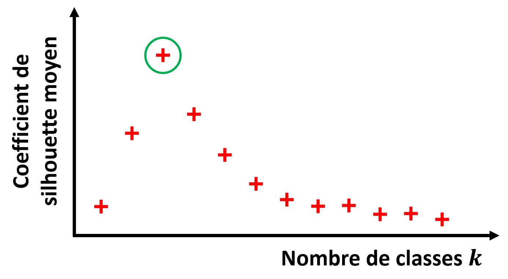

Si on veut essayer de comprendre pourquoi une partition a de mauvaises performances, on peut analyser les valeurs de $s(x_{i,j})$ pour chaque individu d'un jeu de données.
On affiche en général les coefficients de silhouette sous la forme d'un **diagramme en barres**, avec en abscisses $s$ et en ordonnées les individus (rangés par classe).

On peut alors facilement identifier quels individus ont été correctement associés à la bonne classe ou non.

|Nota Bene|
|:-|
|Les coefficients de silhouette obtenus dépendent évidemment de la **mesure de distance** choisie.|

## Méthodes de base

### K Moyennes

#### Principe

La méthode de base en partitionnement "par partition" est celle des **K-moyennes**.

Il s'agit d'un algorithme **itératif**, cherchant à réduire à chaque itération l'inertie intra-classe, à partir d'une partition initiale aléatoire.
L'idée ici est donc d'essayer de faire converger le modèle vers la partition **minimisant l'inertie intra-classe**.
Le nombre de classes $k$ est un paramètre d'entrée de l'algorithme.

Voici l'algorithme détaillé :

|Algorithme des K-moyennes|
|:-|
|On initialise aléatoirement $k$ points $h_i$ dans l'espace des features choisies, chacun correspondant à une classe.|
|Jusqu'à ce qu'une critère d'arrêt soit atteint, on va itérer les actions suivantes :|
|- On assigne à chaque individu la classe $i$ de point $h_i$ le plus proche selon une mesure de distance.|
|- On calcule le barycentre $g_i$ de chacune des classes.|
|- On assigne à $h_i$ le point $g_i$ pour chacune des classes.|
|Le but est de faire converger les $h_i$ vers les barycentres des centres de gravité des classes idéales.|

Il est à noter que dans la plupart des implémentations des K-moyennes, la distance choisie est la **distance euclidienne**.
Néanmoins, d'autres mesures de distance peuvent être envisagées.

Il est également essentiel d'avoir en tête que lorsque l'on utilise les K-moyennes, on fait des hypothèses implicites :

* $k$ est bien le nombre de classes optimal.

* Les différentes classes sont "sphériques" au sens de la distance choisie : on parle "d'**isotropie**" des classes.

* Chaque classe a la **même variance**.

* Chaque classe a le même nombre d'individus : elles sont "**équilibrées**".

Plusieurs approches peuvent être proposées en cas de non-respect de ces hypothèse :

* Le nombre de classes optimal peut être estimé avec une des méthodes vues précédemment.

* Si les classes sont **anisotropes**, c'est peut-être parce que les features évoluent sur des ordres de grandeur différents.
Une **normalisation** des features peut alors aider.

* Si les classes sont **déséquilibrées**, il est recommandé de tester plusieurs initialisations des K-moyennes, pour éviter de rester bloqué dans un minimum local d'inertie intra-classe.

Dans le cas où aucune de ces approches n'est efficace, il faut tout simplement envisager un autre modèle de partitionnement que les K-moyennes.

#### Implémentation Scikit-Learn

Il existe une implémentation Scikit-Learn de la méthode des K-moyennes.

Elle peut être importée avec :

~~~
from sklearn.cluster import KMeans
~~~

On peut ensuite initialiser un modèle de partition `km` avec un objet "KMeans" de paramètre `k` correspondant au nombre de classes à déterminer :

~~~
km = KMeans(n_clusters=k)
~~~

Pour diviser le jeu de données en $k$ classes `clusters` à partir des features choisies `features`, on utilise la méthode :

~~~
clusters = km.fit_predict(features)
~~~

Si on veut obtenir le coefficient de silhouette moyen de notre partition, on peut utiliser la commande :

~~~
from sklearn.metrics import silhouette_score
silhouette_score(features,clusters)
~~~

#### Affichage des coefficients de silhouette

Dans les bibliothèques sélectionnées dans le cadre de ce cours, il n'existe pas d'implémentation de l'affichage des coefficients de silhouette sous la forme d'un diagramme en barres.

Cependant, dans ses tutoriels en ligne, Scikit-Learn propose un code pour réaliser ce type d'affichage "manuellement".

En partant du principe que l'on a les features choisies dans `features`, et les classes obtenues par partitionnement en `k` dans `clusters`, on peut utiliser la méthode "silhouette_samples" pour récupérer les coefficients de silhouette, et réaliser un affichage avec Matplotlib :

~~~
from sklearn.metrics import silhouette_score,silhouette_samples
import numpy as np
import matplotlib.pyplot as plt

sample_scores = silhouette_samples(features,clusters)
mean_score = silhouette_score(features,clusters)

fig, ax = plt.subplots()

y_lower = 10
for idx in range(k):
    sample_scores_idx = sample_scores[clusters == idx]
    sample_scores_idx.sort()

    size_cluster_idx = sample_scores_idx.shape[0]
    y_upper = y_lower + size_cluster_idx

    color = plt.cm.tab10(idx)
    ax.fill_betweenx(
        np.arange(y_lower, y_upper),
        0,
        sample_scores_idx,
        facecolor=color,
        edgecolor=color,
        alpha=0.7
    )

    ax.text(-0.05, y_lower + 0.5 * size_cluster_idx, str(idx))
    y_lower = y_upper + 10
    
ax.axvline(x=mean_score,color="red",linestyle="--")

ax.set_yticks([])
ax.set_xlim([-0.1, 1])
ax.set_xlabel("Coefficient de silhouette",fontsize=12)
ax.set_ylabel("Classes",fontsize=12)
~~~

Vous pouvez réutiliser ce code tel quel pour vos propres affichages.

#### Application à notre exemple

Nous allons à présent appliquer les K-moyennes à notre problème exemple.

Tout d'abord, nous importons notre fichier CSV sous la forme d'un DataFrame, depuis le chemin `input_path` :

~~~
df_dataset = pd.read_csv(input_path)
~~~

Afin de s'assurer que les 2 features évoluent sur des intervalles comparables, nous leur appliquons une transformation de centrage-réduction (voir Chapitre 1) :

~~~
from sklearn.preprocessing import StandardScaler

scaler = StandardScaler()
scaler.fit(df_dataset)

df_dataset[['freq_mean','time_len']] = pd.DataFrame(scaler.transform(df_dataset))
~~~

Nous allons dans un premier temps essayer de trouver le nombre de classes optimal pour notre partition.
Utilisons le **coefficient de silhouette** moyen pour chaque nombre de classes entre 2 et 15, et affichons les scores obtenus :

~~~
from sklearn.cluster import KMeans
from sklearn.metrics import silhouette_score
import matplotlib.pyplot as plt

silhouette = []

for k in range(2,15):
    
    km = KMeans(n_clusters=k,random_state=0)

    clusters = km.fit_predict(df_dataset)
    
    score = silhouette_score(df_dataset,clusters)
    
    silhouette.append(score)

plt.plot(np.arange(2,15),silhouette,'ro-')
plt.grid()
plt.xlabel('Nombre de classes',fontsize=12)
plt.ylabel('Coefficient de silhouette moyen',fontsize=12)
~~~

Voici la courbe obtenue :

On observe que le nombre de classes maximisant le coefficient de silhouette moyen est $k=3$.
Nous choisirons donc ce paramètre pour la suite.

La valeur du coefficient moyen obtenu sera de 0,76 environ, ce qui est considéré comme un bon score pour des données réelles.

|Nota Bene|
|:-|
|Il est à noter que nous avons mis le paramètre "random_state" à 0 car le modèle renvoyé par les K-moyennes dépend de l'initialisation.|
|Nous nous assurons ainsi que 2 executions de ce code Python donnerons le même résultat.|
|Il faudrait en toute rigueur vérifier que d'autres initialisation donnent le même $k$ optimal.|

Nous pouvons ajouter les 3 classes identifiées au DataFrame d'entrée, puis inverser le centrage-réduction des features :

~~~
km = KMeans(n_clusters=3,random_state=0)

clusters = km.fit_predict(df_dataset)

df_dataset_clustured = df_dataset.copy()
df_dataset_clustured['clusters'] = clusters

df_dataset_clustured[['freq_mean','time_len']] = pd.DataFrame(scaler.inverse_transform(df_dataset_clustured[['freq_mean','time_len']]))
~~~

Et afficher sous la forme d'un **nuages de points** la partition obtenue, en utilisant Seaborn :

~~~
import seaborn as sns
sns.scatterplot(data=df_dataset_clustured,x='time_len',y='freq_mean',hue='clusters',palette='tab10')
~~~

Voici le graphique obtenu :

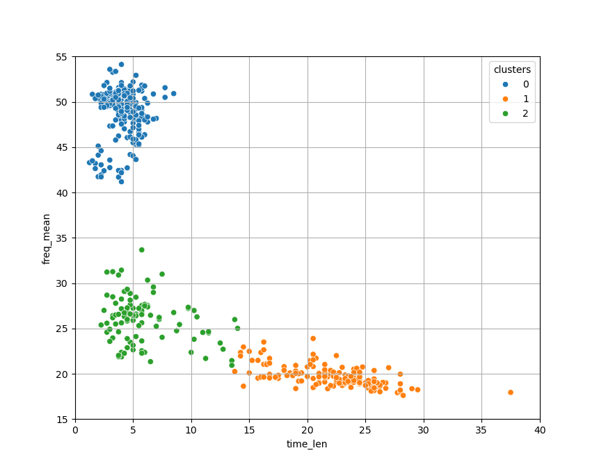

Les classes identifiées ont l'air cohérentes avec les pics que nous avions observés dans les données en début de chapitre.

Pour vérifier la qualité de cette partition, nous proposons d'afficher le coefficient de silhouette pour chaque individu, sous la forme d'un **diagramme en barres**.
Voici le graphique obtenu avec le code donné précédemment :

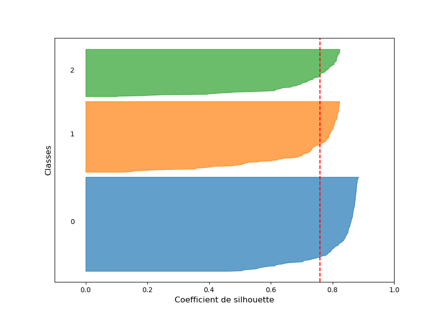

Tout d'abord, on observe qu'aucun individu n'a un coefficient de silhouette négatif, ce qui est le signe d'un plutôt bon partitionnement.

Ensuite, on voit que pour le classe 0, la quasi-intégralité des individus a un coefficient supérieur à 0,5.
Ceci est cohérent avec la matrice de corrélation que nous avons affichée précédemment : la classe 0 a l'air d'être la mieux séparée des 3.

Les classes 1 et 2 ont quelques individus avec des coefficients entre 0 et 0,5.
Ces individus sont donc proches de la frontière avec la classe la plus proche.
Ce qui une fois de plus colle au résultat précédent : les classes 1 et 2 ont l'air plus difficilement séparables avec les features retenues.

Il est à noter que, comme beaucoup de cas pratiques, notre problème ne partitionnement ne respecte pas exactement les hypothèses implicites des K-moyennes :

* Comme nous l'avions déjà mentionné, nos classes sont déséquilibrées.

* Nos classes ne sont pas isotropes.

* La variance de nos classes n'est clairement pas la même.

* Il y a des outliers dans nos données.

De meilleurs résultats pourraient donc potentiellement être obtenus avec plus d'observations pour équilibrer les classes, en supprimant les outliers, ou avec une méthode aux hypothèses différentes.

#### Remarques

La méthode des K-moyennes a les **avantages** suivants :

* Elle est **simple** à implémenter, et son résultat est tout à fait **interprétable** par un humain : on cherche à obtenir les centres de gravité des classes.

* Elle **converge assez rapidement**, et on peut donc l'utiliser sur de **grands jeux de données**.

Mais cette méthode a aussi les **limites** suivantes :

* Les performances de la méthode sont mauvaises si les **hypothèses implicites** sur les données ne sont pas respectées.

* L'initialisation étant **aléatoire**, 2 executions de l'algorithme ne donneront **pas exactement la même partition**.
Il est même possible que la méthode tombe dans un minimum local de l'inertie intra-classe.

* La distance euclidienne étant **sensible aux outliers**, la méthode des K-moyennes l'est aussi.

Les K-moyennes n'étant pas une méthode de partitionnement hiérarchique, elle ne trace aucun lien entre les classes qu'elle détermine.

### Classification Ascendante Hiérarchique

#### Principe

Comme son nom l'indique, la méthode de la **Classification Ascendante Hiérarchique** (CAH) est une méthode de partitionnement **hiérarchique**, qui agrège les classes de manière **ascendante**.
Il s'agit d'une méthode **itérative**, fusionnant 2 classes à chaque itération, ce qui correspond à fusionner 2 branches d'un dendrogramme.

Elle s'initialise en considérant chaque individu comme unique représentant de sa propre classe : on a autant de classes que d'individu, **l'inertie intra-classe est nulle**.

Elle se termine une fois que toutes les classes ont été fusionnées : on a une unique classe, **l'inertie inter-classe est nulle**.

On peut découper le dendrogramme obtenu au niveau du nombre de classe $k$ désiré, ou alors arrêter les itérations de la méthode pour ce $k$ si nous ne sommes pas intéressés par le dendrogramme.

Voici l'algorithme détaillé :

|Algorithme de la CAH|
|:-|
|On initialise $n$ classes : une par individu dans le jeu de données.|
|Jusqu'à ce que l'on atteigne un nombre de classe égal à 1 (ou égal au nombre de classes $k$ désiré), on va itérer les actions suivantes :|
|- On mesure la similarité entre les différentes classes.|
|- Les 2 classes les plus similaires sont fusionnées.|
|On enregistre les classes obtenues à chaque itération pour pouvoir tracer un dendrogramme.|

Cette méthode implique de décider d'un **critère de similarité** entre 2 classes.
Il s'agira d'un **hyperparamètre** à choisir.

Voici les 4 principaux critères utilisables par la CAH pour mesurer la similarité entre 2 classes :

* **Lien simple** : la distance minimale entre 2 individus issus de ces 2 classes.

* **Lien complet** : la distance maximale entre 2 individus issus de ces 2 classes.

* **Lien moyen** : la moyenne des distances entre tous les couples d'individus issus des 2 classes possibles.

* **Critère de Ward** : l'augmentation de l'inertie intra-classe quand les 2 classes sont fusionnées.

Derrière ces critères, se cache donc le choix d'une **mesure de distance** entre individus.

Certains critères sont plus rapides à calculer que d'autres, mais lorsque l'on choisis un critère plutôt qu'un autre, on fait un choix sur notre vision de la "proximité" entre classes :

* Lien simple : on voit la notion de similarité à l'**échelle des individus**.

Ce critère est adapté aux cas de classes très anisotropes, mais aura tendance à relier 2 classes si un outlier se trouve entre elles.
On la considèrera donc comme **peu conservatrice**.

* Lien complet : on voit la notion de similarité à l'**échelle de la classe entière**.

Ce critère est adapté aux classes fortement séparées, mais aura aussi tendance à être sensible aux outliers, mais dans l'excès inverse : la méthode sera **très conservatrice**, et un outlier pourra à lui tout seul empêcher de lier 2 classes pourtant proches.

* Lien moyen : on voit la notion de similarité du point de vue de la **moyenne des distances** des individus entre classes.

On peut donc voir ce critère comme un **compromis entre les 2 précédents**.
Il aura tendance à favoriser des classes "sphériques" au sens de la distance choisie.

* Critère de Ward : il s'agit du critère pour lequel les hypothèses sont **les plus fortes**.

Elles sont similaires à celles des K-moyennes : classes isotropes, de même variance, et équilibrées.

En pratique, on va souvent choisir par défaut le **critère de Ward**. 

#### Implémentation Scikit-Learn

Il existe une implémentation Scikit-Learn de la méthode de la CAH.

Elle peut être importée avec :

~~~
from sklearn.cluster import AgglomerativeClustering
~~~

On peut ensuite initialiser un modèle de partition `hca` avec un objet "AgglomerativeClustering" de paramètre `k` correspondant au nombre de classes à déterminer :

~~~
hca = AgglomerativeClustering(n_clusters=k)
~~~

Par défaut, l'implémentation Scikit-Learn utilise le critère de Ward comme mesure de similarité.
Il est possible de changer cet hyperparamètre avec le paramètre "linkage" de l'objet "AgglomerativeClustering" : 'ward', 'complete', 'average' ou 'single'.

Pour diviser le jeu de données en $k$ classes `clusters` à partir des features choisies `features`, on utilise la méthode :

~~~
clusters = hca.fit_predict(features)
~~~

Comme pour les K-moyennes, si on veut obtenir le coefficient de silhouette moyen de notre partition, on peut utiliser la commande :

~~~
from sklearn.metrics import silhouette_score
silhouette_score(features,clusters)
~~~

#### Affichage d'un dendrogramme avec Scipy

Dans les bibliothèques sélectionnées dans le cadre de ce cours, il n'existe pas d'implémentation pour afficher le dendrogramme d'une CAH.

Cependant, dans ses tutoriels en ligne, Scikit-Learn propose une fonction pour réaliser ce type d'affichage "manuellement", en s'appuyant sur la fonction "dendrogramme" de la bibliothèque Scipy.
La voici, pour un modèle déterminé par CAH `model` :

~~~
from scipy.cluster.hierarchy import dendrogram
import numpy as np

def plot_dendrogram(model, **kwargs):
    
    counts = np.zeros(model.children_.shape[0])
    n_samples = len(model.labels_)

    for i, merge in enumerate(model.children_):
        current_count = 0
        for child_idx in merge:
            if child_idx < n_samples:
                current_count += 1
            else:
                current_count += counts[child_idx - n_samples]
        counts[i] = current_count

    linkage_matrix = np.column_stack([
        model.children_,
        model.distances_,
        counts
    ]).astype(float)

    dendrogram(linkage_matrix, **kwargs)
~~~

Vous pouvez réutiliser ce code tel quel pour vos propres affichages.

Pour pouvoir utiliser cette fonction, il faut créer une partition des features choisies `features`, avec les paramètres suivants :

~~~
hca = AgglomerativeClustering(distance_threshold=0,n_clusters=None)
hca.fit(features)
~~~

Avec d'autres paramètres, il ne sera pas possible de récupérer le dendrogramme associé au modèle. 

Pour afficher le dendrogramme complet (de 1 classe par individu à 1 classe unique) :

~~~
import maplotlib.pyplot as plt
plt.figure()
plot_dendrogram(hca,truncate_mode="level")
plt.xlabel("Nombre d'individus par classe",fontsize=12)
plt.ylabel("Distance entre classes",fontsize=12)
plt.xticks([])
plt.show()
~~~

Mais en général, on va préférer afficher le dendrogramme jusqu'au nombre de classes voulu `k` :

~~~
import matplotlib.pyplot as plt
plt.figure()
plot_dendrogram(hca,truncate_mode="lastp",p=k)
plt.xlabel("Nombre d'individus par classe",fontsize=12)
plt.ylabel("Distance entre classes",fontsize=12)
plt.show()
~~~

#### Application à notre exemple

Nous allons à présent appliquer la CAH à notre problème exemple.

Tout d'abord, nous importons notre fichier CSV sous la forme d'un DataFrame depuis le chemin `input_path` :

~~~
df_dataset = pd.read_csv(input_path)
~~~

Afin de s'assurer que les 2 features évoluent sur des intervalles comparables, nous leur appliquons une transformation de centrage-réduction (voir Chapitre 1) :

~~~
from sklearn.preprocessing import StandardScaler

scaler = StandardScaler()
scaler.fit(df_dataset)

df_dataset[['freq_mean','time_len']] = pd.DataFrame(scaler.transform(df_dataset))
~~~

Comme pour les K-moyennes, nous allons dans un premier temps essayer de trouver le nombre de classes optimal pour notre partition.
Notre exemple étant relativement simple, on s'attend à ce que le résultat soit très similaire.

Nous utilisons une fois encore le coefficient de silhouette moyen pour chaque nombre de classes entre 2 et 15, et nous affichons les scores obtenus :

~~~
from sklearn.cluster import AgglomerativeClustering
from sklearn.metrics import silhouette_score
import matplotlib.pyplot as plt

silhouette = []

for k in range(2,15):
    
    hca = AgglomerativeClustering(n_clusters=k)

    clusters = hca.fit_predict(df_dataset)
    
    score = silhouette_score(df_dataset,clusters)
    
    silhouette.append(score)

plt.plot(np.arange(2,15),silhouette,'ro-')
plt.grid()
plt.xlabel('Nombre de classes',fontsize=12)
plt.ylabel('Coefficient de silhouette moyen',fontsize=12)
~~~

La courbe obtenue est en effet très similaire à celle obtenue avec les K-moyennes :

C'est donc sans surprise que nous choisissons à nouveau $k=3$.
Le coefficient de silhouette moyen sera alors de 0,76.

Ce score est environ le même que pour les K-moyenne : de manière générale les 2 partitions sont aussi bonnes aux yeux du coefficient de silhouette.

Nous pouvons ajouter les 3 classes identifiées au DataFrame d'entrée, puis inverser le centrage-réduction des features :

~~~
hca = AgglomerativeClustering(n_clusters=3)

clusters = hca.fit_predict(df_dataset)

df_dataset_clustured = df_dataset.copy()
df_dataset_clustured['clusters'] = clusters

df_dataset_clustured[['freq_mean','time_len']] = pd.DataFrame(scaler.inverse_transform(df_dataset_clustured[['freq_mean','time_len']]))
~~~

Et comme pour les K-moyennes, nous pouvons afficher sous la forme d'un **nuage de points** la partition obtenue, en utilisant Seaborn :

~~~
import seaborn as sns
sns.scatterplot(data=df_dataset_clustured,x='time_len',y='freq_mean',hue='clusters',palette='tab10')
~~~

Voici le graphique obtenu :

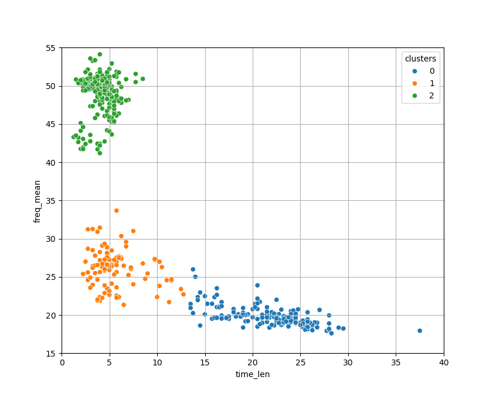

Il est similaire à celui obtenu par les K-moyennes, à l'exception de quelques individus entre les classe
(Attention, les classes n'ont pas reçu le même numéro).

Le coefficient de silhouette de chaque individu peut aussi être affiché sous la forme d'un **diagramme en barres**, et sans surprise il est assez similaire à celui obtenu par les K-moyennes :

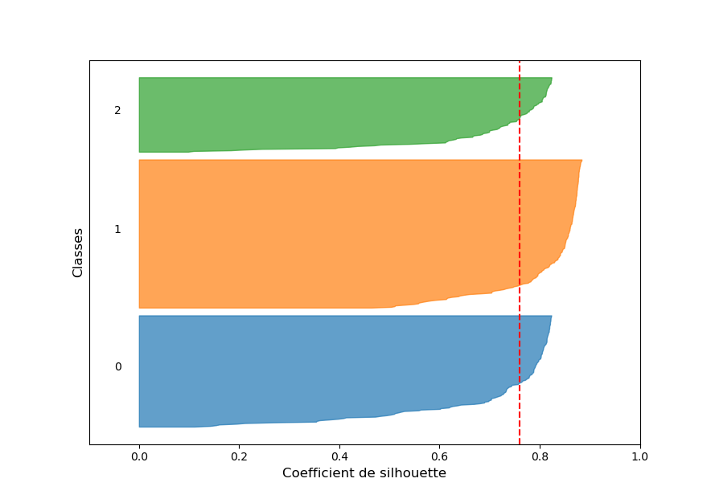

On remarque tout de même que 2 individus sont attribués à tort à la classe 0 selon le coefficient de silhouette.
Il s'agit de d'individus situés entre la classe 0 et la classe 1.

|Nota Bene|
|:-|
|Les K-moyennes et la CAH ne donneront pas toujours des partitions aussi similaires pour un même jeu de données.|
|Nous sommes ici dans un cas particulier.|

La CAH étant une méthode de partitionnement hiérarchique, elle permet de tisser des liens entre les différentes classes.
Nous pouvons tracer ces liens sous la forme d'un **dendrogramme**, en utilisant la fonction présentée précédemment.

Voici le dendrogramme total, ainsi que le dendrogramme tronqué pour 3 classes :

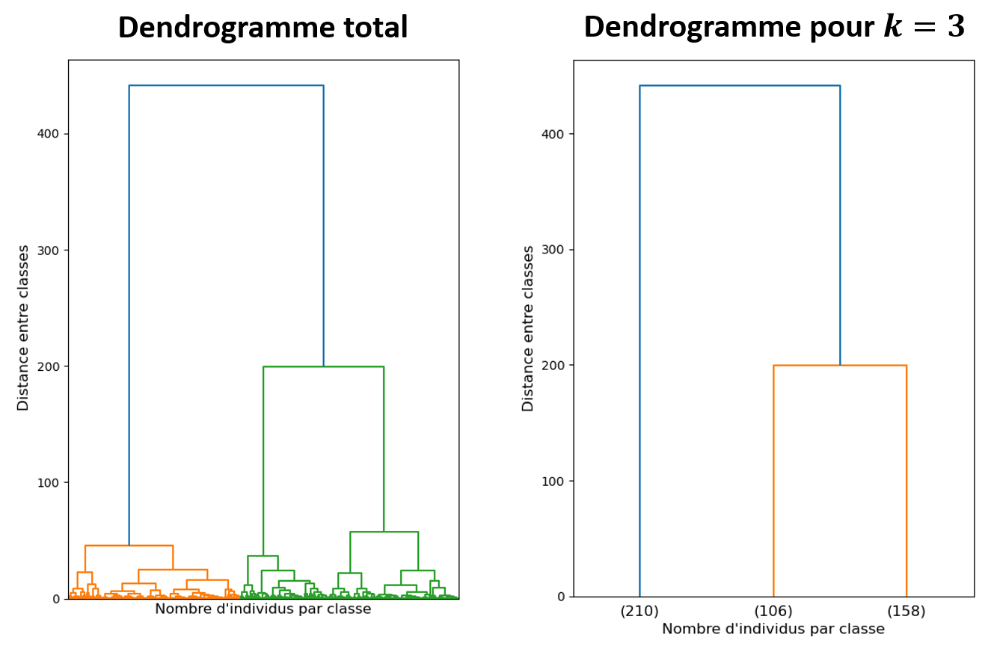

Selon ce dendrogramme, les classes 1 et 2 (104 et 210 individus) sont plus proches entre elles que de la classe 0 (160 individus).

Comme nous l'avons mentionné précédémment, l'implémentation Scikit-Learn de la CAH utilise par défaut le critère de Ward comme mesure de similarité entre classes.
C'est souvent le compromis choisi pour la CAH.

Selon la définition de la "similarité" du critère de Ward, cela signifie que fusionner les classes 1 et 2 fait moins monter l'inertie intra-classe que fusionner les classe 0 et 1 ou 0 et 2.

Il est évident que si nous définissons autrement la "similarité" entre classes, le dendrogramme que nous obtiendrons sera différent : 2 groupes peuvent être plus proche selon une mesure de similarité qu'une autre.

Voici les dendrogrammes obtenus pour les 4 mesures de similarité implémentées dans Scikit-Learn :

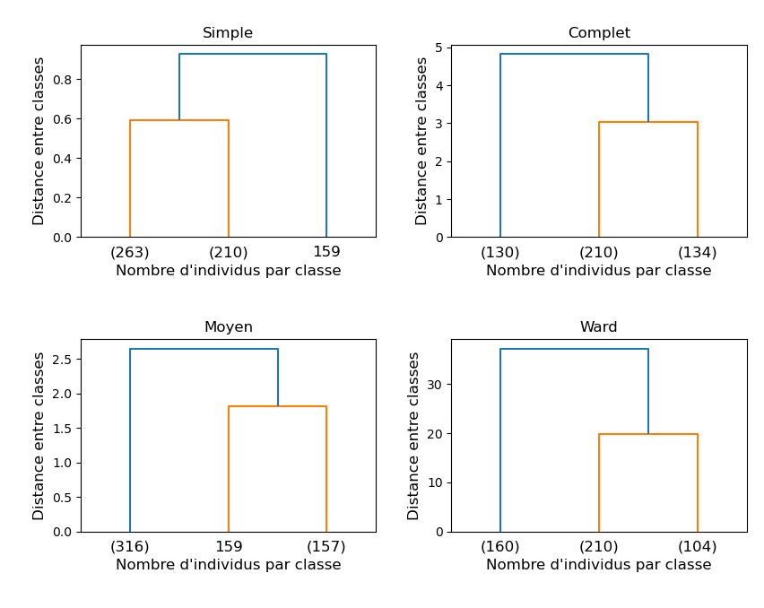

On remarque directement que les critères de similarité du "lien simple" et du "lien moyen" donnent de mauvais résultats : une des classes n'a qu'un seul individu...

Pour les autres critères, difficile de dire quelle partition est la meilleure à partir des dendrogrammes seuls.
On peut vérifier les partitions obtenues avec des nuages de points selon les différentes features.

Voici un exemple pour la fréquence moyenne du fondamental et la durée du cri :

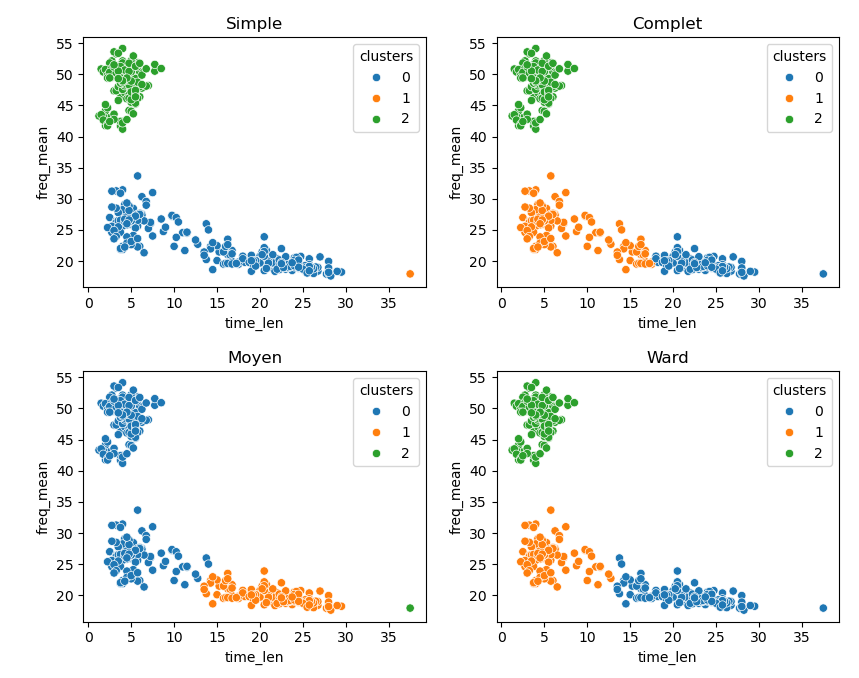

On comprend alors l'origine de la sous-performance des liens "simple" et "moyen": un outlier.

Dans les 2 cas, la CAH a isolé cet outlier dans une classe dont il est l'unique individu.
Ceci peut se comprendre intuitivement : un outlier est par définition loin de tous les autres individus, ainsi que de la moyenne des individus, et ceci pour toutes les classes.

Nous avons ici une illustration de la sensibilité aux outliers de ces 2 types de liens.
Faire le ménage dans notre base de donnée en retirant les outliers pourrait donc grandement améliorer les performances de la CAH dans ces 2 cas.

On peut noter que l'outlier est placé comme éloigné des 2 autre classes dans le dendrogramme pour le lien "simple", et comme proche de la classe 1.
Encore une fois, ceci ce comprend facilement : du point de vue de la distance minimale entre individus, l'outlier est plus éloigné des 2 autres classes, alors que du point de vue de la moyenne il est visiblement plus proche de la classe 1.

D'après les dendrogrammes obtenus, le lien "complet" et le critère de Ward sont en accord sur les liens entre classes.

On observe aussi que les 2 types de liens délimitent de la même façon la classe 2.
Par contre ils ne fixent clairement pas la même frontière entre les classes 0 et 1 : le lien "complet" attribut plus d'individus à la classe 1 que le critère de Ward.

Ce résultat n'est pas surprenant : le lien "complet" se basant sur la distance maximale entre individus de 2 classes, l'outlier va avoir tendance à "tirer" la frontière entre les classes 0 et 1 de sont côté.
Ce n'est pas le cas pour le critère de Ward, qui ne regardera que l'inertie intra-classe.

Nous avons ici une illustration de la sensibilité aux outlier du lien "complet".
On aurait tendance à choisir la partition obtenue avec le critère de Ward.

Pour faire un choix définitif, on peut évaluer le coefficient de silhouette moyen de la partition obtenue pour chaque critère de similarité :

|Critère de similarité|Coefficient de silhouette moyen|
|:-------------------:|:-----------------------------:|
|Simple               |0.55                           |
|Complet              |0.72                           |
|Moyen                |0.63                           |
|Ward                 |0.76                           |

Selon le coefficient de silhouette moyen, sans surprise la meilleure partition est celle obtenue avec le critère de Ward.

Comme nous l'avons mentionné précédemment, le critère de Ward est souvent le choix par défaut.
Cependant, suivant le problème auquel on est confronté, une autre mesure de similarité peut être plus pertinente.

Dans le cas de notre exemple, nettoyer notre base de données des outliers permettrait probablement d'améliorer les performances obtenues pour tous les types de liens. 

Comme pour les K-moyennes, les performances que nous obtenons ici avec le critère de Ward sont limitées, car celui-ci implique des hypothèses fortes, qui ne sont pas respectées ici (isotropie, variance constante, classes équilibrées). 

#### Remarques

La méthode de la CAH a les **avantages** suivants :

* Elle permet de **tisser des liens** entre les classes déterminées, ce qui rend le modèle **très interprétable**.

* On peut décider du nombre optimal de classes $k$ **a posterio**, en coupant le dendrogramme.

* Pour chaque $k$, le modèle renvoyé par le CAH est **déterministe** : il n'y a pas ici d'initialisation aléatoire comme pour les K-moyennes.

* Il est possible d'**adapter le critère de similarité** selon notre problème.

Mais cette méthode a aussi les **limites** suivantes :

* Elle est relativement **gourmande en temps de calcul**, ce qui la rend difficile à appliquer à des grands jeux de données.

* Suivant le critère de similarité choisie, elle peut être plus ou moins **sensible aux outliers**.

## Labélisation de l'exemple

### Eléments pour la labélisation

Nous allons à présent essayer de labéliser les 3 classes obtenues avec les k-moyennes (sachant que les classes obtenues par CAH sont identiques).

Commençons par caractériser avec les **statistiques descriptives** les différents groupes.

Voici les moyennes des classes identifiées selon les différentes features :

|         |Classe 0|Classe 1|Classe 2|
|:-------:|:------:|:------:|:------:|
|freq_mean|48.85   |19.75   |26.07   |
|time_len |4.09    |22.08   |5.87    |

Pour attribuer une espèce à chaque groupe, nous allons nous appuyer sur la clé d'identification acoustique du chercheur du Museum d'Histoire Naturelle Yves Bas.

Commençons par la classe 0.
Nous voyons que la durée des cris est assez courte, de 4.09 ms, et la fréquence moyenne du fondamental est plutôt élevée, de 48.85 kHz.
Voici la table  d'identification pour ce type de cris, à fréquence élevée :

|Espèce                  |Fréquences (kHz)|
|:----------------------:|:--------------:|
|Pipistrelle de Kuhl     |34-40           |
|Pipistrelle de Nathusius|38-42           |
|Pipistrelle commune     |43-50           |
|Pipistrelle pygmée      |53-60           |

Il est alors évident que la seule espèce plausible est la **Pipistrelle commune**

Ensuite, nous voyons que la classe 1 a des longs cris de 22.08 ms.
La fréquence moyenne du cri est de 19.75 kHz, ce qui est plutôt faible (à la limite de l'audition d'un humain).
Voici la table d'identification pour des cris de longue durée, à fréquence basse :

|Espèce            |Fréquences (kHz)|
|:----------------:|:--------------:|
|Molosse de Cestoni|9-12            |
|Grande Noctule    |13-15           |
|Noctule commune   |17-20           |
|Noctule de Leisler|22-26           |

Il est alors évident que la seule espèce plausible est la **Noctule commune**.

Enfin, nous voyons que la classe 2 a une fréquence moyenne intermédiaire de 26.07 kHz, avec une durée de 5.87 ms.
Ce type de cris est généralement associé à des chauves-souris de la famille des **Sérotines** ou des **Oreillards**.

D'après le document de Yves Bas, il est très difficile de différencier les cris des différentes espèces d'Oreillards.
Et sans informations sur la forme des cris, il nous est impossible d'attribuer avec certitude ces cris aux Oreillards ou aux Sérotines.
Nous ne pouvons donc pas aller plus loin dans la labélisation de cette classe.

D'où les labels que nous avons choisis pour les 3 classes : Noctule commune, Pipistrelle commune et Oreillards / Sérotine.

On trouve facilement dans la littérature spécialisée que ces 3 espèces sont crédibles pour une lisière de forêt en Ile-de-France.

De plus, cette labélisation est cohérente avec les lien tracés entre les classes par la CAH : les cris de noctules étant beaucoup plus longs en moyenne que ceux des pipistrelles communes et des oreillards / sérotines, on comprend pourquoi ils seraient considérés comme "moins similaires".

Comme nous l'avions anticipé, la labélisation a nécessité ici des recherches bibliographiques sur l'identification acoustique des chauves-souris française.
De manière générale, une labélisation correcte nécessite souvent une **expertise** dans le domaine d'étude.

### Vérité terrain

En 2006, le Muséum d'Histoire Naturelle lance le programme de sciences participatives "Vigie-Chiro".
L'idée est de collecter des enregistrements de chauves-souris réalisés par des amateurs dans toute la France, afin de réaliser un suivi des différentes espèces d'une année sur l'autre, par région.
Dans le cadre de ce programme, l'OVSQ partage tous les ans l'intégralité de ses enregistrements avec le Muséum.

Sur sa plateforme en ligne, "Vigie-Chiro" propose un logiciel d'identification automatique des enregistrements de chauves-souris : Tadarida (Bas et al., 2017).

Nous avons labélisé nos 474 enregistrements à l'aide de Tadarida, et 5 espèces ont été identifiées :

* La sérotine commune (_Eptesicus serotinus_), de label : **Eptser**.

* Le murin de Daubenton (_Myotis daubentonii_), de label : **Myodau**.

* La noctule commune (_Nyctalus noctula_), de label : **Nycnoc**.

* La pipistrelle commune (_Pipistrellus pipistrellus_), de label : **Pippip**.

* L'Oreillard roux (_Plecotus auritus_), de label : **Pleaur**.

Voici l'identification Tadarida des différents enregistrements, sous la forme d'un **nuage de points** :

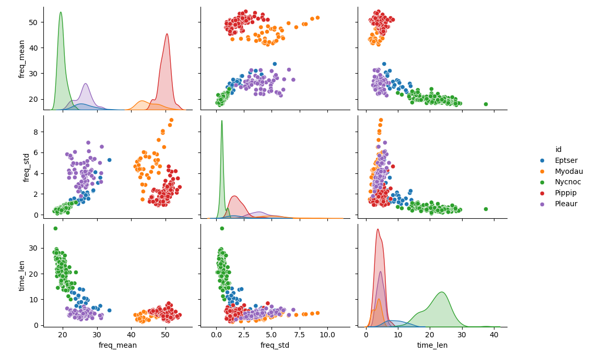

Et pour informations, les 5 exemples de sonogrammes présentés en début de chapitre correspondent chacun à une espèce différente parmi celles identifiées par Tadarida :

On remarque que les noctules communes, les pipistrelles communes, ainsi que les oreillard roux ont été assez bien identifiées par nos méthodes de partitions.
Par contre, la sérotine commune et le murin de Daubenton n'ont pas été clairement identifiées.

On peut avancer plusieurs explications :

* La sérotine commune et le murin de Daubenton sont sous représentés dans les observations (26 et 41, contre 159 pour la noctule commune, 169 pour la pipistrelle commune, et 79 pour l'oreillard roux).

* La sérotine commune a l'air difficilement séparable de l'oreillard roux, et le murin de Daubenton difficilement séparable de la pipistrelle commune. 
Il faudrait donc potentiellement ajouter de nouvelles features, ou appliquer une transformation aux features choisies afin de séparer ces espèces.

* Par défaut, nos méthodes de partitionnement utilisent la distance euclidienne.
Une autre mesure de distance donnerait peut-être de meilleurs résultats.

|Nota Bene|
|:-|
|En général, une vérité terrain n'est pas disponible dans un cas de partitionnement, ou alors pour un échantillon restreint.|
|Dans les cas où des labels sont accessibles ulterieurement, on peut utiliser les mêmes mesures de performances que pour la classification supervisée.|