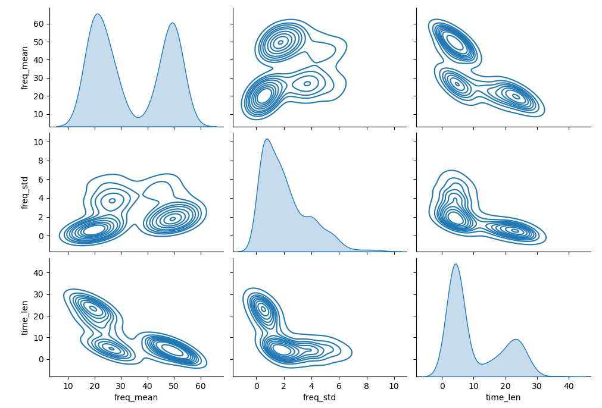

# Chapitre IV : Partitionnement

Ce chapitre est une introduction au partitionnement (ou "classification non-supervisée") : principe, mesures de performances et méthodes de base.

---

## Problème de partitionnement

Comme mentionné lors du Chapitre I, par "**partitionnement**" on entend diviser des individus non-labélisés en groupes suivant leur proximité dans l'espace des features.
On essayera d'assigner des labels à ces groupes par la suite.

L'idée est de **mieux comprendre** un jeu de données, et d'essayer de **classifier de nouvelles données**.

### Différents types de partitionnement

Suivant le problème à résoudre, il existe 2 grands types de partitionnement : **par partition** et **hiérarchique**.

On parle de partitionnement "**par partition**" lorsque l'on cherche à diviser les individus d'une base de donnée en un nombre fini de groupes $k$, sans tisser de lien entre eux.
On a alors aucune information sur la proximité des classes entre elles.

Par opposition, on parle de partitionnement "**hiérarchique**" lorsque l'on va diviser les individus d'une base de données en $k$ groupes, hiérarchisés selon leur similarité.
Cette hiérarchisation sera dite "**descendante**" ou "**ascendante**" suivant si on part de 1 classe vers $k$ classes, ou inversement.

On représente souvent la hiérarchisation des classes sous la forme d'un diagramme appelé **dendrogramme** : un arbre représentant les liens entre classes (en abscisse) et leurs distances (en ordonnée).

### La labélisation

Une fois les données séparées en $k$ groupes, l'étape suivante est souvent d'essayer d'attribuer des labels aux classes ainsi déterminées.
Ceci permettra de donner une interprétation à notre partition, et à nos futures prédictions.
On appelle ce processus "**labélisation**".

En l'absence de vérité terrain pour chacun des individus, la labélisation est délicate.
On peut néanmoins proposer la méthode suivante :

* Essayer de caractériser chaque groupe avec les outils de **statistiques descriptives** vus au Chapitre 1 (moyenne, écart-type, etc.).

* Si une partition hiérarchique a été réalisée, étudier aussi les **liens entre les groupes**. Sinon, analyser les distances entre groupes.

* Comparer les caractéristiques de chaque groupe, ainsi que les liens entre groupes, aux **connaissances établies** sur le domaine d'application, ou à un petit échantillon de données labélisées si disponible.

* Attribuer un label à chaque groupe en se basant sur ces éléments.

La labélisation implique donc une certaine **expertise** dans le domaine où on cherche à appliquer de la classification non-supervisée.

### Exemple de problème

**Comment recenser les espèces de chauves-souris présentes sur le site de l'OVSQ ?**

Les chiroptérologues (spécialistes des chauves-souris), utilisent souvent l'identification acoustique pour faire un relevé des espèces de chauves-souris présentes sur un site donné.
En effet, les ultrasons émis par les chauves-souris sont caractéristiques de leur espèce, et contrairement à la capture, cette méthode n'a aucun impact sur ces animaux, qui sont protégés en France.

Situé en bordure de la forêt des Sources de la Bièvre à Guyancourt, l'Observatoire de Versailles Saint-Quentin-en-Yvelines (OVSQ) est traversé toutes les nuits d'été par des chauves-souris.
C'est pourquoi depuis 2024, l'OVSQ installe un enregistreur d'ultrasons sur son site, afin de recenser les différentes espèces présentes.

Voici quelques exemples de "sonogrammes" obtenus à partir des enregistrements de l'OVSQ :

Chaque image représente un cri de chauve-souris : en abscisse le temps, en ordonnée la fréquence, et en nuance de gris l'amplitude.
On a l'impression que ces 5 cris proviennent de 5 espèces différentes : fréquences moyennes différentes, plage de fréquences différentes, durées différentes, formes différentes et nombre d'harmoniques différentes.

Pour les besoins de ce cours, ont été sélectionnés 474 enregistrements de cris de chauves-souris provenant de l'OVSQ.
Nous aimerions entrainer un modèle à reconnaitre les espèces de chauves-souris enregistrées, mais nous n'avons pas de vérité terrain pour vérifier ses prédictions. 
**Est-il tout de même possible de diviser ces enregistrements en plusieurs classes selon leurs similarités, et d'identifier par la suite l'espèce correspondant à chaque classe ?**

Dans ce but, les 3 features suivantes ont été retenues pour chaque enregistrement de cri de chauve-souris : la fréquence moyenne du fondamental (kHz), l'écart-type en fréquence du fondamental (kHz), et la durée du cri (ms).

Voici le jeu de données complet, au format CSV : [Chap4_bats_dataset](https://github.com/NicOudart/UVSQ_LSSI633_data_science/tree/master/datasets/Chap4_bats_dataset.csv)

Le tableau de données qu'il contient est de la forme :

|freq_mean|freq_std|time_len|
|:-------:|:------:|:------:|
|31.000   |3.566   |7.500   |
|30.340   |3.068   |6.250   |
|28.921   |2.278   |4.750   |
|27.218   |2.136   |9.750   |
|29.574   |4.091   |6.750   |
|...      |...     |...     |
|26.605   |4.166   |4.750   |
|23.630   |6.046   |5.750   |
|26.000   |3.716   |4.500   |

Notre problème de partitionnement sera le suivant : **Identifier les différentes espèces de chauves-souris dans les enregistrements de l'OVSQ, à partir de la fréquence moyenne du fondamental, de l'écart-type en fréquence du fondamental, et de la durée du cri**.

Assurons-nous d'abord qu'une telle partition est possible à partir de ces données.

Une fois le fichier CSV téléchargé, il peut être importé sous Python en tant que DataFrame Pandas à partir de son chemin d'accès "input_path" :

~~~
import pandas as pd
df_dataset = pd.read_csv(input_path)
~~~

Il est possible avec Seaborn d'afficher ces données sous la forme d'une **matrice de corrélations**, avec des densités estimées par **KDE** 2D :

~~~
import seaborn as sns
sns.pairplot(df_dataset,kind='kde')
~~~

Voici le résultat :

On observe que ces 3 features font apparaitre différents regroupements d'enregistrements : les distributions sont clairement multimodales.
Si les frontières entre groupes, ainsi que le nombre exact de groupes restent difficiles à établir, il n'y a aucun doute sur la présence de plusieurs groupes.
Et ces classes sont probablement liées à l'espèce de chauves-souris.

Essayer de partitionner notre base de données à partir de ces features a donc du sens.
Restera alors à labéliser les classes ainsi délimitées.

Cependant, on peut noter que certains groupes visibles ont l'air moins denses que d'autres.
Ceci est plausible : on imagine bien que certaines espèces sont plus communes sur le site que d'autres.
Un tel déséquilibre pourrait être problématique pour entrainer notre modèle.

**Il est à noter que nous avons ici grandement simplifié le problème et sa résolution pour les besoins de ce cours.**
**Une vraie stratégie de validation pour optimiser les hyperparamètres et éviter le sur-apprentissage ne sera pas appliquée**.

**L'idée est que nous verrons cet exemple plus en détails en TP.**

## Mesures de performances

Pour mettre au point des méthodes d'apprentissage automatique d'une partition de données, **nous avons besoin de critères pour juger de la qualité de notre partition**.

Un des grands problèmes en classification non-supervisée est que le nombre de classes est une entrée de la plupart des méthodes de résolution.
**Mais comment connaitre le nombre de classes pertinentes pour un jeu de données ?**

Il faut tester différents nombres de classes plausibles, et évaluer les performances du modèle obtenu pour chacun.

Problème : les données auxquelles on veut appliquer une méthode de partitionnement étant par définition non-labélisées, **on ne peut pas calculer une erreur par rapport à une vérité terrain**.
Il existe néanmoins des critères pour évaluer la pertinence d'un partitionnement.

Nous allons voir dans cette section différents **critères pour évaluer un partitionnement**, et différentes méthodes pour **déterminer un nombre de classes optimal** pour un jeu de données.

### Inertie intra-classe et internie inter-classe

Un bon partitionnement a les 2 caractéristiques suivantes :

* **Les individus au sein d'un groupe sont les plus similaires possibles** (leurs distances dans l'espace des features sont les plus faibles possibles).

* **Les différents groupes sont les plus différents possibles** (leurs distances dans l'espace des features sont les plus grandes possibles).

On utilise souvent comme indicateurs de ces 2 caractéristiques l'**inertie** intra-classe et inter-classe.

L'**inertie d'une classe** $i$ contenant $n_i$ individus est définie comme la somme des distances au centre de gravité $g_i$ de la classe :

$I_i = \sum_{j=1}^{n_i} d(x_{i,j},g_i)^2$

où chaque $x_{i,j}$ est un vecteur contenant les réalisations des différentes features pour un individu de la classe $i$.

|Nota Bene|
|:-|
|Il s'agit d'une analogie avec la notion de moment d'inertie en Physique : la répartition de la masse dans un objet autour de son centre de gravité va rendre plus ou moins difficile sa mise en mouvement.|
|D'une manière analogue, la répartition des individus dans un groupe va rendre plus ou moins coûteuse en termes de performances un changement de centre de gravité des groupes (idem pour les groupes vis-à-vis du centre de gravité du jeu de données total).|

Cette formule dépend bien évidemment de la définition du **centre de gravité** $g_i$ de la classe $i$, et de la **mesure de distance** $d$ choisie.

Pour le centre de gravité, on va souvent considérer le **barycentre** :

$g_i = \frac{1}{n_i} \sum_{j=1}^{n_i} x_{i,j}$

Pour les mesures de distances, reportez-vous à la section "K plus proches voisins" du Chapitre 2.
Dans le cas où on se servirait des inerties pour entrainer un modèle de partitionnement, la mesure de distance sera un **hyperparamètre à optimiser**.

On définit alors l'**inertie intra-classe** comme étant la somme des inerties des $k$ classes :

$I = \sum_{i=1}^{k} I_i = \sum{i=1}^{k} \sum_{j=1}^{n_i} d(x_{i,j},g_i)^2$

Il s'agit d'un indicateur de la **similarité des individus au sein de chaque classe**.

L'**inertie inter-classe** est quant à elle définie comme :

$J = \sum_{i=1}^{k} n_i d(g_i,g)^2$

avec $g = \frac{1}{\sum_{i=1}^{k} n_i} \sum_{i=1}^{k} \sum_{j=1}^{n_i} x_{i,j}$ le barycentre du jeu de données complet.

Il s'agit d'un indicateur de la **séparabilité des différentes classes**.

|Théorème de Huygens|
|:-|
|On note $T$ l'**inertie totale** d'un jeu de données :|
|$T = \sum_{i=1}^{k} \sum_{j=1}^{n_i} d(x_{i,j},g)^2$|
|De manière analogue au théorème de Huygens en Physique, on a conservation de l'inertie totale d'un jeu de données :|
|$T = I + J$|
|Cette somme est **indépendante de la partition** choisie.|

Une bonne partition **minimise l'inertie intra-classe**, ce qui d'après le théorème de Huygens revient à **maximiser l'inertie inter-classe**.

Les inerties peuvent être utilisées pour comparer les performances de 2 partitions d'un **même jeu de données**, à **$k$ constant**, mais elles ne permettent pas de comparer 2 partitions de données différentes, ou de $k$ différents.

De plus, l'inertie intra-classe **diminue toujours à mesure que l'on augmente le nombre classes** d'une partition de données optimisée pour chaque valeur de $k$ : alors comment choisir un nombre de classe pertinent ?

Nous allons voir 2 critères pour résoudre ces problèmes.

### La méthode du coude

Comme nous venons de le mentionner, l'inertie intra-classe diminue toujours à mesure que l'on augmente le nombre de classe $k$ de notre partition de données (optimisée pour chaque $k$).

Mais cette diminution a tendance à ralentir à mesure que $k$ augmente : plus $k$ est élevé, moins on gagne en inertie intra-classe en augmentant $k$.

Plus précisément, si on trace l'inertie intra-classe en fonction de $k$, on observe typiquement une courbe en forme de coude : au début l'inertie diminue fortement, puis soudainement elle diminue de manière marginale.

On va alors considérer que la valeur de $k$ optimale est celle qui correspond à l'**angle du coude**, c'est-à-dire quand augmenter $k$ n'apporte plus grand chose en termes d'inertie intra-classe.
C'est ce que l'on appelle assez logiquement la "**méthode du coude**".

|Nota Bene|
|:-|
|La méthode du coude n'est pas spécifique aux problèmes de partitionnement.|
|On la retrouve dans la détermination d'un paramètre optimal pour de nombreux types de modèles.|

En pratique, cette méthode n'est pas toujours simple à appliquer "visuellement".
En effet, on peut parfois obtenir une courbe de l'inertie intra-classe en fonction de $k$ sans coude évident.
Dans un tel cas, le choix de $k$ peut s'avérer arbitraire.

Pour obtenir un résultat plus objectif, on peut baser sa décision sur un **critère statistique**.
Le plus connu est le **Critère d'Information d'Akaike** (AIC) :

$AIC(k) = 2 p - 2 log(L(k))$

avec $p$ le nombre de paramètres à estimer, et $L(k)$ la vraisemblance du modèle pour $k$ classes.

L'idée est ici que le nombre de classe optimal est celui qui **minimise l'AIC** : la formule cherche un modèle vraisemblable, tout en pénalisant le choix d'un nombre de classes trop grand.

Si la méthode de partitionnement choisie ne se base pas sur un modèle statistique, il faudra faire des **hypothèses statistiques** afin de déterminer une fonction de vraisemblance.

### Coefficient de silhouette

Nous avons vu que la méthode du coude peux aider à trouver le nombre de classes optimal dans certains cas, mais ce choix peut s'avérer difficile en pratique.
Et les critères statistiques tels que l'AIC impliquent de faire des hypothèses statistiques plus ou moins justes sur la méthode de partitionnement choisie.

Dans l'idéal, nous aimerions un critère qui permette de comparer des modèles de partitionnement obtenus pour différents jeux de données, pour différents nombre de classes, et sans hypothèses sur la méthode choisie.

C'est pourquoi le "**coefficient de silhouette**" est un des critères les plus utilisés pour évaluer une partition de données.

Pour chaque individu de la base de données, il est définit comme :

$s(x_{i,j}) = \frac{D_2(x_{i,j})-D_1(x_{i,j})}{max(D_1(x_{i,j}),D_2(x_{i,j}))}$

Avec $D_1$ la **distance moyenne intra-classe** :

$D_1(x_{i,j}) = \frac{1}{n_i-1} \sum_{m=1,m \neq j}^{n_i} d(x_{i,m},x_{i,j})$

Il s'agit d'un indicateur de la **similarité** d'un individu au reste de sa classe : plus il est faible, plus l'individu est proche du reste de sa classe.

Et $D_2$ la **distance moyenne à la classe la plus proche** :

$D_2(x_{i,j}) = min_{1 \leq l \leq k, l \neq i}(\frac{1}{n_l} \sum_{m=1}^{n_l} d(x_{l,m},x_{i,j}))$

Il s'agit d'un indicateur de **séparabilité** d'un individus par rapport à la classe la plus proche de la sienne : plus il est élevé, plus l'individu est séparable des autres classes

Le coefficient de silhouette est un score compris entre -1 et 1.
Si pour un individu :

* $s(x_{i,j}) \approx 1$ alors l'individu est correctement identifié à sa classe.

* $s(x_{i,j}) = 0$ alors l'individu est à la frontière entre 2 classes.

* $s(x_{i,j}) < 0$ alors l'individu est mal identifié à sa classe.

On peut alors utiliser le coefficient de silhouette moyen $S = \frac{1}{\sum_{i=1}^{k} n_i} \sum_{i=1}^{k} \sum_{j=1}^{n_i} s(x_{i,j})$ comme mesure de la qualité d'une partition de données : il doit être le plus proche possible de 1.

Dans le but de choisir un nombre de classes optimal pour une partition, on peut simplement tracer la courbe de $S$ obtenu pour les modèles optimisés par chaque $k$, et choisir la valeur de $k$ maximisant $S$.

Si on veut essayer de comprendre pourquoi une partition a de mauvaises performances, on peut analyser les valeurs de $s(x_{i,j})$ pour chaque individu d'un jeu de données.
On affiche en général les coefficients de silhouette sous la forme d'un **diagramme en barres**, avec en abscisses $s$ et en ordonnées les individus (rangés par classe).

On peut alors facilement identifier quels individus ont été correctement associés à la bonne classe ou non.

|Nota Bene|
|:-|
|Les coefficients de silhouette obtenus dépendent évidemment de la **mesure de distance** choisie.|

## Méthodes de base

### K Moyennes

#### Principe

#### Implémentation Scikit-Learn

#### Application à notre exemple

#### Remarques

### Classification Ascendante Hiérarchique

#### Principe

#### Implémentation Scikit-Learn

#### Application à notre exemple

#### Remarques

## Labélisation de l'exemple

### Eléments pour la labélisation

Nous allons à présent essayer de labéliser les 3 classes obtenues avec les k-moyennes (sachant que les classes obtenues par CAH sont quasi identiques).

Commençons par caractériser avec les **statistiques** descriptives les différents groupes.

Voici les moyennes des classes identifiées selon les différentes features :

|         |Classe 0|Classe 1|Classe 2|
|:-------:|:------:|:------:|:------:|
|freq_mean|        |        |        |
|freq_std |        |        |        |
|time_len |        |        |        |

Et voici les écart-types des classes identifiées selon les différentes features :

|         |Classe 0|Classe 1|Classe 2|
|:-------:|:------:|:------:|:------:|
|freq_mean|        |        |        |
|freq_std |        |        |        |
|time_len |        |        |        |

### Vérité terrain

En 2006, le Muséum d'Histoire Naturelle lance le programme de sciences participatives "Vigie-Chiro".
L'idée est de collecter des enregistrements de chauves-souris réalisés par des amateurs dans toute la France, afin de réaliser un suivi des différentes espèces d'une année sur l'autre, par région.
Dans le cadre de ce programme, l'OVSQ partage tous les ans l'intégralité de ses enregistrements avec le Muséum.

Sur sa plateforme en ligne, "Vigie-Chiro" propose un logiciel d'identification automatique des enregistrements de chauves-souris : Tadarida (Bas et al., 2017).

Nous avons labélisé nos 474 enregistrements à l'aide de Tadarida, et 5 espèces ont été identifiées :

* La sérotine commune (_Eptesicus serotinus_), de label : **Eptser**.

* Le murin de Daubenton (_Myotis daubentonii_), de label : **Myodau**.

* La noctule commune (_Nyctalus noctula_), de label : **Nycnoc**.

* La pipistrelle commune (_Pipistrellus pipistrellus_), de label : **Pippip**.

* L'Oreillard roux (_Plecotus auritus_), de label : **Pleaur**.

Voici l'identification Tadarida des différents enregistrements, sous la forme d'une matrice de confusion :

Et pour informations, les 5 exemples de sonogrammes présentés en début de chapitre correspondent chacun à une espèce différente parmi celles identifiées par Tadarida :

On remarque que les noctules communes, les pipistrelles communes, ainsi que les oreillard roux ont été assez bien identifiées par nos méthodes de partitions.
Par contre, la sérotine commune et le murin de Daubenton n'ont pas été identifiées.

On peut avancer plusieurs explications :

* La sérotine commune et le murin de Daubenton sont sous représentés dans les observations (26 et 41, contre 159 pour la noctule commune, 169 pour la pipistrelle commune, et 79 pour l'oreillard roux).

* La sérotine commune a l'air difficilement séparable de l'oreillard roux, et le murin de Daubenton difficilement séparable de la pipistrelle commune. 
Il faudrait donc potentiellement ajouter de nouvelles features, ou appliquer une transformation aux features choisies afin de séparer ces espèces.

* Par défaut, nos méthodes de partitionnement utilisent la distance euclidienne.
Une autre mesure de distance donnerait peut-être de meilleurs résultats.