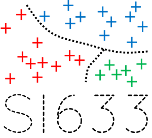

# LSSI633 : Sciences des données

{width="250"}

_Cours conçu pour les étudiants de L3 de l'Université de Versailles Saint-Quentin (UVSQ)_

## Présentation du cours

* [Chapitre I : Introduction](Chap1_Introduction.md) : .

* [Chapitre II : Classification supervisée](Chap2_Classification_supervisee.md) : .

* [Chapitre III : Régression](Chap3_Regression.md) : .

* [Chapitre IV : Clustering](Chap4_Clustering.md) :  .

---

Tous les exemples de ce cours sont imaginaires, et les données synthétiques.
Leur intérêt est purement pédagogique. 

---

## Credits

© Nicolas OUDART

_Remerciements à Cécile MALLET_